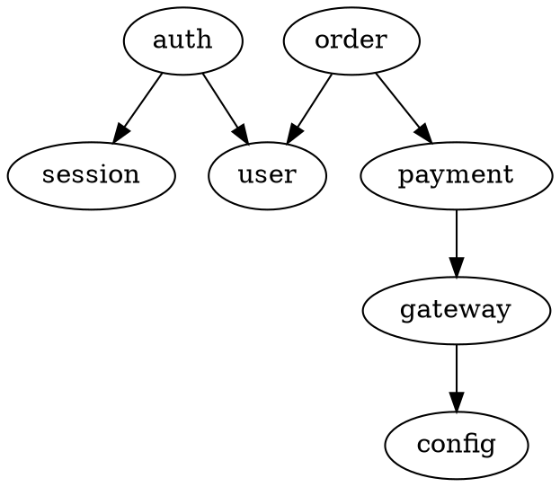

# 第4章：项目探索与理解

## 章节概述

面对一个陌生的代码库，开发者通常需要花费大量时间阅读文档、浏览目录、追踪调用关系才能建立起对项目的整体认知。Claude Code 凭借其对代码的深度理解能力和项目级上下文感知能力，能够大幅缩短这一过程。本章将系统性地介绍如何使用 Claude Code 快速探索和理解陌生代码项目，涵盖项目结构分析、代码库导航、依赖关系理解以及文档自动生成等核心技能。掌握这些技巧后，你可以在几分钟内对一个陌生项目建立起足以开始编码的完整理解。

## 学习目标

- 能够使用 Claude Code 快速理解项目结构，识别架构风格和技术栈
- 掌握代码库导航技巧，高效定位任何文件、符号或逻辑片段
- 能够分析项目的内部和外部依赖关系，理解模块间的耦合方式
- 学会利用 Claude Code 自动生成项目文档和架构概览

## 核心知识点

### 1. 项目结构分析

**目录结构解读**：当你首次打开一个项目时，第一件事是让 Claude Code 从宏观层面分析项目布局。使用 `/read` 或直接询问"Describe the project structure"，Claude Code 会递归扫描目录，识别出常见的项目模式。例如，一个 Python 项目通常会包含 `src/`、`tests/`、`docs/`、`setup.py` 等标准目录；一个 React 前端项目则会有 `src/components/`、`src/pages/`、`public/`、`package.json` 等。Claude Code 不仅能列出目录，还能自动推断每个目录的职责。对于非标准结构，你可以要求 Claude Code 提供结构化的目录树并附上每个目录的功能说明。

**配置文件识别**：现代项目通常有多个配置文件，它们承载着项目的构建方式、运行时行为、代码规范等关键信息。Claude Code 可以自动识别并解析这些配置文件的核心内容。你可以直接提问："What does this project's `tsconfig.json` tell us?"或"Summarize the key settings in `pyproject.toml`"。Claude Code 会提取关键配置项并用自然语言解释其含义。例如，对于 `package.json`，它会指出项目的入口文件、脚本命令、依赖版本以及工程配置。常见的配置文件包括：

| 文件 | 用途 | Claude Code 分析要点 |
|------|------|---------------------|
| package.json | Node.js 项目元数据 | 脚本命令、依赖、工程配置 |
| tsconfig.json | TypeScript 编译配置 | 目标版本、模块系统、严格模式 |
| pyproject.toml | Python 项目配置 | 构建系统、依赖、工具配置 |
| Dockerfile | 容器化配置 | 基础镜像、构建阶段、运行环境 |
| Makefile | 构建自动化 | 目标任务、依赖链、命令组合 |

**构建系统理解**：不同的编程语言使用不同的构建工具，Claude Code 能够根据项目的配置文件自动识别出构建系统，并解释其工作流程。例如，面对一个包含 `Cargo.toml` 的项目，Claude Code 会知道这是 Rust 项目，使用 Cargo 作为包管理和构建工具；看到 `build.gradle` 则识别为 Gradle 构建的 Java/Kotlin 项目。你可以进一步询问构建流程，如"How do I build this project?"或"What are the available build targets?"，Claude Code 会查阅配置文件中的构建脚本并给出具体的命令示例。

```
# 询问项目构建方式
$ claude "How do I build and test this project?"

# Claude Code 可能的输出
"Based on package.json, this is a Next.js project. You can:
- `npm run dev` → Start development server
- `npm run build` → Production build
- `npm run lint` → Run ESLint
- `npm test` → Run Jest tests"
```

### 2. 代码导航

**文件搜索与定位**：Claude Code 提供了强大的文件搜索能力，远不止于简单的文件名匹配。你可以基于文件内容、代码特征、逻辑职责等条件来搜索文件。使用自然语言描述你需要的文件，Claude Code 能理解你的意图并精确定位。例如：

```
# 基于功能描述搜索
$ claude "找出定义用户认证逻辑的文件"
$ claude "找到所有 API 路由处理函数所在的文件"
$ claude "搜索所有包含数据库查询的 service 文件"
```

Claude Code 会结合语义理解进行搜索，而非简单的关键词匹配。当你需要查找一个"负责处理用户登录和注册的模块"时，即使文件中没有"登录"或"注册"这些具体词汇，只要它包含了认证相关的逻辑，Claude Code 也能正确识别。

**符号跳转与引用查找**：在理解代码时，经常需要查找某个函数、类或变量的定义位置以及它在哪些地方被引用。Claude Code 能够跨越多个文件追踪符号的定义和引用关系。传统的 IDE 需要语言服务器协议（LSP）支持，而 Claude Code 通过代码理解来实现类似的功能：

```
# 查找符号定义
$ claude "find the definition of `authenticateUser`"
$ claude "show me where `UserModel` is used across the codebase"

# 追踪引用关系
$ claude "find all callers of the `validateInput` function"
$ claude "哪些地方依赖了 `config.database.uri` 这个配置项？"
```

这种能力在大型项目中尤为有用。无需手动在文件间跳转，Claude Code 会收集所有引用点并以列表形式呈现，甚至能对这些引用进行分类（如"3 处为测试调用，2 处为生产代码调用"）。

**代码路径追踪**：代码路径追踪是理解复杂逻辑的关键技能。当你需要理解"用户点击登录按钮后发生了什么"或"API 请求从入口到数据库的完整流程"时，Claude Code 可以帮助你追踪完整的执行链路。它能够跨越多个文件和函数，拼接出完整的调用链：

```
# 追踪执行路径
$ claude "Trace the complete code path when a user submits the login form"
$ claude "从 HTTP 请求到数据库写入的完整链路是什么？"
```

Claude Code 会以清晰的层级结构展示调用链，每个步骤标注文件位置和关键参数。这让理解一个跨越多层架构（如 Controller → Service → Repository → Database）的请求处理流程变得异常简单。

### 3. 依赖分析

**外部依赖识别**：现代项目通常依赖数十甚至上百个第三方包。Claude Code 能够从 `package.json`、`requirements.txt`、`Cargo.toml`、`go.mod` 等依赖管理文件中提取完整的外部依赖列表，并对每个依赖的用途进行解读。更重要的是，它可以帮助你评估这些依赖的健康状况：

```
# 分析外部依赖
$ claude "Summarize the external dependencies and their purposes"
$ claude "Which dependencies are outdated or have known security issues?"
$ claude "What does the `lodash` dependency actually get used for in this codebase?"
```

最后一个问题特别有价值。Claude Code 可以扫描项目中实际使用某个依赖的代码，让你了解是否真正需要该依赖，或者是否可以移除那些仅被少量代码使用的"沉重"依赖。

**内部模块依赖**：理解内部模块之间的依赖关系是把握项目架构的关键。Claude Code 可以分析项目内部的导入/导出关系，生成模块依赖图。你可以通过以下方式探索：

```
# 模块依赖分析
$ claude "Map out the dependency relationships between all modules in src/"
$ claude "Which modules have the most incoming dependencies (hub modules)?"
$ claude "Are there any circular dependencies in our codebase?"
```

Claude Code 能够检测出循环依赖—这是大型项目中常见但难以手动发现的问题。它还可以识别出"上帝模块"（被几乎所有其他模块依赖的中心模块）和"孤岛模块"（几乎不被其他模块依赖的模块），帮助你评估模块划分的合理性。

**依赖关系可视化**：对于复杂的依赖关系，文字描述可能不够直观。Claude Code 可以生成用于可视化的数据格式，你可以配合外部工具加以呈现。例如，它可以输出 DOT 格式（Graphviz 的输入格式）来描述依赖关系图：

```
# 要求生成可视化数据
$ claude "Generate a DOT-format dependency graph for the core module"
```

输出示例：



将这段输出保存为 `.dot` 文件，用 Graphviz 渲染即可得到清晰的依赖关系图。对于更简单的需求，Claude Code 也可以直接输出 ASCII 艺术风格的依赖树：

```
src/
├── auth/
│   ├── login.ts      → user/, session/
│   └── register.ts   → user/, email/
├── order/
│   ├── create.ts     → user/, payment/
│   └── cancel.ts     → order/, notification/
└── payment/
    └── gateway.ts    → config/, http/
```

### 4. 项目文档生成

**README 生成**：许多开源项目或内部项目的 README 文档往往不够完善。Claude Code 可以根据对项目代码的全面理解，自动生成高质量的 README 文档。你只需要提供项目名称和一个简短描述，甚至不需要任何额外输入：

```
$ claude "生成一个完整的 README.md，基于我对这个项目的理解"
```

Claude Code 会生成包含以下内容的 README：项目简介与技术栈、安装与配置步骤、快速开始指南、主要功能列表、API 文档概述、项目结构说明、贡献指南与许可信息。生成的内容基于实际的代码分析，因此不会出现"文档与代码不一致"的问题。你可以检查后要求 Claude Code 进行调整，比如"增加部署说明"或"简化入门示例"。

**架构文档**：架构文档记录了项目的高层设计思想，但往往因为维护成本高而迅速过时。Claude Code 可以从代码中逆向推断出项目的架构风格和分层策略，生成架构文档草稿：

```
$ claude "分析项目的架构模式，生成架构文档"
```

输出可能包括：整体架构风格（MVC、六边形架构、微服务等）、核心模块职责说明、数据流路径描述、关键设计决策及其在代码中的体现、架构模式一致性分析（哪些地方遵从了模式，哪些地方存在偏差）。这些内容可以帮助新成员快速理解项目设计理念，也便于架构评审时作为参考基线。

**API 文档概览**：对于包含 API 服务的项目，Claude Code 可以扫描路由定义和请求处理函数，生成 API 文档概览：

```
$ claude "列出所有 API 端点及其功能描述"
```

输出示例：

| 路由 | 方法 | 功能 | 文件位置 |
|------|------|------|---------|
| /api/users | GET | 获取用户列表 | routes/users.ts:15 |
| /api/users/:id | GET | 获取用户详情 | routes/users.ts:34 |
| /api/users | POST | 创建新用户 | routes/users.ts:52 |
| /api/login | POST | 用户登录 | routes/auth.ts:10 |

Claude Code 还可以根据函数签名和实现逻辑推断出请求参数和响应格式，帮助你快速构建 API 文档基础框架。

## 实战练习

**练习目标**：选择一个中等规模的开源项目（建议选择你感兴趣但之前没有接触过的项目），使用本章所学的技巧全面探索和理解该项目。

**步骤一：选择项目**
选择一个 GitHub 上 5000-50000 行代码的开源项目。推荐选项：FastAPI（Python Web 框架）、Day.js（JavaScript 日期库）、Cobra（Go CLI 框架）。使用 `cd` 进入项目目录，启动 Claude Code。

**步骤二：宏观分析**
使用以下命令进行整体探索：
1. `Describe the overall project structure` — 让 Claude Code 分析目录布局
2. `What is the tech stack and build system?` — 了解技术选型
3. `列出所有配置文件并解释关键配置项` — 深入了解项目配置

**步骤三：深入理解核心模块**
1. `Identify the core module and explain its responsibilities` — 找到核心模块
2. `Map out the main data flow of the project` — 理解数据处理流程
3. `找出项目中使用的设计模式` — 识别设计模式

**步骤四：依赖分析**
1. `列出所有外部依赖及其用途` — 理解第三方依赖
2. `检查内部模块依赖，看是否有循环依赖` — 验证模块设计
3. `Identify the most coupled module` — 找出耦合最严重的模块

**步骤五：文档生成**
1. `Generate a README overview for this project` — 生成项目概览
2. `Create an architecture summary based on your understanding` — 生成架构总结

**步骤六：验证与复盘**
将 Claude Code 的分析结果与项目的官方文档和实际代码进行对比，评估 Claude Code 理解的准确性。记录下你学到的项目设计思路。

## 本章小结

1. Claude Code 能够从目录结构、配置文件、构建系统三个维度对项目进行宏观画像，帮助开发者在几分钟内建立起对陌生项目的整体认知。

2. 在代码导航方面，Claude Code 支持基于语义的文件搜索、跨文件的符号引用追踪，以及跨越多个函数和文件的全链路执行路径分析，相比传统 IDE 的 LSP 导航更具上下文理解能力。

3. 依赖分析是理解项目架构的关键环节。Claude Code 可以自动识别外部依赖的用途和健康度，分析内部模块间的耦合关系，并检测循环依赖等架构问题。

4. 文档自动生成是 Claude Code 的实用功能之一。基于对代码的实际理解，它可以生成与代码保持一致的 README、架构文档和 API 概览，有效解决文档滞后于代码的常见问题。

5. 最佳的探索策略是"从宏观到微观"：先了解整体结构和技术栈，再深入核心模块，最后进行依赖分析和文档输出，形成一个完整的理解闭环。

## 思考题

1. 面对一个包含 100 个以上模块的大型项目，应该按照什么顺序进行探索？

   **提示**：建议先找出入口文件（main/index），然后识别出被最多模块依赖的"核心模块"，再从数据流角度沿"输入→处理→输出"的路径逐渐展开。避免试图一次性理解所有模块。

2. Claude Code 在项目理解方面相比传统工具有哪些优势？

   **提示**：从三个方面思考——语义理解（传统工具只能做文本匹配，Claude 能理解代码意图）、跨文件上下文（Claude 能看到多个文件的关联）、自然语言交互（不需要学习特定快捷键或查询语法）。

3. 当 Claude Code 对项目的理解出现偏差时，如何纠正和引导？

   **提示**：可以尝试提供更具体的上下文文件，使用 `/read` 命令加载关键文件，或者用更精确的自然语言描述限制分析范围。也可以分步提供信息："先从配置文件开始分析，然后逐一检查核心模块"。