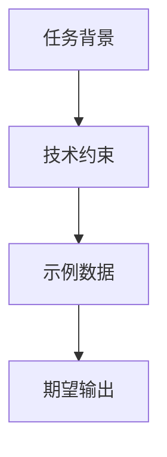
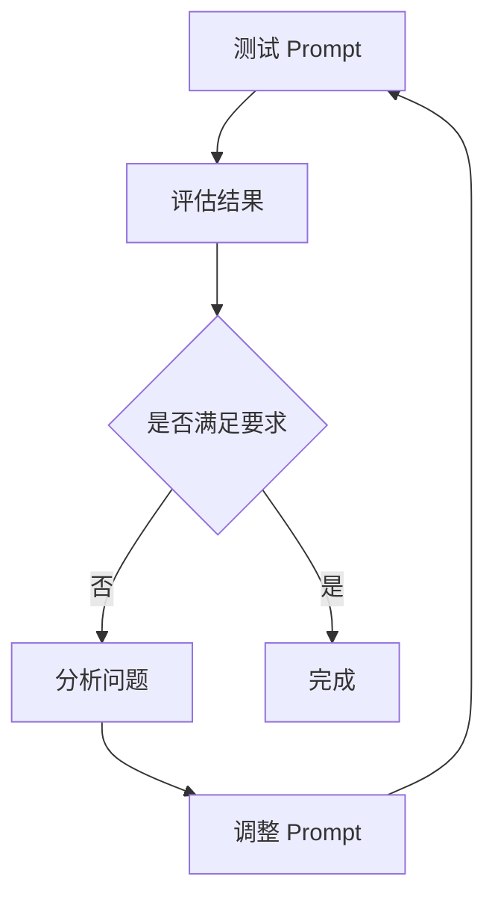

# 第15章 Prompt 工程进阶

## 15.1 Prompt 结构化

### 15.1.1 系统 Prompt

**系统提示词设计**

```python
SYSTEM_PROMPT = """你是一个专业的 Python 后端开发工程师。

## 约束
1. 只使用 Python 技术栈
2. 遵循 PEP 8 规范
3. 优先使用类型注解
4. 代码必须包含文档字符串

## 输出格式
1. 先解释方案
2. 提供完整代码
3. 说明关键点
"""
```

**系统提示词优化**

```markdown
# 好的系统提示词
- 明确角色：你是 X 领域的专家
- 设定约束：使用 Y 技术，遵循 Z 规范
- 定义格式：输出包含 A、B、C 部分
- 说明受众：面向初级/中级/高级开发者

# 不好的系统提示词
- 过于笼统：帮我写代码
- 缺乏上下文：写一个函数
- 没有约束：随便写
```

### 15.1.2 用户 Prompt

**结构化用户提示**

```bash
# 基础版
claude "写一个排序函数"

# 结构化版
claude """任务：实现一个排序函数

要求：
- 语言：Python
- 算法：快速排序
- 时间复杂度：O(n log n)
- 返回类型：List[int]

输入示例：[3,1,4,1,5,9]
输出示例：[1,1,3,4,5,9]
"""
```

**用户提示模板**

```markdown
## 任务模板

[任务描述]

## 约束
- 技术栈：[具体技术]
- 规范：[编码规范]
- 限制：[限制条件]

## 输入
[输入描述]

## 输出
[输出格式]

## 示例
[示例1]

## 注意事项
[需要特别注意的点]
```

### 15.1.3 上下文构建

**上下文层次**



**上下文示例**

```python
# 好的上下文构建
context = """
## 项目背景
- 项目名：电商后端 API
- 框架：FastAPI
- 数据库：PostgreSQL

## 技术约束
- 使用 SQLAlchemy ORM
- 遵循项目现有代码风格
- 必须有类型注解

## 关键文件
- 模型定义：src/models/
- 路由定义：src/routes/
- 现有服务：src/services/
"""
```

## 15.2 高级 Prompt 技巧

### 15.2.1 Chain of Thought

**思维链提示**

```python
COT_PROMPT = """解决这个问题的步骤：
1. 首先理解问题的核心要求
2. 分析可能的解决方案
3. 选择最佳方案
4. 逐步实现
5. 验证结果

问题：{problem}

请按步骤思考并给出答案。"""
```

**思维链示例**

```bash
claude """使用思维链解决：如何优化一个查询时间 5 秒的 SQL 查询？

步骤1：理解问题
- 当前查询涉及 3 个表的 JOIN
- 数据量约 100 万行
- 没有合适的索引

步骤2：分析原因
- 全表扫描
- 索引缺失
- 查询条件不当

步骤3：提出方案
- 添加合适的索引
- 优化查询条件
- 考虑分页

步骤4：实施...

步骤5：验证...
"""
```

### 15.2.2 ReAct 模式

**ReAct（Reason + Act）**

```python
REACT_PROMPT = """对于每个步骤，你需要：
1. Thought：思考当前应该做什么
2. Action：执行具体行动
3. Observation：观察结果
4. 继续或完成

任务：{task}"""
```

**ReAct 示例**

```markdown
Thought 1: 我需要了解项目结构才能进行代码审查
Action 1: 执行 `find . -name "*.py" -type f`
Observation 1: 发现项目有 50 个 Python 文件，主要在 src/ 目录

Thought 2: 现在我需要了解主要模块
Action 2: 读取 src/__init__.py
Observation 2: 发现这是一个 FastAPI 项目，包含 user, order, product 三个模块

...
```

### 15.2.3 Few-shot 学习

**少样本提示**

```bash
claude """示例 1：
输入：["apple","banana","apple"]
输出：{"apple": 2, "banana": 1}

示例 2：
输入：["a","b","a","c","b"]
输出：{"a": 2, "b": 2, "c": 1}

请为以下输入生成输出：
输入：["x","y","x","x","z"]
"""
```

**Few-shot 技巧**

1. 提供 2-5 个示例
2. 示例要覆盖不同场景
3. 示例要有代表性
4. 格式要一致

## 15.3 Prompt 优化

### 15.3.1 效果评估

**评估指标**

- 准确率：回答正确的比例
- 完整性：覆盖所有要求的程度
- 效率：tokens 消耗
- 一致性：多次回答的一致程度

**评估方法**

```python
def evaluate_prompt(prompt, test_cases):
    results = []
    for case in test_cases:
        response = claude.ask(prompt, case)
        correct = evaluate_response(response, case.expected)
        results.append(correct)

    accuracy = sum(results) / len(results)
    return accuracy
```

### 15.3.2 迭代优化

**优化循环**



**常见问题与解决**

| 问题 | 解决 |
|------|------|
| 输出过长 | 添加格式约束 |
| 输出过短 | 要求详细说明 |
| 格式不对 | 指定输出格式 |
| 理解错误 | 增加示例 |

```python
# 优化示例
# 优化前
claude "解释什么是 API"

# 优化后
claude """用 2-3 句话解释什么是 API，要求：
1. 通俗易懂，适合初学者
2. 用日常生活中的例子说明
3. 不要超过 100 字
"""
```

### 15.3.3 自动化测试

**Prompt 测试框架**

```python
class PromptTester:
    def __init__(self, prompts, test_cases):
        self.prompts = prompts
        self.test_cases = test_cases

    def run_tests(self):
        results = {}
        for name, prompt in self.prompts.items():
            scores = []
            for case in self.test_cases:
                response = self.call_api(prompt, case)
                score = self.evaluate(response, case.expected)
                scores.append(score)
            results[name] = sum(scores) / len(scores)
        return results

    def optimize(self, best_prompt, variations):
        # 测试变体
        # 选择最佳版本
        pass
```

## 本章小结

本章介绍了 Prompt 工程进阶技巧。涵盖系统提示词设计、用户提示结构化、思维链、ReAct 模式、少样本学习，以及 Prompt 优化和自动化测试。

## 练习题

1. 优化一个现有 Prompt
2. 使用思维链解决复杂问题
3. 构建 Prompt 测试框架
