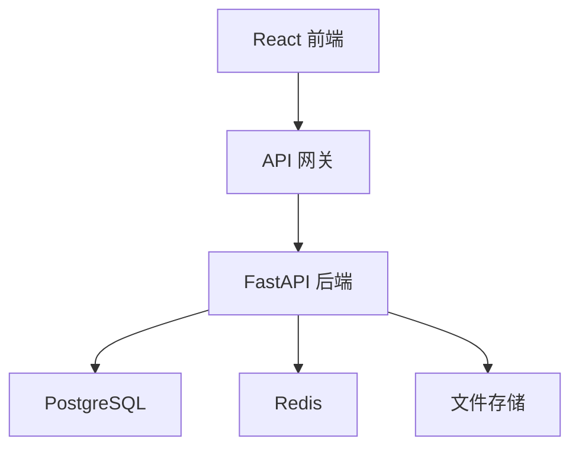

# 第20章 全栈应用开发

## 20.1 项目规划与架构

### 20.1.1 系统架构设计

**全栈架构概览**



**架构分层**

```text
前端层 (React + TypeScript)
    |
API 层 (RESTful)
    |
业务逻辑层 (FastAPI)
    |
数据访问层 (SQLAlchemy)
    |
数据存储层 (PostgreSQL + Redis)
```

### 20.1.2 前后端分工

**前端职责**

- 用户界面渲染
- 用户交互处理
- 表单验证
- 状态管理
- 与后端 API 通信

**后端职责**

- 业务逻辑处理
- 数据存储和检索
- 认证和授权
- API 文档生成
- 数据验证

**接口约定**

```typescript
// 统一响应格式
interface ApiResponse<T> {
  success: boolean
  data?: T
  error?: {
    code: string
    message: string
  }
  pagination?: {
    page: number
    size: number
    total: number
  }
}
```

### 20.1.3 数据流动

**数据流方向**

1. 用户在前端点击按钮
2. 前端收集数据并验证
3. 前端发送请求到后端 API
4. 后端验证请求数据
5. 后端执行业务逻辑
6. 后端返回响应
7. 前端更新界面

## 20.2 数据库设计

### 20.2.1 表结构设计

**核心表设计**

```python
from sqlalchemy import Column, Integer, String, Text, DateTime, ForeignKey
from sqlalchemy.orm import relationship
from sqlalchemy.declarative import Base

Base = declarative_base()

class User(Base):
    __tablename__ = "users"

    id = Column(Integer, primary_key=True)
    username = Column(String(50), unique=True, index=True)
    email = Column(String(100), unique=True, index=True)
    hashed_password = Column(String(255))
    created_at = Column(DateTime, default=datetime.utcnow)

    orders = relationship("Order", back_populates="user")

class Order(Base):
    __tablename__ = "orders"

    id = Column(Integer, primary_key=True)
    user_id = Column(Integer, ForeignKey("users.id"))
    status = Column(String(20), default="pending")
    total_amount = Column(Integer)
    created_at = Column(DateTime, default=datetime.utcnow)

    user = relationship("User", back_populates="orders")
    items = relationship("OrderItem", back_populates="order")

class OrderItem(Base):
    __tablename__ = "order_items"

    id = Column(Integer, primary_key=True)
    order_id = Column(Integer, ForeignKey("orders.id"))
    product_id = Column(Integer, ForeignKey("products.id"))
    quantity = Column(Integer)
    price = Column(Integer)

    order = relationship("Order", back_populates="items")
    product = relationship("Product")

class Product(Base):
    __tablename__ = "products"

    id = Column(Integer, primary_key=True)
    name = Column(String(100))
    description = Column(Text)
    price = Column(Integer)
    stock = Column(Integer, default=0)
    category = Column(String(50))
```

### 20.2.2 索引与优化

**索引设计**

```python
# 经常查询的字段添加索引
class User(Base):
    __table_args__ = (
        Index('idx_user_email', 'email'),
        Index('idx_user_username', 'username'),
        Index('idx_user_created', 'created_at'),
    )

class Order(Base):
    __table_args__ = (
        Index('idx_order_user_status', 'user_id', 'status'),
        Index('idx_order_created', 'created_at'),
    )
```

### 20.2.3 迁移策略

**Alembic 迁移**

```bash
# 创建迁移
alembic revision --autogenerate -m "add user table"

# 执行迁移
alembic upgrade head

# 查看历史
alembic history
```

## 20.3 完整功能实现

### 20.3.1 用户系统

**注册流程**

```python
# 后端
@router.post("/auth/register")
async def register(user: UserCreate, db: Session = Depends(get_db)):
    # 验证邮箱
    existing = db.query(User).filter(User.email == user.email).first()
    if existing:
        raise HTTPException(400, "邮箱已被注册")

    # 验证用户名
    existing = db.query(User).filter(User.username == user.username).first()
    if existing:
        raise HTTPException(400, "用户名已被使用")

    # 创建用户
    hashed = get_password_hash(user.password)
    db_user = User(username=user.username, email=user.email, hashed_password=hashed)
    db.add(db_user)
    db.commit()
    return {"id": db_user.id, "username": db_user.username}
```

**前端调用**

```typescript
// services/auth.ts
import api from './api'

export const register = (data: RegisterData) => api.post('/auth/register', data)
export const login = (data: LoginData) => api.post('/auth/login', data)

// 组件使用
const handleRegister = async () => {
  try {
    await register({ username, email, password })
    navigate('/login')
  } catch (error) {
    setError('注册失败')
  }
}
```

### 20.3.2 核心业务

**订单流程**

```python
@router.post("/orders/", response_model=OrderResponse)
async def create_order(
    order_data: OrderCreate,
    db: Session = Depends(get_db),
    current_user: User = Depends(get_current_user)
):
    # 验证商品
    products = db.query(Product).filter(
        Product.id.in_([item.product_id for item in order_data.items])
    ).all()
    if len(products) != len(order_data.items):
        raise HTTPException(400, "部分商品不存在")

    # 计算总价
    total = sum(p.price * qty for p, qty in zip(products, [i.quantity for i in order_data.items]))

    # 创建订单
    order = Order(user_id=current_user.id, total_amount=total)
    db.add(order)
    db.commit()
    return order
```

### 20.3.3 实时功能

**WebSocket 实现**

```python
from fastapi import WebSocket, WebSocketDisconnect

manager = ConnectionManager()

class ConnectionManager:
    def __init__(self):
        self.active_connections: List[WebSocket] = []

    async def connect(self, websocket: WebSocket):
        await websocket.accept()
        self.active_connections.append(websocket)

    def disconnect(self, websocket: WebSocket):
        self.active_connections.remove(websocket)

    async def send_personal_message(self, message: str, websocket: WebSocket):
        await websocket.send_text(message)

    async def broadcast(self, message: str):
        for connection in self.active_connections:
            await connection.send_text(message)

@app.websocket("/ws/{client_id}")
async def websocket_endpoint(websocket: WebSocket, client_id: int):
    await manager.connect(websocket)
    try:
        while True:
            data = await websocket.receive_text()
            await manager.broadcast(f"Client {client_id}: {data}")
    except WebSocketDisconnect:
        manager.disconnect(websocket)
```

**前端 WebSocket**

```typescript
const socket = new WebSocket('ws://localhost:8000/ws/1')

socket.onmessage = (event) => {
  console.log('收到消息:', event.data)
}

socket.send('Hello')
```

## 本章小结

本章介绍了全栈应用开发。涵盖系统架构设计、前后端分工、数据库设计、用户系统实现、核心业务逻辑和实时功能。

## 练习题

1. 搭建一个完整的全栈项目
2. 实现用户认证和订单功能
3. 添加实时通知功能
