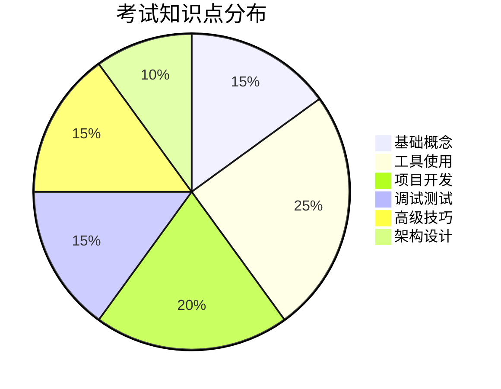

# 第21章 考试概述与备考策略

## 21.1 考试简介

### 21.1.1 考试形式

**Claude Certified Architect 考试**是 Anthropic 推出的官方认证考试，用于验证考生在 AI 辅助软件开发和 Claude Code 使用方面的专业能力。

**考试形式**

- **考试时长**：90 分钟
- **题目数量**：60-80 道题
- **题型**：选择题、简答题、场景分析题
- **及格分数**：70%
- **考试语言**：英语（可选中文）

### 21.1.2 报名流程

**报名步骤**

1. 访问 Anthropic 认证官网
2. 创建或登录账户
3. 选择考试时间和地点
4. 支付考试费用（$299）
5. 预约确认

### 21.1.3 考试费用

**费用说明**

| 项目 | 金额 | 说明 |
|------|------|------|
| 首次考试 | $299 | 一次机会 |
| 重考费用 | $149 | 失败后可优惠重考 |
| 模拟考试 | $49 | 可多次练习 |

## 21.2 知识点全景图

### 21.2.1 核心知识点分布

**知识领域权重**



**详细知识点列表**

1. **基础概念（15%）**
   - Claude Code 概述
   - 安装与配置
   - 基本交互方式
   - 工具系统

2. **工具使用（25%）**
   - 文件操作
   - Shell 命令执行
   - 代码生成与修改
   - 搜索与检索

3. **项目开发（20%）**
   - 项目初始化
   - 多文件开发
   - 团队协作
   - 文档生成

4. **调试测试（15%）**
   - 错误分析
   - 问题排查
   - 单元测试
   - 集成测试

5. **高级技巧（15%）**
   - Agent 编排
   - Prompt 工程
   - MCP 集成

6. **架构设计（10%）**
   - 设计模式
   - 架构原则
   - 决策文档

### 21.2.2 权重分析

**重点复习内容**

```markdown
## 高频考点（必须掌握）
1. ⭐⭐⭐ Claude Code 工具使用
2. ⭐⭐⭐ 项目开发流程
3. ⭐⭐⭐ 调试与测试方法
4. ⭐⭐ Prompt 工程技巧
5. ⭐⭐ Agent 编排

## 中频考点（理解即可）
1. ⭐ 安装配置
2. ⭐ 架构设计基础

## 低频考点（了解）
1. 历史背景
2. 竞品对比
```

### 21.2.3 难度评估

**题目难度分布**

| 难度 | 占比 | 特征 |
|------|------|------|
| 简单 | 30% | 基础概念、工具使用 |
| 中等 | 50% | 综合应用、问题解决 |
| 困难 | 20% | 复杂场景、架构设计 |

## 21.3 备考计划

### 21.3.1 学习路径

**推荐学习周期：4-6 周**

```text
Week 1-2：基础入门
- 完成本书第一篇
- 完成本书第二篇

Week 3：中级应用
- 完成本书第三篇
- 完成本书第四篇

Week 4：项目实战
- 完成本书第五篇

Week 5：考试准备
- 完成本书第六篇
- 模拟考试练习

Week 6：冲刺复习
- 错题复习
- 重点知识回顾
- 考试模拟
```

### 21.3.2 时间规划

**每日学习计划**

| 时间 | 内容 | 时长 |
|------|------|------|
| 周末 | 系统学习 + 动手实践 | 2-3 小时/天 |
| 工作日 | 复习 + 练习 | 1-2 小时/天 |

**阶段目标**

- 第 1-2 周：掌握基础（完成 1-8 章）
- 第 3 周：提升技能（完成 9-16 章）
- 第 4 周：实战演练（完成 17-20 章）
- 第 5 周：考试准备（完成 21-23 章）
- 第 6 周：冲刺复习

### 21.3.3 资源推荐

**官方资源**

- Claude Code 官方文档
- Anthropic 官方博客
- 认证考试模拟题库

**学习资源**

- 本书（完整学习）
- 在线教程
- 视频课程

**练习资源**

- 官方模拟考试
- 练习题库
- GitHub 示例项目

## 本章小结

本章介绍了 Claude Certified Architect 考试。涵盖考试形式、报名流程、知识点分布、权重分析和备考计划。

## 练习题

1. 了解考试形式和要求
2. 制定个人备考计划
3. 开始系统学习
