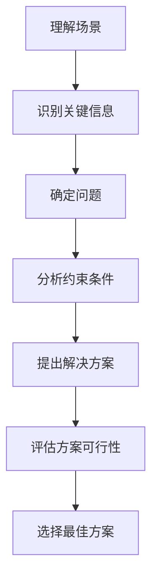

# 第22章 模拟试题与解析

## 22.1 选择题解析

### 22.1.1 题型分析

**选择题特点**

- 每题 1 分
- 只有一个正确答案
- 考察基础知识和应用能力

**常见题型**

```markdown
1. 概念题：考察基本定义和原理
2. 工具题：考察工具使用方法和参数
3. 场景题：考察实际问题解决能力
4. 辨析题：考察相似概念的区别
```

### 22.1.2 解题技巧

**答题技巧**

1. **仔细读题**：注意题目中的关键词
2. **排除法**：先排除明显错误的选项
3. **对比分析**：比较剩余选项的差异
4. **时间控制**：每题不超过 1 分钟

### 22.1.3 典型例题

**例题 1：基础概念**

```markdown
题目：Claude Code 与 Claude 网页版的主要区别是什么？

A. 使用相同的 AI 模型
B. CLI 版本可以操作文件系统
C. 网页版功能更强大
D. 没有区别

答案：B

解析：Claude Code 作为命令行工具，可以直接读取、修改、创建文件，执行 Shell 命令，这是与网页版的主要区别。
```

**例题 2：工具使用**

```markdown
题目：以下哪个命令可以搜索项目中的特定内容？

A. claude "search" 内容
B. claude --grep "pattern" 目录
C. claude /search 内容
D. claude find 内容

答案：B

解析：使用 --grep 参数可以在指定目录搜索内容。
```

**例题 3：场景应用**

```markdown
题目：项目需要进行大规模重构，以下哪个方式最合适？

A. 一次完成所有修改
B. 使用 TDD 方式小步重构
C. 直接使用 AI 生成所有代码
D. 跳过测试直接部署

答案：B

解析：大规模重构应该使用 TDD 方式，小步前进，确保每一步都是正确的。
```

**例题 4：调试分析**

```markdown
题目：遇到 ImportError 错误时，首先应该？

A. 重新安装系统
B. 检查导入路径是否正确
C. 忽略错误继续运行
D. 修改 Python 版本

答案：B

解析：ImportError 通常是路径问题，应该先检查导入路径是否正确。
```

## 22.2 场景题解析

### 22.2.1 案例分析

**场景题特点**

- 提供具体业务场景
- 需要综合分析
- 考察实际应用能力

**场景题结构**

```markdown
【场景描述】
- 背景信息
- 面临问题
- 约束条件

【问题】
- 需要解决的问题

【分析要点】
- 关键考量
- 解决方案
- 实施步骤
```

### 22.2.2 解决方案

**场景 1：遗留系统迁移**

```markdown
【场景】
一家公司需要将一个 10 年历史的单体 PHP 应用迁移到现代架构，团队只有 5 人，时间 6 个月。

【问题】
如何高效完成迁移？

【分析要点】
1. 评估现有系统
2. 确定迁移策略（逐步迁移 vs 重写）
3. 选择技术栈
4. 制定迁移计划
5. 风险控制

【推荐方案】
采用绞杀榕树模式，逐步将功能迁移到新系统。
```

**场景 2：性能优化**

```markdown
【场景】
一个 API 接口响应时间从 200ms 增长到 5s，数据量增长到原来的 10 倍。

【问题】
如何定位和解决性能问题？

【分析要点】
1. 性能分析
2. 瓶颈定位
3. 优化方案
4. 效果验证

【排查步骤】
1. 查看日志，分析请求
2. 检查数据库查询
3. 检查缓存使用
4. 检查代码逻辑
5. 实施优化
```

### 22.2.3 思路讲解

**场景分析框架**



## 22.3 实操题解析

### 22.3.1 操作要求

**实操题特点**

- 需要实际操作
- 考察动手能力
- 有明确评分标准

**环境要求**

- 稳定的网络连接
- 可用的 Claude Code 环境
- 基础开发环境

**操作规范**

1. 仔细阅读要求
2. 先理解后操作
3. 分步骤进行
4. 验证结果正确性

### 22.3.2 评分标准

**评分维度**

| 维度 | 权重 | 说明 |
|------|------|------|
| 功能正确性 | 50% | 是否正确完成任务 |
| 代码质量 | 20% | 代码规范、可读性 |
| 效率 | 15% | 是否高效完成 |
| 错误处理 | 15% | 是否有适当的错误处理 |

**常见失分点**

1. 理解题意错误
2. 操作步骤遗漏
3. 结果验证不完整
4. 代码质量差

### 22.3.3 常见错误

**错误类型及避免**

```markdown
## 错误 1：操作不规范
- 表现：不按步骤操作，跳过关键步骤
- 解决：严格按照要求操作

## 错误 2：结果不验证
- 表现：操作完成但不检查结果
- 解决：每步操作后都验证结果

## 错误 3：效率低下
- 表现：使用繁琐的方法
- 解决：使用工具和快捷方式

## 错误 4：忽略错误处理
- 表现：代码不考虑异常情况
- 解决：添加适当的错误处理
```

## 本章小结

本章介绍了模拟试题与解析。涵盖选择题的题型分析、解题技巧、典型例题，场景题的分析方法和解决方案，以及实操题的评分标准和常见错误。

## 练习题

1. 完成官方模拟考试
2. 分析错题原因
3. 总结答题技巧
