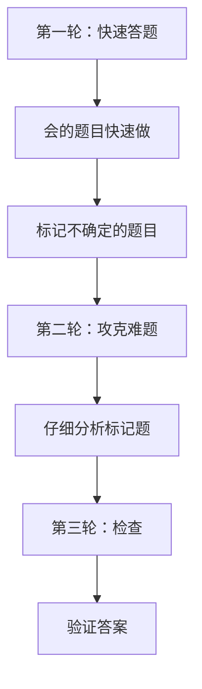
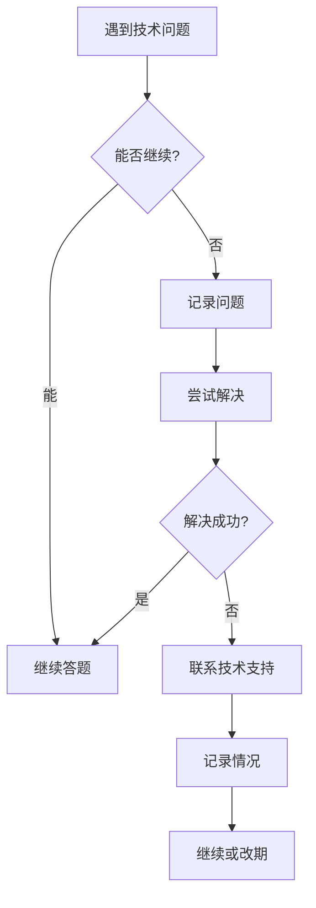

# 第23章 考试技巧与注意事项

## 23.1 时间管理

### 23.1.1 答题顺序

**推荐答题顺序**



**时间分配建议**

| 阶段 | 时间 | 目标 |
|------|------|------|
| 第一轮 | 50 分钟 | 完成 80% 题目 |
| 第二轮 | 25 分钟 | 完成剩余 15% |
| 第三轮 | 15 分钟 | 检查并修正 |

### 23.1.2 时间分配

**单题时间分配**

| 题型 | 建议时间 | 最长时间 |
|------|----------|----------|
| 选择题 | 30-60 秒 | 90 秒 |
| 简答题 | 2-3 分钟 | 5 分钟 |
| 场景题 | 5-8 分钟 | 10 分钟 |
| 实操题 | 10-15 分钟 | 20 分钟 |

### 23.1.3 检查策略

**检查重点**

1. **漏题检查**：确保所有题目都作答
2. **审题检查**：确认理解题意正确
3. **答案检查**：检查是否有明显错误
4. **标记检查**：重点检查不确定的题目

```markdown
# 检查技巧

1. 逆序检查：从最后一题开始往前检查
2. 快速扫描：只看关键词
3. 重点关注：不确定的题目
4. 相信直觉：不要随意改答案
```

## 23.2 考试当天

### 23.2.1 考前准备

**前一天**

```markdown
- 确认考试时间和地点
- 准备好身份证件
- 了解考场规则
- 早点休息
- 准备好考试用品
```

**考试当天**

```markdown
- 提前 30 分钟到达
- 带好证件和考试确认信
- 确保网络和设备正常
- 放松心情，保持平和
```

### 23.2.2 环境检查

**技术环境检查**

```markdown
1. 网络连接是否稳定
2. 浏览器是否正常
3. Claude Code 是否可以运行
4. 是否有弹窗广告
5. 电源是否充足
6. 环境是否安静
```

**考试环境要求**

- 稳定的网络连接（宽带或 4G/5G）
- 安静的考试环境
- 清晰的显示屏幕
- 舒适的键盘和鼠标

### 23.2.3 心态调整

**心态管理技巧**

```markdown
## 保持自信
- 相信自己的准备
- 不要过度紧张
- 保持平常心

## 应对紧张
- 深呼吸放松
- 积极的自我暗示
- 适当的休息

## 遇到难题
- 不要慌
- 先跳过
- 回头再战
```

## 23.3 常见问题与解决

### 23.3.1 突发情况处理

**常见问题与解决方案**

| 问题 | 解决方案 | 预防措施 |
|------|----------|----------|
| 网络中断 | 刷新页面重试，保持答案 | 提前检查网络 |
| 系统卡顿 | 刷新或重启 | 提前测试环境 |
| 突然断电 | 保存进度联系监考 | 保持设备电量 |
| 看错题目 | 仔细审题后再答 | 用笔标记关键词 |
| 时间不够 | 先答会做的 | 合理分配时间 |

### 23.3.2 技术问题应对

**技术问题处理流程**



### 23.3.3 申诉流程

**申诉适用范围**

- 考试技术问题导致成绩异常
- 评分标准不公平
- 系统错误导致答题异常

**申诉步骤**

```markdown
1. 考试结束后 48 小时内提交申诉
2. 详细描述问题
3. 提供相关证据
4. 等待审核结果（5-7 工作日）
5. 如不通过可再次申诉
```

**申诉注意事项**

- 保持冷静，客观描述
- 提供详细信息和证据
- 遵循官方申诉流程
- 理解申诉结果

## 本章小结

本章介绍了考试技巧与注意事项。涵盖时间管理（答题顺序、时间分配、检查策略），考试当天（考前准备、环境检查、心态调整），以及常见问题处理和技术问题应对。

## 练习题

1. 模拟考试时间管理
2. 准备考试当天 checklist
3. 了解申诉流程

---

## 书籍总结

经过 23 章的学习，你应该已经掌握了：

1. Claude Code 的基础知识和安装配置
2. 核心工具使用和交互方法
3. 项目开发和代码管理能力
4. 调试测试和问题解决技巧
5. 高级技巧和最佳实践
6. 考试要点和备考策略

祝你顺利通过 Claude Certified Architect 考试！

---

- 作者：Claude Code 权威指南
- 版本：1.0
- 日期：2026-05-04
