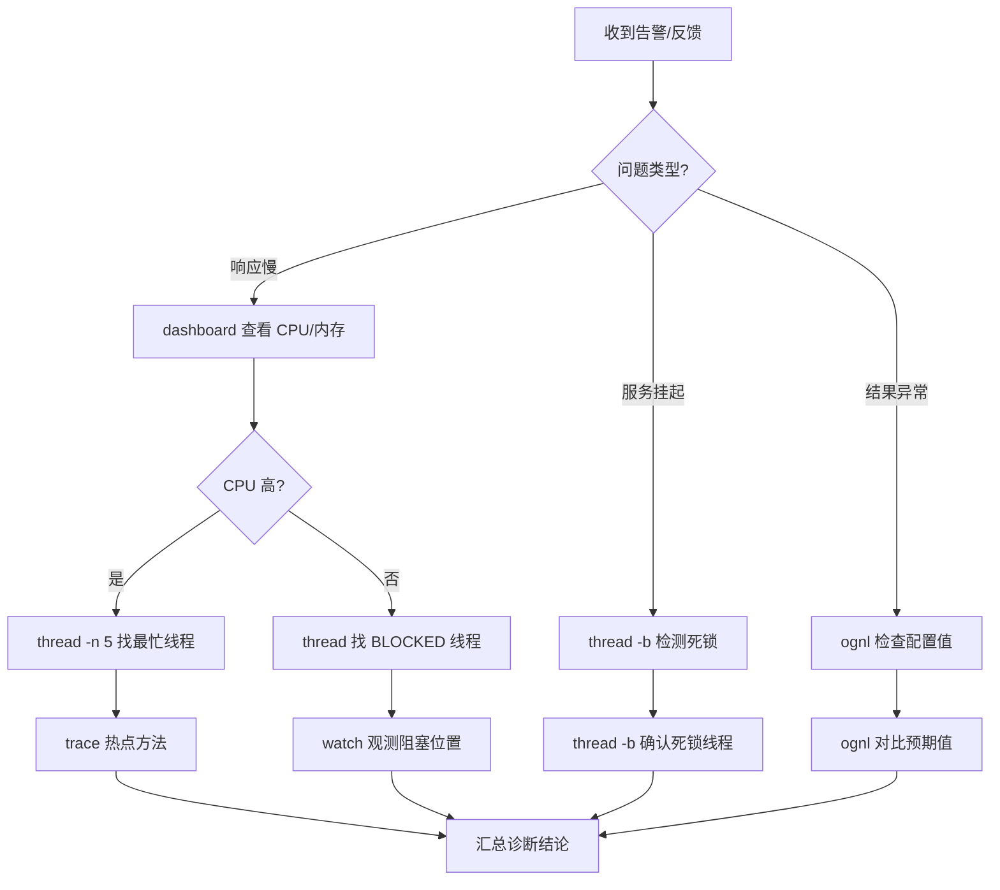

# 第4章 Arthas：在线诊断瑞士军刀

> 如果说 async-profiler 是 JVM 的"心电图"，那么 Arthas 就是 JVM 的"手术刀"——它不需要你提前准备任何探针或参数，在应用运行的过程中就可以随时切入，观察方法调用、检测死锁、甚至修改运行时的代码逻辑。

## 4.1 Arthas 概述

### 4.1.1 什么是 Arthas

Arthas（阿尔萨斯）是阿里巴巴开源的一款 Java 在线诊断工具，官方仓库地址为 `github.com/alibaba/arthas`。它解决了 Java 开发者最常见的一个痛点：**生产环境问题难以复现，但你又无法在测试环境模拟**。

典型的场景包括：

- **线上偶发超时**：某个接口每隔几小时慢一次，但日志里看不出原因——你想知道这次调用到底花了多少时间、参数是什么、返回值是什么
- **死锁导致服务挂起**：应用没有崩溃，但某些请求永远卡住了——你需要快速确认哪些线程持有哪些锁
- **内存泄漏怀疑**：某个类的实例数量异常增长——你想知道这些对象是在哪里创建的
- **配置错误**：一个配置项的值和你预期的不一致——你希望在不重启的情况下检查运行时的实际值

对于这些场景，传统做法是：加日志 -> 重新部署 -> 等待复现。这个过程至少需要几小时甚至几天。而 Arthas 可以在**不修改代码、不重启应用**的情况下，实时诊断运行中的 JVM 进程。

**Arthas 的核心特性：**

- **无侵入**：不需要在应用中引入任何依赖，不需要修改 JVM 启动参数
- **实时性**：attach 到目标进程后立即生效，随时连接、随时断开
- **丰富命令**：提供超过 50 个诊断命令，覆盖类加载、方法执行、线程、GC、JVM 配置等各个维度
- **表达式求值**：内置 OGNL 表达式引擎，可以在运行时求值任意表达式
- **文本协议与 HTTP API**：既支持交互式命令行，也支持通过 HTTP 接口自动化和集成
- **Tunnel Server**：支持远程连接容器内的应用，无需 SSH 到宿主机

### 4.1.2 与其他工具的对比

| 特性 | Arthas | async-profiler | JFR | 传统 APM |
|------|--------|---------------|-----|----------|
| 安装部署 | 单 jar 包 | 需要编译或下载 native 库 | 内置于 JDK | 需安装 Agent |
| 对应用影响 | <1% CPU（空闲时 0%） | <1% | <1% | 3-10% |
| 方法级追踪 | 支持（watch/trace） | 不支持 | 不支持 | 部分支持 |
| 死锁检测 | 一键 `thread -b` | 不支持 | 部分支持 | 部分支持 |
| 运行时修改 | 支持（ognl/redefine） | 不支持 | 不支持 | 不支持 |
| 对象查看 | 支持（vmtool） | 不支持 | 不支持 | 不支持 |
| 生产环境 | 非常适合 | 适合 | 非常适合 | 谨慎使用 |

---

## 4.2 安装与启动

### 4.2.1 下载安装

Arthas 的安装非常简单——它本质上就是一个可执行的 JAR 包：

```bash
# 方式一：使用 arthas-boot.jar（推荐）
curl -O https://arthas.aliyun.com/arthas-boot.jar
java -jar arthas-boot.jar

# 方式二：下载完整发行版
curl -O https://arthas.aliyun.com/arthas-packaging-4.0.0-bin.zip
unzip arthas-packaging-4.0.0-bin.zip
cd arthas-4.0.0-bin
# 使用 as.sh 启动
./as.sh

# 方式三：通过包管理器（macOS）
brew install arthas
```

**Docker 环境安装：**

```dockerfile
# Dockerfile 片段
FROM eclipse-temurin:21-jdk

# 下载 arthas-boot.jar
RUN curl -O https://arthas.aliyun.com/arthas-boot.jar \
    && mv arthas-boot.jar /opt/arthas-boot.jar

# 安装完整工具链（推荐生产环境使用）
RUN curl -O https://arthas.aliyun.com/arthas-packaging-4.0.0-bin.zip \
    && unzip arthas-packaging-4.0.0-bin.zip -d /opt/arthas \
    && ln -s /opt/arthas/as.sh /usr/local/bin/as.sh

COPY target/*.jar /app.jar
CMD ["java", "-jar", "/app.jar"]
```

初次运行 `java -jar arthas-boot.jar` 时，Arthas 会列出当前机器上所有 Java 进程，输入编号即可 attach 到目标进程：

```bash
$ java -jar /opt/arthas-boot.jar
[INFO] arthas-boot version: 4.0.0
[INFO] Found existing java process, please choose one and input the serial number of the process, eg: 1. Then hit ENTER.
  [1]: 12345 com.example.MyApplication
  [2]: 67890 org.apache.catalina.startup.Bootstrap
  [3]: 11111 org.jetbrains.idea.maven.server.RemoteMavenServer
```

也可以直接指定 PID：`java -jar /opt/arthas-boot.jar 12345`。

### 4.2.2 Dashboard 概览

成功 attach 后，Arthas 进入交互式命令行。输入 `dashboard` 即可看到实时的系统概要面板：

```
$ dashboard
ID     NAME                          GROUP           PRIORITY   STATE     %CPU      TIME      INTERRUPTED  DAEMON
1      main                          main            5          WAITING   0.0       0:0:0     false        false
2      Worker-1                      main            5          WAITING   0.0       0:0:0     false        false
3      Worker-2                      main            5          WAITING   0.0       0:0:0     false        false
4      arthas-command-execute        system          5          RUNNABLE  0.0       0:0:0     false        true
...

Memory             used      total     max        usage     GC
heap               256M      512M      2048M      12.50%    gc.ps_scavenge.count      = 12
  ps_eden_space    128M      256M      1024M      12.50%    gc.ps_scavenge.time(ms)   = 580
  ps_survivor_space 16M      32M       32M        50.00%    gc.ps_marksweep.count     = 2
  ps_old_gen       112M      224M      1024M      10.94%    gc.ps_marksweep.time(ms)  = 320
nonheap            64M       96M       -          66.67%
  code_cache       16M       24M       240M       6.67%
  metaspace        32M       48M       -          66.67%

Runtime Info
  OS: Linux 5.15.0 / x86_64 / 4 cores
  JVM: Eclipse Temurin-21.0.2
  Loaded Class Count: 15876
  Thread Count: 32
  ...
```

Dashboard 面板分为三个区域：

1. **线程信息区**：显示所有活跃线程的 ID、名称、组、优先级、状态、CPU 使用率、累计运行时间等。按 `Q` 退出 Dashboard
2. **内存信息区**：显示堆内存各分代（Eden、Survivor、Old）以及非堆内存（Code Cache、Metaspace）的使用情况，同时展示 GC 次数和耗时
3. **运行时信息区**：显示操作系统、JVM 版本、已加载类数量、线程总数等

Dashboard 默认每 5 秒刷新一次，可以通过 `dashboard -n 3` 指定只输出 3 次后自动退出，适用于脚本化采集。

---

## 4.3 线程诊断命令：thread

### 4.3.1 查看线程信息

`thread` 命令是 Arthas 中最常用的线程诊断工具。它可以列出所有线程、查看特定线程的调用栈、以及检测死锁。

```bash
# 列出所有线程
thread

# 查看最繁忙的 N 个线程（按 CPU 使用率排序）
thread -n 5

# 查看特定线程的调用栈（按线程 ID）
thread 1

# 查看处于特定状态的线程
thread --state BLOCKED
thread --state WAITING
```

**输出示例（`thread -n 3`）：**

```
$ thread -n 3
"arthas-command-execute" Id=4 cpuUsage=1.2% deltaTime=0ms time=1250ms RUNNABLE
    at sun.management.ThreadImpl.dumpThreads0(Native Method)
    at sun.management.ThreadImpl.getThreadInfo(ThreadImpl.java:496)
    at com.taobao.arthas.core.command.monitor200.ThreadCommand.processTopBusiestThreads(ThreadCommand.java:175)

"http-nio-8080-exec-1" Id=12 cpuUsage=0.8% deltaTime=0ms time=8230ms RUNNABLE
    at java.net.SocketInputStream.socketRead0(Native Method)
    at java.net.SocketInputStream.read(SocketInputStream.java:168)

"Worker-1" Id=8 cpuUsage=0.0% deltaTime=0ms time=100ms WAITING
    at java.lang.Object.wait(Native Method)
    at java.lang.Thread.join(Thread.java:1356)
    at com.jvmbook.ch04.DeadlockDemo.main(DeadlockDemo.java:26)
```

### 4.3.2 死锁检测：thread -b

`thread -b` 是 Arthas 的死锁检测利器。`-b` 代表 "blocked"，它会找出当前被阻塞的线程，并显示阻塞它的锁和线程：

```bash
# 一键检测死锁
thread -b
```

**死锁检测原理：**

`thread -b` 的核心逻辑是调用 `ThreadMXBean.findDeadlockedThreads()` 方法（Java 6+ 提供），然后遍历死锁线程的 Monitor 信息，构建出"线程-锁"的等待关系图。

**输出示例：**

```
$ thread -b
"Worker-2" Id=10 BLOCKED on java.lang.Object@3f99bd52 owned by "Worker-1" Id=9
    at com.jvmbook.ch04.DeadlockDemo.lambda$main$1(DeadlockDemo.java:18)
    -  blocked on java.lang.Object@3f99bd52
    -  locked java.lang.Object@47f37ef1

"Worker-1" Id=9 BLOCKED on java.lang.Object@47f37ef1 owned by "Worker-2" Id=10
    at com.jvmbook.ch04.DeadlockDemo.lambda$main$0(DeadlockDemo.java:12)
    -  blocked on java.lang.Object@47f37ef1
    -  locked java.lang.Object@3f99bd52
```

**解读方法：**

- `BLOCKED on <对象>`：线程正在等待哪个对象的锁
- `owned by <线程>`：该锁当前被哪个线程持有
- `locked <对象>`：该线程当前持有哪些锁

通过以上信息，可以清晰地看到：

```
Worker-1 持有 LOCK_A，等待 LOCK_B
Worker-2 持有 LOCK_B，等待 LOCK_A
```

构成了经典的"循环等待"死锁。在 4.9 节的专项案例中，我们将用 `DeadlockDemo` 完整演示这一过程。

---

## 4.4 类与方法查询：sc / sm

### 4.4.1 sc（Search Class）

`sc` 命令用于搜索 JVM 中已加载的类。它支持全限定名匹配、通配符搜索，以及查看类加载信息：

```bash
# 搜索指定类名的类（支持通配符）
sc com.jvmbook.ch04.*
sc *Deadlock*

# 查看类的详细信息（-d 表示 detail）
sc -d com.jvmbook.ch04.DeadlockDemo

# 查看类加载器信息
sc -d com.jvmbook.ch04.DeadlockDemo | head -20
```

**输出示例（`sc -d com.jvmbook.ch04.DeadlockDemo`）：**

```
$ sc -d com.jvmbook.ch04.DeadlockDemo
 class-info       com.jvmbook.ch04.DeadlockDemo
 code-source      /app/classes/
 name             com.jvmbook.ch04.DeadlockDemo
 isInterface      false
 isAnnotation     false
 isEnum           false
 isAnonymousClass false
 isArray          false
 isMemberClass    false
 isSynthetic      false
 simple-name      DeadlockDemo
 modifier         public
 annotation
 interfaces
 super-class      +-java.lang.Object
 class-loader     +-jdk.internal.loader.ClassLoaders$AppClassLoader@512ddf17
                   +-jdk.internal.loader.ClassLoaders$PlatformClassLoader@4563e9ab
 classLoaderHash  512ddf17
```

`-d` 参数显示的信息在排查类加载问题时非常有用——你可以确认一个类是否被正确加载、是由哪个类加载器加载的。

### 4.4.2 sm（Search Method）

`sm` 命令用于查看指定类中声明的方法：

```bash
# 查看类的所有方法
sm com.jvmbook.ch04.DeadlockDemo

# 查看特定方法（支持通配符）
sm com.jvmbook.ch04.DeadlockDemo sleep
sm com.jvmbook.ch04.DeadlockDemo main

# 显示方法详情
sm -d com.jvmbook.ch04.DeadlockDemo main
```

**输出示例：**

```
$ sm com.jvmbook.ch04.DeadlockDemo
com.jvmbook.ch04.DeadlockDemo <init>()V
com.jvmbook.ch04.DeadlockDemo main([Ljava/lang/String;)V
com.jvmbook.ch04.DeadlockDemo sleep(J)V
com.jvmbook.ch04.DeadlockDemo lambda$main$0()V
com.jvmbook.ch04.DeadlockDemo lambda$main$1()V
```

需要注意的是，`sm` 显示的方法签名采用 JVM 内部描述符格式（如 `([Ljava/lang/String;)V` 表示参数为 `String[]`，返回值为 `void`）。这种格式在日常诊断中不太直观，Arthas 的 `watch`、`trace` 等命令会提供更友好的参数展示。

---

## 4.5 方法观测命令：watch

`watch` 是 Arthas 中最强大的方法观测命令之一。它可以**在方法执行的各个阶段**（调用前、调用后、异常抛出时）捕获方法的入参、返回值和异常信息。

### 4.5.1 基本用法

```bash
# 观测方法的入参和返回值
watch com.jvmbook.ch04.DeadlockDemo sleep params returnObj

# 只观测方法返回时（-b 表示方法开始前，-e 表示异常时）
watch com.jvmbook.ch04.DeadlockDemo sleep params returnObj -x 2
```

**参数说明：**

| 参数 | 含义 |
|------|------|
| `params` | 方法入参数组 |
| `returnObj` | 方法返回值 |
| `throwExp` | 抛出的异常 |
| `target` | 当前对象（this） |
| `method` | 方法对象 |
| `args` | params 的别名 |
| `-x <N>` | 展开结果的深度（默认 1） |
| `-b` | 在方法调用前观测 |
| `-e` | 在方法抛出异常时观测 |
| `-f` | 在方法返回后观测（默认） |
| `-n <N>` | 观测次数限制（达到后自动退出） |
| `#cost` | 方法执行耗时（毫秒） |

### 4.5.2 条件观测与耗时过滤

实际生产环境中，一个方法可能每秒被调用成千上万次。直接观测会导致大量输出。Arthas 支持**条件表达式过滤**和**耗时过滤**：

```bash
# 只观测 params[0] > 100 的调用（第一个参数大于 100）
watch com.jvmbook.ch04.DeadlockDemo sleep "params[0] > 100" -n 5

# 只观测耗时超过 50ms 的调用
watch com.jvmbook.ch04.DeadlockDemo sleep "{params,returnObj}" "#cost > 50" -n 5

# 观测异常情况（方法抛出异常时输出）
watch com.jvmbook.ch03.CpuHotspotDemo expensiveCalculation params throwExp -e -x 2
```

**条件过滤的工作机制：**

条件表达式是在 Arthas 服务端进行求值的。只有满足条件的调用才会被记录和返回给客户端，这大大减少了网络传输和客户端输出的压力。对于高频调用的方法，强烈建议加上 `-n` 参数限制观测次数，避免输出爆炸。

### 4.5.3 案例：监控方法延迟

假设我们需要排查 `CpuHotspotDemo.expensiveCalculation` 方法的执行时间。使用 `watch` 命令配合 `#cost` 变量：

```bash
# 监控方法的执行耗时（每次输出）
watch com.jvmbook.ch03.CpuHotspotDemo expensiveCalculation "{params,returnObj, #cost}" -x 2

# 只监控耗时超过 200ms 的慢调用
watch com.jvmbook.ch03.CpuHotspotDemo expensiveCalculation "{#cost}" "#cost > 200" -n 10
```

输出示例：

```
$ watch com.jvmbook.ch03.CpuHotspotDemo expensiveCalculation "{params,returnObj,#cost}" -x 2
Press Q or Ctrl+C to abort.
Affect(class count: 1 , method count: 1) cost in 85 ms, listenerId: 1
method=com.jvmbook.ch03.CpuHotspotDemo.expensiveCalculation location=AtExceptionExit
ts=2025-06-01 10:23:45; [cost=312.45ms] rc=null
ts=2025-06-01 10:23:55; [cost=298.12ms] rc=null
ts=2025-06-01 10:24:05; [cost=305.88ms] rc=null
```

**重要提示：** `#cost` 只在方法执行结束（`-f` 模式，默认）时可用。在 `-b`（方法开始前）模式下，`#cost` 的值为 `-1`。

---

## 4.6 时空隧道命令：tt

`tt`（Time-Tunnel）命令是 Arthas 的"时空隧道"功能。与 `watch` 一次性地观察方法调用不同，`tt` 会**记录指定方法的每次调用上下文**，并允许你在后续任意时间点回放（replay）该调用。

### 4.6.1 基本用法

```bash
# 记录 DeadlockDemo.sleep 方法的每次调用
tt -t com.jvmbook.ch04.DeadlockDemo sleep

# 记录方法调用，限制记录条数
tt -t com.jvmbook.ch04.DeadlockDemo sleep -n 5
```

**`tt` 的四种核心操作：**

| 操作 | 命令 | 说明 |
|------|------|------|
| 记录 | `tt -t <class> <method>` | 开始记录指定方法的调用 |
| 查看 | `tt -l` | 列出所有记录的调用 |
| 搜索 | `tt -s <condition>` | 按条件搜索已记录的调用 |
| 回放 | `tt -i <index>` | 重播指定的调用记录 |

### 4.6.2 记录与查看

**开始记录：**

```bash
$ tt -t com.jvmbook.ch04.DeadlockDemo sleep
Press Q or Ctrl+C to abort.
Affect(class count: 1 , method count: 1) cost in 72 ms, listenerId: 2
 INDEX   TIMESTAMP            COST(ms)   IS-RET   IS-EXP   OBJECT      CLASS                          METHOD
------------------------------------------------------------------------------------------------------------------
 1000    2025-06-01 10:30:01  1000.23    true     false    0x3f99bd52  DeadlockDemo                   sleep
 1001    2025-06-01 10:30:01  999.87     true     false    0x47f37ef1  DeadlockDemo                   sleep
```

**查看记录的调用：**

```bash
$ tt -l
 INDEX   TIMESTAMP            COST(ms)   IS-RET   IS-EXP   OBJECT      CLASS                          METHOD
------------------------------------------------------------------------------------------------------------------
 1000    2025-06-01 10:30:01  1000.23    true     false    0x3f99bd52  DeadlockDemo                   sleep
 1001    2025-06-01 10:30:01  999.87     true     false    0x47f37ef1  DeadlockDemo                   sleep
```

### 4.6.3 调用回放

`tt` 最具特色的功能是**调用回放（Replay）**。你可以重新执行某一次记录的方法调用，包括相同的参数和调用上下文。这在定位偶发问题时非常有用——当问题第二次出现时，你能复现第一次的调用环境：

```bash
# 回放 ID 为 1000 的调用
tt -i 1000 -p

# 回放并指定新的参数（覆盖原始参数）
tt -i 1000 -p "--params" 500
```

**回放的工作原理：**

`tt -i <INDEX> -p` 的实现机制是：

1. 从记录缓冲区中读取该次调用的参数、目标对象引用、方法签名
2. 通过反射（`Method.invoke`）在 Arthas 的线程中重新调用该方法
3. 返回执行结果

**重要限制：**

- 回放只会重新执行该方法本身，不会重新执行导致该方法被调用的整个调用链
- 如果方法依赖于外部状态（如数据库、网络 IO），回放时的结果可能与原始调用不同
- 回放使用的是 Arthas 的线程，而非原始调用线程——这对于依赖 `ThreadLocal` 的方法可能产生不同的行为

### 4.6.4 条件搜索

当记录了很多条调用后，可以通过条件表达式搜索特定的调用记录：

```bash
# 搜索耗时超过 1000ms 的调用
tt -s "#cost > 1000"

# 搜索第 1 个参数大于 100 的调用
tt -s "params[0] > 100"

# 搜索返回值为 true 的调用
tt -s "returnObj == true"
```

---

## 4.7 运行时表达式求值：ognl

`ognl` 命令是 Arthas 中最具"侵入力"的命令。它使用 OGNL（Object-Graph Navigation Language）表达式引擎，可以在运行的 JVM 中**执行任意表达式**。这意味着你可以在不修改代码、不重启应用的情况下，调用任何方法、修改任何字段的值。

### 4.7.1 基本用法

```bash
# 执行静态方法
ognl "@java.lang.System@getProperty('java.version')"

# 调用静态字段
ognl "@java.lang.Math@PI"

# 创建新对象
ognl "new java.util.Date()"

# 调用对象方法
ognl "new java.util.Date().getTime()"
```

**核心概念：OGNL 表达式中的 `@` 符号**

- `@class@method(args)`：调用指定类的静态方法
- `@class@field`：读取指定类的静态字段
- `new class(args)`：创建新实例
- `method(args)`：调用当前上下文对象的方法

### 4.7.2 查询 Spring Bean 状态

在 Spring Boot 应用中，`ognl` 最常见的用法是查询 Spring 容器中 Bean 的运行时状态：

```bash
# 获取 Spring ApplicationContext（需要先找到 context）
ognl "#context = @com.example.MyApplication@context, #context.getBean('userService')"

# 调用 Bean 的方法
ognl "#context = @com.example.MyApplication@context, #context.getBean('userService').getUserCount()"

# 查看配置属性的实际值
ognl "#context = @com.example.MyApplication@context, #context.getEnvironment().getProperty('server.port')"
```

### 4.7.3 运行时修改变量

`ognl` 不仅可以读取，还可以修改运行时的数据：

```bash
# 修改静态字段的值
ognl "@com.example.config.AppConfig@DEBUG_MODE = true"

# 调用 setter 方法
ognl "#context = @com.example.MyApplication@context, #context.getBean('configService').setTimeout(5000)"
```

**注意事项：**

- `ognl` 是一个极其强大的命令，同时也意味着高风险。**在生产环境中使用时务必小心**，建议遵循"只读不动"的原则
- 修改静态字段的值会影响所有线程的后续行为，需要确保修改的正确性和一致性
- 修改集合类型（如 `Map`、`List`）的字段时，注意线程安全问题
- 强烈建议在测试环境验证 OGNL 表达式后再到生产环境执行

### 4.7.4 常见生产排查场景

```bash
# 场景 1：检查日志级别是否被正确设置
ognl "@ch.qos.logback.classic.Logger@root.getLogger().getLevel()"

# 场景 2：查看 HTTP 请求线程的当前状态
ognl "#thread = @java.lang.Thread@currentThread(), #thread.getName() + ':' + #thread.getState()"

# 场景 3：计算当前 JVM 中某个类的实例数量
ognl "#rt = @java.lang.Runtime@getRuntime(), #rt.totalMemory() - #rt.freeMemory()"
```

---

## 4.8 内存对象查看：vmtool

`vmtool` 是 Arthas 4.0 引入的强力命令，用于**查看和操作 JVM 堆内存中的 Java 对象**。与 `ognl` 不同，`ognl` 是通过类路径上的静态引用来访问对象，而 `vmtool` 是通过 JVM TI（Tool Interface）直接遍历堆内存，找到所有符合条件的实例。

### 4.8.1 基本用法

```bash
# 查看某个类的所有实例数量
vmtool --action countInstances --className java.lang.String

# 获取类的实例并执行方法
vmtool --action getInstances --className com.example.MyService --express "instances[0].getStatus()"

# 限制返回实例数
vmtool --action getInstances --className java.util.ArrayList --limit 5
```

**`vmtool` 的核心参数：**

| 参数 | 说明 |
|------|------|
| `--action countInstances` | 统计指定类的实例数量 |
| `--action getInstances` | 获取指定类的实例 |
| `--className <name>` | 指定要查询的类（全限定名） |
| `--limit <N>` | 最多返回 N 个实例 |
| `--express <expr>` | 对获取的实例执行表达式 |

### 4.8.2 案例：内存泄漏排查

假设怀疑应用存在内存泄漏，怀疑某个自定义类 `DataCache` 的实例数量异常增长：

```bash
# 第一步：查看 DataCache 的实例数量
vmtool --action countInstances --className com.example.DataCache

# 第二步：获取实例并查看其字段（判断实例是否正常）
vmtool --action getInstances --className com.example.DataCache --limit 3 --express "instances"

# 第三步：查看实例的内部数据结构（如缓存大小）
vmtool --action getInstances --className com.example.DataCache --limit 1 \
       --express "instances[0].cache.size()"
```

**输出示例：**

```
$ vmtool --action countInstances --className com.example.DataCache
class: com.example.DataCache, instance count: 1

$ vmtool --action getInstances --className com.example.DataCache --limit 1 --express "instances[0].cache.size()"
expression: "instances[0].cache.size()", result: 23456
```

如果 `cache.size()` 持续增长且没有减少的趋势，基本可以确认是缓存未设置淘汰策略导致的内存泄漏。

### 4.8.3 与 ognl 的对比

| 特性 | vmtool | ognl |
|------|--------|------|
| 访问方式 | 通过 JVM TI 遍历堆 | 通过类静态引用 |
| 可访问对象 | 所有堆中的实例 | 只有静态字段可达的对象 |
| 性能开销 | 较高（需遍历堆） | 极低 |
| 触发 GC | 不会 | 不会 |
| 安全性 | 只读操作安全 | 可写操作需谨慎 |

**选择指南：**

- 如果你知道对象的获取路径（如通过 Spring 容器的 `getBean`），优先使用 `ognl`——执行效率更高
- 如果你不知道对象在哪里，或者想统计某个类的实例总量，使用 `vmtool`
- 结合使用：先用 `vmtool` 找到实例，再用 `ognl` 操作实例的方法和字段

---

## 4.9 专项案例：死锁检测与延迟分析

本节通过一个完整的案例，展示如何使用 Arthas 诊断死锁和方法延迟问题。

### 4.9.1 案例程序：DeadlockDemo

以下是本书配套的死锁演示程序 `DeadlockDemo`：

```java
package com.jvmbook.ch04;

public class DeadlockDemo {
    private static final Object LOCK_A = new Object();
    private static final Object LOCK_B = new Object();

    public static void main(String[] args) throws Exception {
        System.out.println("Deadlock Demo started. PID: "
            + ProcessHandle.current().pid());

        Thread t1 = new Thread(() -> {
            synchronized (LOCK_A) {
                sleep(100);
                synchronized (LOCK_B) { }
            }
        }, "Worker-1");

        Thread t2 = new Thread(() -> {
            synchronized (LOCK_B) {
                sleep(100);
                synchronized (LOCK_A) { }
            }
        }, "Worker-2");

        t1.start(); t2.start();
        t1.join(); t2.join();
    }

    private static void sleep(long ms) {
        try { Thread.sleep(ms); }
        catch (InterruptedException e) { Thread.currentThread().interrupt(); }
    }
}
```

**死锁形成过程：**

```
时间轴：
 T=0ms:   Worker-1 获取 LOCK_A，Worker-2 获取 LOCK_B
 T=100ms: Worker-1 尝试获取 LOCK_B（被 Worker-2 持有）→ BLOCKED
          Worker-2 尝试获取 LOCK_A（被 Worker-1 持有）→ BLOCKED
 T=∞:    两个线程永远阻塞，形成死锁
```

### 4.9.2 操作流程

**第一步：编译并启动程序**

```bash
# 编译
cd /workspace/cases/ch04-arthas
mvn clean compile

# 运行
java -cp target/classes com.jvmbook.ch04.DeadlockDemo
```

记录输出的 PID，如 `Deadlock Demo started. PID: 12345`。

**第二步：启动 Arthas 并检测死锁**

```bash
# 方式一：直接 attach
java -jar /opt/arthas-boot.jar 12345

# 方式二：使用辅助脚本（本书配套）
./arthas-demo.sh 12345
```

在 Arthas 交互式界面中输入：

```bash
# 检测死锁
thread -b
```

预期输出：

```
$ thread -b
"Worker-2" Id=10 BLOCKED on java.lang.Object@3f99bd52 owned by "Worker-1" Id=9
    at com.jvmbook.ch04.DeadlockDemo.lambda$main$1(DeadlockDemo.java:18)
    -  blocked on java.lang.Object@3f99bd52
    -  locked java.lang.Object@47f37ef1

"Worker-1" Id=9 BLOCKED on java.lang.Object@47f37ef1 owned by "Worker-2" Id=10
    at com.jvmbook.ch04.DeadlockDemo.lambda$main$0(DeadlockDemo.java:12)
    -  blocked on java.lang.Object@47f37ef1
    -  locked java.lang.Object@3f99bd52
```

**第三步：观测方法延迟**

在同一个 Arthas 会话中（或者重新 attach），使用 `watch` 命令观测 `sleep` 方法的执行耗时：

```bash
watch com.jvmbook.ch04.DeadlockDemo sleep "{params, returnObj, #cost}" -x 2 -n 5
```

预期输出：

```
$ watch com.jvmbook.ch04.DeadlockDemo sleep "{params, returnObj, #cost}" -x 2 -n 5
Press Q or Ctrl+C to abort.
Affect(class count: 1 , method count: 1) cost in 62 ms, listenerId: 1
ts=2025-06-01 10:45:01; [cost=100.23ms] rc=null
ts=2025-06-01 10:45:01; [cost=100.18ms] rc=null
```

**第四步：使用辅助脚本（一键诊断）**

```bash
# 一站式完成死锁诊断
./arthas-demo.sh 12345
```

### 4.9.3 诊断分析

**死锁诊断要点：**

1. 在 `thread -b` 的输出中，关注 `BLOCKED on` 和 `owned by` 两个关键信息
2. 如果输出为空（没有输出任何线程），说明当前没有死锁
3. `thread -b` 只能检测 Java 级别的 Monitor 死锁（使用 `synchronized` 关键字产生的死锁），无法检测 `java.util.concurrent` 包中的 `ReentrantLock` 等高级锁导致的死锁
4. 对于 `ReentrantLock` 的死锁，可以使用 `thread` 命令查看线程状态和调用栈来辅助推断

**延迟分析要点：**

1. `watch` 输出中的 `[cost=100.23ms]` 即为方法执行耗时
2. 如果实际耗时远大于预期的 100ms，说明存在线程调度延迟或锁竞争
3. 在死锁场景下，`sleep` 方法可能无法返回（因为线程被永久阻塞），`watch` 不会再输出新的记录

---

## 4.10 Arthas Tunnel Server

### 4.10.1 为什么需要 Tunnel Server

在生产环境中，应用通常部署在 Docker 容器或 Kubernetes Pod 中。直接 SSH 到宿主机并运行 Arthas 存在以下问题：

- 容器内可能没有安装 SSH 服务
- 每次诊断都需要 `kubectl exec` 进入容器，操作不便
- 多容器环境下，难以统一管理和审计诊断操作
- 安全策略可能禁止直接登录容器

**Arthas Tunnel Server 解决了这个问题。** 它的架构如下：

```
┌──────────────┐      ┌─────────────────┐      ┌──────────────┐
│  开发者机器    │─────▶│  Tunnel Server   │◀─────│  容器 / Pod   │
│  (Arthas CLI) │      │  (代理服务器)     │      │  (Arthas Agent)│
└──────────────┘      └─────────────────┘      └──────────────┘
                              │
                        防火墙 / 负载均衡
```

工作流程：

1. 每个容器中的 Arthas Agent 启动时，主动连接到 Tunnel Server（由容器内的应用或 sidecar 启动）
2. 开发者通过 Arthas CLI 连接到 Tunnel Server，指定要诊断的应用标识
3. Tunnel Server 建立 CLI 和 Agent 之间的双向通信通道
4. 所有 Arthas 命令通过这个通道传输

### 4.10.2 Tunnel Server 部署

```bash
# 下载 Tunnel Server
curl -O https://arthas.aliyun.com/arthas-tunnel-server-4.0.0.jar

# 启动 Tunnel Server（默认端口 7777）
java -jar arthas-tunnel-server-4.0.0.jar

# 指定端口启动
java -jar arthas-tunnel-server-4.0.0.jar --server.port=8888
```

### 4.10.3 Docker 环境集成

在 Docker Compose 中集成 Arthas Tunnel Server：

```yaml
version: "3.8"
services:
  # Tunnel Server
  arthas-tunnel-server:
    image: registry.cn-hongkong.aliyuncs.com/arthas/arthas-tunnel-server:latest
    container_name: arthas-tunnel-server
    ports:
      - "7777:7777"    # Arthas 协议端口
      - "8080:8080"    # Web 管理界面端口
    environment:
      ARTHAS_TUNNEL_ENABLE: "true"

  # 目标应用（需要诊断的 Java 应用）
  app:
    build: .
    container_name: app-with-arthas
    # 通过 JAVA_OPTS 启动 Arthas Agent
    environment:
      JAVA_OPTS: >
        -javaagent:/opt/arthas/arthas-agent.jar
        -Darthas.tunnelServer=arthas-tunnel-server:7777
        -Darthas.appName=my-app
    volumes:
      - ./arthas:/opt/arthas
```

**Kubernetes 环境集成（sidecar 模式）：**

```yaml
apiVersion: v1
kind: Pod
metadata:
  name: app-pod
spec:
  containers:
  - name: app
    image: my-app:latest
    env:
    - name: JAVA_OPTS
      value: "-javaagent:/opt/arthas/arthas-agent.jar -Darthas.tunnelServer=arthas-tunnel-server:7777 -Darthas.appName=my-app"
  - name: arthas-agent
    image: arthas-agent:latest
    command: ["java", "-jar", "/opt/arthas/arthas-agent.jar"]
    env:
    - name: ARTHAS_APP_NAME
      value: "my-app"
    - name: ARTHAS_TUNNEL_SERVER
      value: "arthas-tunnel-server:7777"
```

### 4.10.4 远程连接

```bash
# 方式一：通过 Tunnel Server 连接（指定应用名称）
java -jar arthas-boot.jar --tunnel-server http://tunnel-server:8080 --app-name my-app

# 方式二：直接指定 Agent ID
java -jar arthas-boot.jar --tunnel-server http://tunnel-server:8080 --agent-id abc123

# 方式三：通过 Web 界面管理
# 打开浏览器访问 http://tunnel-server:8080
```

**安全建议：**

- Tunnel Server 应该部署在内部网络，不要暴露到公网
- 建议为 Tunnel Server 配置 TLS 加密和身份认证
- 在 Kubernetes 环境中，可以考虑使用 NetworkPolicy 限制 Tunnel Server 的访问来源
- 记录所有的 Arthas 操作日志，便于审计

---

## 4.11 非侵入式诊断工作流

Arthas 的核心理念是**非侵入式诊断**——不对目标应用做任何修改，就可以获取深度诊断信息。以下是生产环境推荐的诊断工作流。

### 4.11.1 诊断金字塔

将诊断操作按"侵入性"分为三个层级，遵循**从低到高**的原则：

```
▲                     高风险区
│    ┌─────────────────────────────┐
│    │  3. 运行时修改              │  ognl 修改变量、redefine 热替换
│    │     风险：高                │  ★ 仅在确认问题时使用
│    ├─────────────────────────────┤
│    │  2. 深度观测                │  watch/tt/trace/monitor
│    │     风险：中                │  会注入 AOP 拦截逻辑
│    ├─────────────────────────────┤
│    │  1. 只读查询                │  thread/sc/sm/dashboard/vmtool
│    │     风险：极低              │  仅读取 JVM 内部数据
│    ▼                            │
│   低风险区                      │
└────────────────────────────────────────┘
```

**分层诊断策略：**

- **第一层（只读查询）**：首先使用 `dashboard`、`thread`、`vmtool` 等命令做全局排查，确认问题的范围和类型
- **第二层（深度观测）**：确认问题类型后，使用 `watch` 或 `tt` 对特定方法进行观测，收集参数、返回值和执行时间
- **第三层（运行时修改）**：仅在绝对必要时（如紧急修复线上配置错误），使用 `ognl` 修改运行时状态

### 4.11.2 典型排查流程



### 4.11.3 最佳实践

**什么时候使用 Arthas：**

- 生产环境偶发问题，难以通过日志复现
- 需要查看运行时状态，但不想重启应用
- 紧急情况下需要临时修改配置或数据
- 新系统上线后的健康检查和性能摸底

**什么时候不要使用 Arthas：**

- 问题可以通过日志或监控系统明确判断
- 需要长期持续监控（应使用 APM 或 Prometheus 等监控系统）
- 对性能敏感度极高的应用（<0.5% 的性能损失都不能接受）

**操作建议：**

- 所有 watch/tt 操作都要加上 `-n` 参数限制次数，避免输出爆炸
- 使用 `ognl` 修改生产环境数据前，先在测试环境验证表达式
- 诊断完成后主动执行 `reset` 命令清除 Arthas 注入的观测逻辑
- 在容器化环境中优先使用 Tunnel Server，而不是 `kubectl exec`

---

## 4.12 小结

本章全面介绍了 Arthas——Java 在线诊断领域的标杆工具。

**核心要点：**

1. **Arthas 以单 JAR 包形式运行**，通过 Java Attach 机制连接到目标 JVM 进程，无需修改应用代码或 JVM 参数
2. **`thread -b` 命令可以一键检测 Java Monitor 级别的死锁**，输出包括每个线程持有的锁和正在等待的锁
3. **`watch` 命令支持在方法执行的前后和异常时捕获参数、返回值和异常**，配合 `#cost` 变量可以实现方法级别的延迟监控
4. **`tt`（时空隧道）命令记录了方法的每次调用上下文**，并支持后续回放，适合复现偶发问题
5. **`sc` 和 `sm` 命令提供了类和方法级别的搜索能力**，用于确认运行时类加载状态和方法签名
6. **`ognl` 命令可以在运行时执行任意 Java 表达式**，既能读取也能修改运行时的字段值——是排查配置错误的利器
7. **`vmtool` 命令通过 JVM TI 直接遍历堆内存**，可以统计任意类的实例数量并操作实例，是排查内存泄漏的利器
8. **Arthas Tunnel Server 提供了远程连接容器化应用的标准方案**，配合 sidecar 模式可以在 Kubernetes 集群中统一管理诊断操作
9. **非侵入式诊断工作流遵循"从只读查询到深度观测再到运行时修改"的分层原则**，优先使用低风险的操作，避免对生产环境造成影响
10. **专项案例展示了使用 `thread -b` 检测 `DeadlockDemo` 的死锁**，以及使用 `watch` 监控 `sleep` 方法延迟的完整流程

**进一步学习：**

- 安装 Arthas 后执行 `help` 查看所有可用命令
- 执行 `help <command>` 查看特定命令的详细用法
- 官方文档：[arthas.aliyun.com](https://arthas.aliyun.com/)
- 本书配套案例代码位于 `/workspace/cases/ch04-arthas/` 目录

在下一章中，我们将介绍 JMH（Java Microbenchmark Harness）—— Java 微基准测试框架，学习如何科学地在 JVM 上编写和运行性能基准测试。
