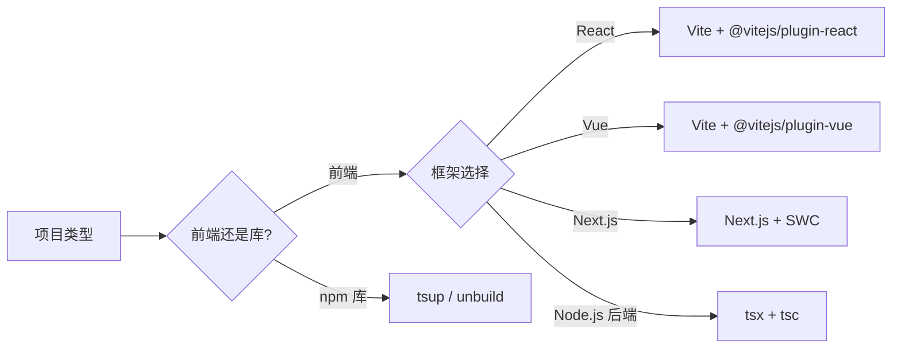

# 第15章 现代构建工具链集成

## 1. 核心概念

### 为什么 tsc 不适合做生产构建？

tsc 是 TypeScript 官方的编译器，但它有几个"天生缺陷"：

| 问题 | 原因 | 后果 |
|------|------|------|
| **慢** | tsc 要做类型检查 + 转译，是"双重工作" | 大型项目编译 > 30 秒 |
| **单文件输出** | tsc 不做打包，每个文件输出一个 JS 文件 | 前端项目需要额外打包工具 |
| **不处理非 JS 文件** | tsc 不认识 CSS / SVG / JSON 等 | 前端场景完全不可用 |
| **无 Tree Shaking** | tsc 不做死代码消除 | 输出体积大 |
| **无 HMR** | tsc 不做热模块替换 | 开发体验差 |

类比：tsc 就像一把瑞士军刀——什么都能干一点，但每个功能都不专精。专业厨房里，你有单独的厨师刀（esbuild/SWC 做转译）、单独的料理机（打包器）、单独的质检员（tsc 只做类型检查）。

**现代 TS 项目的最佳实践是：** 将"类型检查"和"代码转译"分离——tsc 只做类型检查（`tsc --noEmit`），用 esbuild / SWC / Babel 来做代码转译。这样既享受类型安全，又获得极速构建。

### 各工具处理 TS 的差异

| 工具 | 类型检查 | 转译方式 | 速度 | 适用场景 |
|------|---------|---------|------|---------|
| **tsc** | 完整检查 | 自己转译 | 慢 | 类型检查、库编译 |
| **esbuild** | 不做检查 | 快速转译 | 极快 | Vite 开发、快速原型 |
| **SWC** | 不做检查 | Rust 转译 | 极快 | Next.js、大型项目 |
| **Babel** | 不做检查 | 插件转译 | 中等 | 需要特殊 Babel 插件的项目 |
| **tsup** | 可选检查 | esbuild 转译 | 极快 | 打包 npm 库 |
| **unbuild** | 可选检查 | esbuild / mkdist | 快 | 库打包（支持多格式） |

### 类型检查与转译分离的原理

```typescript
// 源码（TypeScript）
function greet(name: string): string {
  return `Hello, ${name}`;
}

// tsc 的处理流程：类型检查 → 擦除类型 → 输出 JS
// 擦除类型后的结果：
function greet(name) {
  return `Hello, ${name}`;
}

// esbuild / SWC / Babel 的处理流程：仅擦除类型 → 输出 JS
// 它们跳过类型检查步骤，直接擦除类型注解
```

**关键洞察：** TypeScript 类型系统是"可擦除的"——去掉类型注解后就是合法的 JavaScript。这意味着任何工具都可以通过简单地把类型注解去掉来"编译"TS，而不需要真正运行类型检查器。

---

## 2. 典型问题与处理

### 问题 1：esbuild/SWC 不做类型检查导致类型错误逃逸

```typescript
// 源码（类型错误但 esbuild 不会报错）
function add(a: number, b: number): number {
  return a + b;
}

// 传了字符串，类型错误！
const result: number = add("hello", "world");
```

```bash
# Bad — 只运行 esbuild 构建
esbuild src/index.ts --bundle --outfile=dist/bundle.js

# ✅ 输出成功，没有任何错误提示！
# ✅ 运行时才发现 result 是 "helloworld" 而不是数字
```

```bash
# Good — 先类型检查，再构建
# 步骤 1：类型检查
tsc --noEmit

# 步骤 2：构建（esbuild 只负责快速转译）
esbuild src/index.ts --bundle --outfile=dist/bundle.js

# 或者用一条命令（npm scripts 中）
# "build": "tsc --noEmit && esbuild src/index.ts --bundle --outfile=dist/bundle.js"
```

```json
// Good — 在 CI 中分别配置类型检查和构建
{
  "scripts": {
    "type-check": "tsc --noEmit",
    "build": "tsc --noEmit && vite build",
    "type-check:watch": "tsc --noEmit --watch"
  }
}
```

**为什么不好：** esbuild 的设计哲学是"速度优先"。它假设开发者已经用其他工具（IDE、tsc）完成了类型检查，所以它跳过类型检查直接输出 JS。如果只依赖 esbuild，类型错误会悄无声息地逃逸到运行时。

**为什么好：** 在 CI 或构建脚本中先运行 `tsc --noEmit`，确保类型正确后再用 esbuild 构建。这样既享受 esbuild 的速度，又保留 tsc 的类型安全性。

### 问题 2：tsc 转译后的代码与 esbuild 转译后的代码行为差异

```typescript
// 源码
class MyClass {
  #privateField = 42;  // 真正私有字段（#）
  method() {
    return this.#privateField;
  }
}

const obj = { foo: "bar" };
const clone = { ...obj };
```

```javascript
// tsc (target: ES2021) 输出 — 保留 # 私有字段
class MyClass {
  #privateField = 42;
  method() {
    return this.#privateField;
  }
}
const obj = { foo: "bar" };
const clone = { ...obj };
```

```javascript
// tsc (target: ES5) 输出 — 用 WeakMap 模拟私有字段
var _MyClass_privateField;
class MyClass {
  constructor() {
    _MyClass_privateField.set(this, 42);
  }
  method() {
    return _MyClass_privateField.get(this);
  }
}
_MyClass_privateField = new WeakMap();
var obj = { foo: "bar" };
var clone = { __assign({}, obj) };  // 需要 __assign 辅助函数
```

```javascript
// esbuild (target: es2020) 输出
class MyClass {
  constructor() {
    this.#privateField = 42;  // esbuild 可能直接保留 # 语法
  }
  #privateField;
  method() {
    return this.#privateField;
  }
}
const obj = { foo: "bar" };
const clone = { ...obj };
```

**关键差异：** tsc 会对 `target` 以下的所有语法做降级处理（包括生成辅助函数），而 esbuild 只做语法转换不做 polyfill。这意味着相同的 `target` 设置在两个工具中可能产生不同的输出——esbuild 更"薄"（不做辅助函数），需要你自行处理 polyfill。

### 问题 3：使用 tsup 打包库时丢失类型声明

```typescript
// Bad — tsup 配置缺少 dts 选项

// tsup.config.ts
import { defineConfig } from "tsup";

export default defineConfig({
  entry: ["src/index.ts"],
  format: ["cjs", "esm"],
  // 没有配置 dts: true
});
// ❌ 打包结果缺少 .d.ts 文件，消费者无法获得类型提示
```

```typescript
// Good — 完整配置

// tsup.config.ts
import { defineConfig } from "tsup";

export default defineConfig({
  entry: ["src/index.ts"],
  format: ["cjs", "esm"],    // 同时输出 CJS 和 ESM
  dts: true,                  // 生成 .d.ts 声明文件
  clean: true,                // 构建前清理 dist
  sourcemap: true,
  minify: false,              // 库项目通常不压缩
  splitting: true,
  treeshake: true,
  external: ["react"],        // 外部依赖不打包
});
```

**为什么不好：** tsup 使用 esbuild 做转译，默认不生成类型声明文件。没有 `.d.ts` 的库在消费者项目中会丢失所有类型提示。

**为什么好：** `dts: true` 让 tsup 在打包后额外运行一次 `tsc --declaration` 来生成声明文件。这虽然增加了几秒时间，但保证了库的类型完整性。

---

## 3. 示例代码

### 使用 tsup 打包 npm 库的完整示例

```typescript
// tsup.config.ts
import { defineConfig } from "tsup";

export default defineConfig({
  // 入口文件
  entry: ["src/index.ts"],

  // 输出格式
  format: ["cjs", "esm"],
  outDir: "dist",

  // 类型声明
  dts: true,

  // 代码质量
  clean: true,
  sourcemap: true,
  minify: false,
  treeshake: true,
  splitting: true,

  // 外部依赖（不要打包进库中）
  external: [
    "react",
    "react-dom",
    "lodash",
  ],

  // 元数据
  banner: {
    js: "/** My Awesome Library v1.0.0 */",
  },
});
```

```json
// package.json
{
  "name": "my-awesome-lib",
  "version": "1.0.0",
  "type": "module",
  "main": "./dist/index.cjs",
  "module": "./dist/index.js",
  "types": "./dist/index.d.ts",
  "exports": {
    ".": {
      "import": {
        "types": "./dist/index.d.ts",
        "default": "./dist/index.js"
      },
      "require": {
        "types": "./dist/index.d.ts",
        "default": "./dist/index.cjs"
      }
    }
  },
  "scripts": {
    "build": "tsup",
    "dev": "tsup --watch",
    "type-check": "tsc --noEmit"
  },
  "devDependencies": {
    "tsup": "^8.0.0",
    "typescript": "^5.5.0"
  }
}
```

### 使用 unbuild 打包库

```typescript
// build.config.ts
import { defineBuildConfig } from "unbuild";

export default defineBuildConfig({
  entries: [
    "./src/index.ts",
    "./src/cli/index.ts",
  ],
  declaration: true,          // 生成声明文件
  clean: true,
  rollup: {
    emitCJS: true,            // 同时输出 CJS
    inlineDependencies: false, // 不内联依赖
  },
});
```

### Vite 项目完整构建配置

```typescript
// vite.config.ts
import { defineConfig } from "vite";
import react from "@vitejs/plugin-react";

export default defineConfig({
  plugins: [react()],

  // 开发服务器
  server: {
    port: 3000,
    open: true,
    proxy: {
      "/api": "http://localhost:8080",
    },
  },

  // 构建配置
  build: {
    target: "es2020",
    outDir: "dist",
    sourcemap: true,

    // Rollup 打包选项
    rollupOptions: {
      output: {
        manualChunks: {
          vendor: ["react", "react-dom"],
        },
      },
    },
  },

  // 路径别名（需与 tsconfig.json 保持一致）
  resolve: {
    alias: {
      "@": "/src",
    },
  },
});
```

### ESLint + Prettier 企业级配置

```javascript
// eslint.config.js（Flat Config 格式）
import tseslint from "typescript-eslint";
import eslint from "@eslint/js";
import prettier from "eslint-config-prettier";

export default tseslint.config(
  // 1. 全局忽略
  {
    ignores: ["dist/**", "node_modules/**", "*.js"],
  },

  // 2. 基础 ESLint 推荐规则
  eslint.configs.recommended,

  // 3. TypeScript 严格规则
  ...tseslint.configs.strictTypeChecked,
  ...tseslint.configs.stylisticTypeChecked,

  // 4. 自定义规则
  {
    rules: {
      // TypeScript 特有规则
      "@typescript-eslint/no-unused-vars": [
        "error",
        { argsIgnorePattern: "^_" },
      ],
      "@typescript-eslint/explicit-function-return-type": "warn",
      "@typescript-eslint/no-explicit-any": "warn",
      "@typescript-eslint/consistent-type-imports": "error",

      // 通用规则
      "no-console": ["warn", { allow: ["warn", "error"] }],
      "prefer-const": "error",
      "eqeqeq": ["error", "always"],
    },
  },

  // 5. 语言选项（指定项目 TS 配置）
  {
    languageOptions: {
      parserOptions: {
        projectService: true,
        tsconfigRootDir: import.meta.dirname,
      },
    },
  },

  // 6. 与 Prettier 兼容（必须放在最后）
  prettier,
);
```

```json
// .prettierrc
{
  "semi": true,
  "singleQuote": false,
  "tabWidth": 2,
  "trailingComma": "all",
  "printWidth": 100,
  "arrowParens": "always",
  "endOfLine": "lf"
}
```

---

## 4. 配置/环境示例

### 完整企业级构建流水线

```json
// package.json
{
  "name": "enterprise-ts-project",
  "type": "module",
  "scripts": {
    // --- 开发 ---
    "dev": "vite",
    "dev:next": "next dev",

    // --- 类型检查 ---
    "type-check": "tsc --noEmit",
    "type-check:watch": "tsc --noEmit --watch",

    // --- 构建 ---
    "build": "npm run type-check && vite build",
    "build:lib": "tsup",

    // --- 代码质量 ---
    "lint": "eslint .",
    "lint:fix": "eslint . --fix",
    "format": "prettier --write .",
    "format:check": "prettier --check .",

    // --- 测试 ---
    "test": "vitest run",
    "test:watch": "vitest",
    "test:coverage": "vitest run --coverage",

    // --- 完整 CI 检查 ---
    "ci": "npm run type-check && npm run lint && npm run format:check && npm run test && npm run build",

    // --- 清理 ---
    "clean": "rimraf dist .tsbuildinfo coverage"
  },
  "devDependencies": {
    "typescript": "^5.5.0",
    "vite": "^5.4.0",
    "vitest": "^1.6.0",
    "eslint": "^9.0.0",
    "typescript-eslint": "^8.0.0",
    "prettier": "^3.3.0",
    "eslint-config-prettier": "^9.1.0",
    "@types/node": "^20.0.0",
    "tsup": "^8.0.0"
  }
}
```

### 各工具的角色分工

```
开发阶段：
  IDE / VSCode → 实时类型检查
  vite dev     → esbuild 快速转译 + HMR
  eslint       → 代码风格检查
  prettier     → 代码格式化

构建阶段：
  tsc --noEmit → 完整类型检查（确保类型安全）
  vite build   → esbuild 转译 + Rollup 打包
  vitest run   → 运行测试

CI/CD 阶段：
  npm run ci   → type-check + lint + format:check + test + build

发布阶段：
  tsup         → 打包库（esbuild + tsc --declaration）
  changeset    → 版本管理和变更日志
```

### 不同类型项目的工具选择



| 项目类型 | 推荐工具链 | 类型检查方式 |
|---------|-----------|------------|
| React SPA | Vite + TypeScript | `tsc --noEmit` |
| Next.js | Next.js + SWC | Next.js 内置 |
| Node.js 后端 | tsx（开发）+ tsc（构建） | `tsc --noEmit` |
| npm 库 | tsup 或 unbuild | `tsup --dts` 内置 |
| 工具 CLI | tsup + esbuild | `tsc --noEmit` |
| Monorepo | Turborepo + tsup | 各包独立检查 |

---

## 5. 必须掌握的技能

| 技能 | 说明 | 优先级 |
|------|------|--------|
| 理解类型检查与转译分离 | 知道为什么 esbuild 不做类型检查 | 必需 |
| 使用 tsc --noEmit | 独立运行类型检查 | 必需 |
| 配置 tsup 打包库 | 正确配置 dts、format、external | 重要 |
| 理解 Vite 的 TS 处理方式 | Vite 使用 esbuild 做转译 | 重要 |
| 配置 ESLint + Prettier | 团队代码风格统一 | 重要 |
| 理解 target 与 polyfill 的关系 | esbuild 不做 polyfill | 重要 |
| 配置完整的 CI 流水线 | type-check + lint + test + build | 重要 |
| 选择正确的构建工具 | 根据项目类型选择工具链 | 必需 |

### 自我检查清单

- [ ] 我知道为什么现代项目将类型检查与构建分离
- [ ] 我能在 CI 中配置 `tsc --noEmit` 作为类型检查步骤
- [ ] 我能用 tsup 或 unbuild 打包一个带类型声明的 npm 库
- [ ] 我理解 Vite 使用 esbuild 转译 TS 而非 tsc
- [ ] 我能配置 ESLint Flat Config + Prettier
- [ ] 我知道 esbuild/SWC 不做类型检查是设计决策而非缺陷
- [ ] 我能为团队项目设计完整的开发/构建/检查流水线

---

> **一句话总结：** 现代 TS 工具链的精髓是"各司其职"——让专业的工具做专业的事：tsc 负责类型安全，esbuild/SWC 负责极速转译，打包器负责代码优化，ESLint/Prettier 负责代码风格。学会组合这些工具，而不是让一个工具做所有事。
