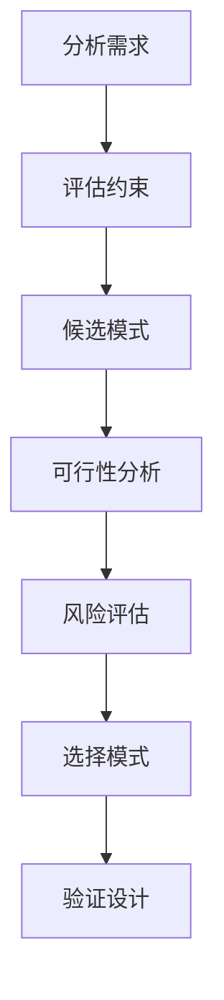

# 第1章 软件架构概述

软件架构是软件系统设计的高层抽象，它定义了系统的结构、组件、以及组件之间的关系。一个好的架构是项目成功的关键基础。

## 1.1 什么是软件架构

### 1.1.1 定义

软件架构是软件系统设计的基础，它包含了：

- **结构**：系统的组织方式，包括模块、组件、服务
- **行为**：组件之间的交互和通信方式
- **约束**：设计决策和原则
- **质量属性**：性能、安全性、可扩展性等非功能性需求

```java
// 一个典型的三层架构结构示例
public class ArchitectureStructure {
    // 表现层
    private PresentationLayer presentation;
    
    // 业务逻辑层
    private BusinessLayer business;
    
    // 数据访问层
    private DataAccessLayer dataAccess;
}
```

### 1.1.2 架构的层次

软件架构通常分为多个层次：

- **企业级架构**：整个企业的IT战略和系统规划
- **解决方案架构**：跨系统的集成方案
- **应用架构**：单个应用的设计
- **技术架构**：基础设施和技术选型

## 1.2 架构与设计的区别

### 1.2.1 设计 vs 架构

| 方面 | 软件设计 | 软件架构 |
|------|----------|----------|
| 关注点 | 具体的类、接口、方法 | 组件、模块、服务 |
| 粒度 | 细节层面 | 抽象层面 |
| 时机 | 设计阶段 | 架构规划阶段 |
| 变更成本 | 较低 | 较高 |

### 1.2.2 架构决策的重要性

架构决策影响整个项目生命周期：

- **技术选型**：决定团队使用的技术栈
- **团队组织**：影响团队协作方式
- **维护成本**：决定长期维护难度
- **扩展能力**：影响系统未来的演进

## 1.3 架构模式的重要性

### 1.3.1 什么是架构模式

架构模式是经过验证的解决方案，可以解决常见的架构问题。它提供：

- **经验复用**：利用前人的成功经验
- **标准化**：建立团队共同语言
- **降低风险**：避免重复踩坑
- **提高效率**：加速开发进程

### 1.3.2 常见架构模式分类

```
软件架构模式
├── 分层架构
│   ├── 单层架构
│   ├── 两层架构
│   ├── 三层架构
│   └── 多层架构
├── 客户端-服务器架构
├── 面向服务的架构（SOA）
├── 微服务架构
├── 事件驱动架构
├── 云原生架构
├── 空间架构
└── 管道与过滤器
```

## 1.4 如何选择合适的架构模式

### 1.4.1 决策因素

选择架构模式时需要考虑：

1. **业务需求**
   - 业务复杂度
   - 伸缩性需求
   - 一致性要求

2. **技术因素**
   - 团队技术能力
   - 现有技术栈
   - 基础设施

3. **组织因素**
   - 团队规模
   - 团队经验
   - 协作方式

4. **业务因素**
   - 上市时间
   - 预算限制
   - 维护周期

### 1.4.2 决策流程



### 1.4.3 模式选择指南

| 场景 | 推荐架构 |
|------|----------|
| 小型项目，团队小 | 单体架构 |
| 中型项目，需要分层 | 三层架构 |
| 大型项目，多团队 | 微服务架构 |
| 高并发，低延迟 | 事件驱动+缓存 |
| 快速迭代 | 微服务+容器化 |
| 云原生应用 | Serverless |

## 1.5 本章小结

本章介绍了软件架构的基本概念：

1. **软件架构**是系统设计的高层抽象，定义结构、行为和约束
2. **架构与设计**的区别在于粒度和关注点
3. **架构模式**是经过验证的解决方案，能降低风险提高效率
4. **选择架构**需要综合考虑业务、技术、组织等多方面因素

在下一章中，我们将学习架构设计的基本原则。