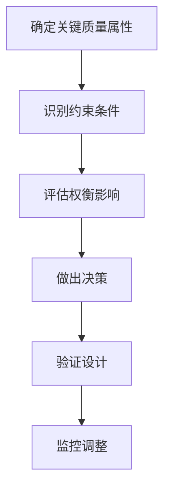

# 第3章 架构质量属性

架构质量属性是非功能性需求，决定了系统的可用性、可靠性和长期维护成本。理解这些属性是架构设计的核心。

## 3.1 性能（Performance）

### 3.1.1 定义

性能指系统响应请求的速度和吞吐量。

### 3.1.2 关键指标

- **响应时间**：请求到响应的时间
- **吞吐量**：单位时间处理的请求数
- **并发数**：同时处理的请求数
- **资源利用率**：CPU、内存、IO使用率

### 3.1.3 架构影响

```java
// 影响性能的关键因素
public class PerformanceConsiderations {
    // 1. 数据库查询 - N+1问题
    List<User> users = userRepository.findAll();
    for (User user : users) {
        // 每个用户都触发一次额外查询
        List<Order> orders = orderRepository.findByUserId(user.getId());
    }
    
    // 解决方案：使用JOIN或批量查询
    List<User> usersWithOrders = userRepository.findAllWithOrders();
    
    // 2. 缓存策略
    @Cacheable("user")
    public User getUserById(Long id) {
        return userRepository.findById(id);
    }
    
    // 3. 异步处理
    @Async
    public void sendEmailAsync(Email email) {
        emailService.send(email);
    }
}
```

### 3.1.4 性能优化策略

- 缓存：减少数据库访问
- 异步：非关键路径异步化
- 批处理：减少网络往返
- 索引：加速数据查询
- 负载均衡：分散请求压力
- CDN：加速静态资源访问

## 3.2 可用性（Availability）

### 3.2.1 定义

系统正常运行的时间比例，通常用"几个9"来表示。

| 可用性 | 年停机时间 | 说明 |
|--------|------------|------|
| 99% | 87.6小时 | 基本可用 |
| 99.9% | 8.76小时 | 较高可用 |
| 99.99% | 52.6分钟 | 高可用 |
| 99.999% | 5.26分钟 | 极高可用 |

### 3.2.2 架构模式

```java
// 高可用架构关键组件
public class HighAvailabilityArchitecture {
    // 1. 冗余部署
    private LoadBalancer loadBalancer;
    private List<ServiceInstance> instances;
    
    // 2. 健康检查
    @Component
    public class HealthCheck {
        @Scheduled(fixedRate = 30000)
        public void checkHealth() {
            for (ServiceInstance instance : instances) {
                if (!instance.isHealthy()) {
                    loadBalancer.remove(instance);
                }
            }
        }
    }
    
    // 3. 自动故障转移
    private void failover(ServiceInstance failed) {
        ServiceInstance backup = getBackup(failed);
        redirectTraffic(backup);
    }
}
```

### 3.2.3 可用性保障措施

- **冗余部署**：多副本部署
- **负载均衡**：流量分发
- **健康检查**：及时发现问题
- **自动故障转移**：快速恢复
- **多活架构**：跨地域容灾

## 3.3 可修改性（Modifiability）

### 3.3.1 定义

系统变更的难易程度，包括功能修改、性能调优、技术升级。

### 3.3.2 衡量指标

- **变更影响范围**：一次变更需要修改多少代码
- **变更成本**：变更所需的时间和精力
- **变更风险**：变更引入缺陷的可能性

### 3.3.3 架构实践

```java
// 模块化设计提高可修改性
// 模块A
moduleA {
    exports com.example.moduleA.api;
    
    provides ServiceA with ServiceAImpl;
}

// 模块B
moduleB {
    requires com.example.moduleA.api;
    
    inject ServiceA serviceA;
}

// 变更时：只需要修改相关模块，不影响其他模块
```

### 3.3.4 策略

- **模块化**：降低耦合
- **接口抽象**：隔离实现细节
- **配置外置**：减少代码修改
- **插件化**：热插拔功能

## 3.4 安全性（Security）

### 3.4.1 定义

保护系统免受未授权访问和恶意攻击的能力。

### 3.4.2 安全维度

```java
// 安全架构关键要素
public class SecurityArchitecture {
    // 1. 身份认证
    @PostMapping("/login")
    public Token login(Credentials credentials) {
        // 验证用户名密码
        // 生成令牌
        return tokenService.generate(credentials);
    }
    
    // 2. 权限控制
    @PreAuthorize("hasRole('ADMIN')")
    @DeleteMapping("/user/{id}")
    public void deleteUser(@PathVariable Long id) {
        userService.delete(id);
    }
    
    // 3. 数据加密
    @Encrypt
    private String sensitiveData;
    
    // 4. 输入验证
    @Valid
    private UserDTO userDTO;
    
    // 5. 安全审计
    @Auditable(action = "USER_DELETE")
    public void delete(Long id) {
        // 记录审计日志
        auditService.log("User deletion", id);
    }
}
```

### 3.4.3 安全措施

- **身份认证**：JWT、OAuth2、SAML
- **权限控制**：RBAC、ABAC
- **数据加密**：TLS、AES、RSA
- **输入验证**：白名单验证
- **审计日志**：完整操作记录
- **防护机制**：WAF、防DDoS

## 3.5 可测试性（Testability）

### 3.5.1 定义

系统可以被测试的难易程度。

### 3.5.2 架构影响

```java
// 依赖注入提高可测试性
public class UserServiceTest {
    // 使用Mock替代真实依赖
    private UserRepository mockRepository = mock(UserRepository.class);
    private UserService userService = new UserService(mockRepository);
    
    @Test
    public void testGetUserById() {
        // Arrange
        when(mockRepository.findById(1L)).thenReturn(new User(1L, "John"));
        
        // Act
        User result = userService.getUserById(1L);
        
        // Assert
        assertEquals("John", result.getName());
    }
}
```

### 3.5.3 提高可测试性的方法

- **依赖注入**：松耦合
- **接口抽象**：易Mock
- **单一职责**：简单测试
- **配置外置**：环境隔离
- **无副作用**：纯函数

## 3.6 可扩展性（Scalability）

### 3.6.1 定义

系统处理增长负载的能力，包括垂直扩展和水平扩展。

### 3.6.2 扩展类型

| 类型 | 描述 | 例子 |
|------|------|------|
| 垂直扩展 | 增加单机资源 | 升级CPU、内存 |
| 水平扩展 | 增加机器数量 | 加服务器 |
| 手动扩展 | 人工干预 | 手动扩容 |
| 自动扩展 | 根据负载自动 | K8s HPA |

### 3.6.3 架构模式

```java
// 无状态服务设计支持水平扩展
@Service
public class OrderService {
    // 不存储用户状态，可以无限制扩展
    private final OrderRepository repository;
    private final MessageProducer producer;
    
    // 状态存储在外部（Redis/数据库）
    public Order create(Order order) {
        Order saved = repository.save(order);
        producer.send("order.created", saved.getId());
        return saved;
    }
}

// 负载均衡器配置
@Configuration
public class LoadBalancerConfig {
    @Bean
    public IRule roundRobinRule() {
        return new WeightedResponseTimeRule();
    }
}
```

## 3.7 质量属性权衡

### 3.7.1 典型权衡

| 权衡 | 例子 |
|------|------|
| 性能 vs 安全 | 加密增加CPU开销 |
| 可用性 vs 成本 | 多活增加基础设施成本 |
| 扩展性 vs 复杂度 | 微服务增加系统复杂度 |
| 可测试性 vs 性能 | 过多的抽象层影响性能 |

### 3.7.2 决策框架



## 3.8 本章小结

本章介绍了六大架构质量属性：

1. **性能**：响应时间、吞吐量、并发能力
2. **可用性**：系统正常运行时间比例
3. **可修改性**：变更的难易程度
4. **安全性**：防护未授权访问
5. **可测试性**：可被测试的难易程度
6. **可扩展性**：处理增长负载的能力

这些属性相互关联，在架构设计时需要根据业务优先级进行权衡。理解这些属性有助于架构师做出更合理的设计决策。

--- 

在后续章节中，我们将详细学习各种架构模式，以及如何根据质量属性需求选择合适的架构。