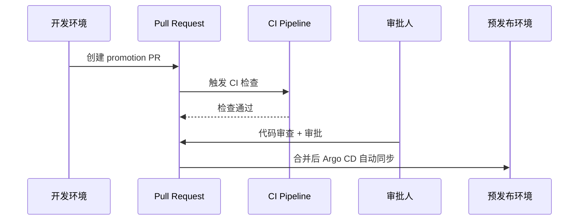
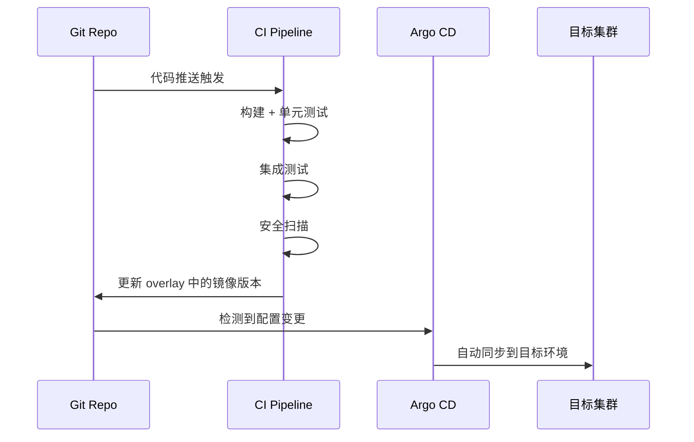

# 第6章 多环境管理与渐进式发布

> **本章覆盖内容：** 分支策略与环境映射、目录结构设计、环境间 Promotion 策略、ApplicationSet 多环境部署、完整实战案例、潜在风险与应对

---

## 6.1 分支策略与环境映射

### 6.1.1 解决的问题

在 GitOps 体系中，环境（开发、预发布、生产）与 Git 分支之间的关系是架构设计的首要决策。如果分支策略选择不当，会导致以下问题：

- **环境配置漂移**：不同环境使用不同分支，但缺乏同步机制，导致配置差异不可控
- **发布流程混乱**：开发人员不清楚代码应该合并到哪个分支才能触发对应环境的部署
- **回滚困难**：多分支并行时，难以追溯某个环境当前运行的是哪个版本的代码
- **合并冲突频繁**：分支间长期偏离，合并时产生大量冲突

分支策略的核心目标是建立 **"一次构建，多次部署"** 的可靠管道，同时保证每个环境的状态在 Git 中都有唯一且可追溯的表示。

### 6.1.2 核心原理

#### GitFlow 模式

GitFlow 是经典的分支模型，在 GitOps 环境中通常映射为：

```
main ────────────────●────────────────●── 生产环境
                      \              /
feature/my-feature ───●──●──●──────●── 开发环境
                         \
staging ─────────────────●──────────── 预发布环境
```

**环境-分支映射关系：**

| 环境 | Git 分支 | 说明 |
|------|----------|------|
| 生产 (prod) | `main` 或 `master` | 唯一长期分支，只接受来自 release 分支的合并 |
| 预发布 (staging) | `release/*` 或 `staging` | 从 main 分出，用于集成测试和验收 |
| 开发 (dev) | `feature/*` | 功能开发分支，完成后合并回 main |
| 测试 (qa) | `qa` | 可选，用于 QA 团队的独立测试 |

**Argo CD 中的映射实现：**

```yaml
# ApplicationSet 使用 SCM Provider Generator 按分支匹配环境
apiVersion: argoproj.io/v1alpha1
kind: ApplicationSet
metadata:
  name: gitflow-appset
spec:
  generators:
  - scmProvider:
      github:
        owner: my-company
        repo: my-app
        branchRef: true  # 启用分支引用
      filters:
      - branchMatch: "^main$"
        paths:
        - "environments/prod/*"
      - branchMatch: "^release/.*"
        paths:
        - "environments/staging/*"
      - branchMatch: "^feature/.*"
        paths:
        - "environments/dev/*"
  template:
    metadata:
      name: '{{ repository }}'
    spec:
      source:
        repoURL: https://github.com/my-company/my-app.git
        targetRevision: '{{ branch }}'
        path: '{{ path }}'
      destination:
        server: https://kubernetes.default.svc
        namespace: '{{ branch_normalized }}'
```

#### Trunk-Based Development (TBD) 模式

TBD 是云原生社区推荐的分支策略，所有开发人员频繁合并到主干分支（main），通过 **发布分支** 或 **标签** 来管理环境：

```
main ─────●──●──●──●──●──●──●──●──●── 所有环境共享主干
          │     │          │
          v     v          v
        dev    staging    prod
        (auto) (auto)    (manual gate)
```

**环境-分支映射关系：**

| 环境 | Git 引用 | 说明 |
|------|----------|------|
| 生产 (prod) | `tags/v*` 或 `release/v*` | 通过 Git 标签触发，经过审批 |
| 预发布 (staging) | `main` | 自动部署主干最新代码 |
| 开发 (dev) | `main` 或 `feature/*` | 自动部署，快速反馈 |

**Argo CD 中的标签驱动部署：**

```yaml
apiVersion: argoproj.io/v1alpha1
kind: ApplicationSet
metadata:
  name: tbd-appset
spec:
  generators:
  - git:
      repoURL: https://github.com/my-company/my-app.git
      revision: HEAD
      directories:
      - path: "environments/dev/*"
      - path: "environments/staging/*"
  - git:
      repoURL: https://github.com/my-company/my-app.git
      revision: "tags/v*"  # 生产环境只匹配标签
      directories:
      - path: "environments/prod/*"
  template:
    spec:
      source:
        repoURL: https://github.com/my-company/my-app.git
        targetRevision: '{{ branch }}'
        path: '{{ path }}'
```

### 6.1.3 代码/配置实现

**GitFlow 分支保护规则（GitHub Branch Protection）：**

```yaml
# .github/branch-protection.yml
branch_protection:
  - branch: main
    required_status_checks:
      contexts:
        - "ci/build"
        - "ci/test"
        - "ci/security-scan"
    required_pull_request_reviews:
      required_approving_review_count: 2
      dismiss_stale_reviews: true
    enforce_admins: true

  - branch: release/*
    required_status_checks:
      contexts:
        - "ci/build"
        - "ci/integration-test"
    required_pull_request_reviews:
      required_approving_review_count: 1
```

**TBD 分支保护规则：**

```yaml
# .github/branch-protection-tbd.yml
branch_protection:
  - branch: main
    required_status_checks:
      contexts:
        - "ci/lint"
        - "ci/test"
        - "ci/build"
        - "ci/e2e-test"
    required_pull_request_reviews:
      required_approving_review_count: 1
    required_linear_history: true  # 强制线性历史，禁止 merge commit
```

### 6.1.4 使用场景

| 场景 | 推荐策略 | 原因 |
|------|----------|------|
| 初创团队（1-5 人） | TBD | 流程轻量，快速迭代 |
| 中型团队（5-20 人） | TBD + 短生命周期特性分支 | 平衡速度与质量 |
| 大型企业（20+ 人） | GitFlow 或 Trunk-Based + Release Branches | 需要严格的发布管控 |
| 合规性要求高的行业 | GitFlow | 审计追踪需求 |
| 微服务架构 | TBD（每个服务独立） | 减少跨服务分支依赖 |

### 6.1.5 潜在风险与注意事项

- **GitFlow 的合并地狱**：长期存在的 release 分支与 main 分支偏离过大，合并时产生大量冲突。**建议**：release 分支生命周期不超过 1 周。
- **TBD 的稳定性风险**：未完成的功能直接合并到 main 可能破坏生产环境。**建议**：使用功能开关（Feature Flags）配合 TBD。
- **分支数量膨胀**：每个环境一个分支，当环境数量超过 5 个时，分支管理成本急剧上升。**建议**：环境数量控制在 3-4 个以内。
- **Argo CD 同步冲突**：多个 Application 监听同一个分支的不同路径时，需要确保路径互不重叠。

### 6.1.6 本章小结

分支策略是 GitOps 多环境管理的基石。TBD 适合追求交付速度的团队，GitFlow 适合需要严格管控的场景。无论选择哪种策略，核心原则是：**每个环境的状态在 Git 中有且仅有一个权威表示**。推荐大多数团队采用 TBD + 短生命周期特性分支 + 标签驱动发布的组合，在速度与安全之间取得平衡。

---

## 6.2 目录结构设计

### 6.2.1 解决的问题

Kubernetes 清单文件在 Git 仓库中的组织方式直接影响：

- **可维护性**：当应用数量增长到几十个时，混乱的目录结构会让运维人员迷失
- **可复用性**：不同环境之间的配置差异如何最小化重复
- **可读性**：新成员能否快速理解仓库布局
- **自动化能力**：CI/CD 管道能否通过目录结构推断部署目标

### 6.2.2 核心原理

#### 按环境分层（Environment-First）

```
gitops-repo/
├── apps/                          # 应用定义
│   ├── frontend/
│   │   ├── base/                  # 环境无关的基础配置
│   │   │   ├── deployment.yaml
│   │   │   ├── service.yaml
│   │   │   └── kustomization.yaml
│   │   └── overlays/              # 环境特定覆盖
│   │       ├── dev/
│   │       │   ├── kustomization.yaml
│   │       │   ├── replica-count.yaml
│   │       │   └── ingress-dev.yaml
│   │       ├── staging/
│   │       │   ├── kustomization.yaml
│   │       │   └── ingress-staging.yaml
│   │       └── prod/
│   │           ├── kustomization.yaml
│   │           ├── hpa.yaml
│   │           └── ingress-prod.yaml
│   └── backend/
│       ├── base/
│       └── overlays/
│           ├── dev/
│           ├── staging/
│           └── prod/
├── infra/                         # 基础设施配置
│   ├── base/
│   └── overlays/
│       ├── dev/
│       ├── staging/
│       └── prod/
└── clusters/                      # 集群级配置
    ├── dev-cluster/
    ├── staging-cluster/
    └── prod-cluster/
```

**特点：**
- 每个应用内部按环境组织 overlay
- 新增环境时，所有应用同步添加对应目录
- 适合 **应用数量少（<20）、环境数量固定** 的场景

#### 按应用分层（Application-First）

```
gitops-repo/
├── environments/                  # 环境入口
│   ├── dev/
│   │   ├── kustomization.yaml     # 引用所有 dev 应用
│   │   ├── frontend.yaml
│   │   └── backend.yaml
│   ├── staging/
│   │   ├── kustomization.yaml
│   │   ├── frontend.yaml
│   │   └── backend.yaml
│   └── prod/
│       ├── kustomization.yaml
│       ├── frontend.yaml
│       └── backend.yaml
├── apps/                          # 应用配置（环境无关）
│   ├── frontend/
│   │   ├── deployment.yaml
│   │   ├── service.yaml
│   │   └── kustomization.yaml
│   └── backend/
│       ├── deployment.yaml
│       ├── service.yaml
│       └── kustomization.yaml
└── config/                        # 环境特定配置值
    ├── dev/
    │   ├── frontend-config.yaml
    │   └── backend-config.yaml
    ├── staging/
    └── prod/
```

**特点：**
- 环境目录作为聚合入口，应用配置集中管理
- 新增应用时只需在 environments 目录下添加引用
- 适合 **应用数量多（20+）、环境数量少** 的场景

#### 混合模式（推荐）

```
gitops-repo/
├── apps/
│   ├── base/                      # 共享基础配置
│   │   ├── kustomization.yaml
│   │   ├── deployment.yaml
│   │   └── service.yaml
│   └── overlays/
│       ├── dev/
│       │   ├── kustomization.yaml
│       │   ├── dev-values.yaml
│       │   └── resource-patch.yaml
│       ├── staging/
│       │   ├── kustomization.yaml
│       │   └── staging-values.yaml
│       └── prod/
│           ├── kustomization.yaml
│           ├── prod-values.yaml
│           └── hpa.yaml
├── argocd/                        # Argo CD 配置
│   ├── projects/
│   │   ├── dev-project.yaml
│   │   ├── staging-project.yaml
│   │   └── prod-project.yaml
│   └── applicationsets/
│       ├── dev-appset.yaml
│       ├── staging-appset.yaml
│       └── prod-appset.yaml
├── clusters/                      # 集群注册
│   ├── dev-cluster.yaml
│   ├── staging-cluster.yaml
│   └── prod-cluster.yaml
└── policies/                      # 策略与合规
    ├── rbac/
    └── network-policies/
```

### 6.2.3 代码/配置实现

**Kustomize base 示例：**

```yaml
# apps/base/kustomization.yaml
apiVersion: kustomize.config.k8s.io/v1beta1
kind: Kustomization
resources:
- deployment.yaml
- service.yaml
commonLabels:
  app.kubernetes.io/managed-by: argocd
  app.kubernetes.io/part-of: my-app
```

**Kustomize overlay 示例（开发环境）：**

```yaml
# apps/overlays/dev/kustomization.yaml
apiVersion: kustomize.config.k8s.io/v1beta1
kind: Kustomization
namespace: myapp-dev
bases:
- ../../base
patchesStrategicMerge:
- resource-patch.yaml
configMapGenerator:
- name: app-config
  literals:
  - ENVIRONMENT=dev
  - LOG_LEVEL=debug
  - API_URL=https://api.dev.example.com
images:
- name: my-app
  newTag: latest
```

**Kustomize overlay 示例（生产环境）：**

```yaml
# apps/overlays/prod/kustomization.yaml
apiVersion: kustomize.config.k8s.io/v1beta1
kind: Kustomization
namespace: myapp-prod
bases:
- ../../base
patchesStrategicMerge:
- resource-patch.yaml
- hpa.yaml
configMapGenerator:
- name: app-config
  literals:
  - ENVIRONMENT=prod
  - LOG_LEVEL=info
  - API_URL=https://api.example.com
images:
- name: my-app
  newTag: v1.2.3  # 固定版本，由 CI 更新
replicas:
- name: my-app
  count: 5
```

### 6.2.4 使用场景

| 模式 | 适用场景 | 不适用场景 |
|------|----------|------------|
| 按环境分层 | 应用数量少，环境差异大 | 应用数量 > 30，目录嵌套过深 |
| 按应用分层 | 应用数量多，环境差异小 | 环境间配置差异巨大 |
| 混合模式 | 大多数中大型项目 | 小型项目（过度设计） |

### 6.2.5 潜在风险与注意事项

- **目录深度陷阱**：嵌套超过 4 层时，Kustomize 的 base 引用路径变得难以维护。**建议**：使用 `relativePath` 或统一管理 base 版本。
- **配置重复**：多个 overlay 中重复相同的 patch。**建议**：提取公共 patch 到 base 或使用 Kustomize 的 components 功能。
- **base 版本漂移**：不同环境的 overlay 引用了不同版本的 base。**建议**：使用 Git 子模块或 monorepo 确保 base 版本一致。
- **Argo CD 路径限制**：ApplicationSet 的 Git Generator 对目录深度有限制。**建议**：保持目录结构扁平化，不超过 3 层。

### 6.2.6 本章小结

目录结构设计是 GitOps 仓库的骨架。推荐采用 **混合模式**：应用配置按 Kustomize base/overlays 组织，环境入口在顶层聚合。核心原则是 **"base 定义是什么，overlay 定义差异"**，确保环境间配置差异最小化且可追溯。对于超过 50 个应用的大型组织，建议拆分为多个 Git 仓库（每个团队一个），而不是在单一仓库中堆叠。

---

## 6.3 Promotion 策略

### 6.3.1 解决的问题

Promotion（环境间提升）是 GitOps 多环境管理的核心流程。它解决以下问题：

- **如何确保代码在 dev → staging → prod 的传递过程中质量可控**
- **如何在发现生产问题时快速阻断 promotion**
- **如何平衡自动化效率与人工审批的安全性**
- **如何追踪每次 promotion 的内容和时间**

### 6.3.2 核心原理

Promotion 策略分为三个层次：

```
┌─────────────┐     ┌─────────────┐     ┌─────────────┐
│    Dev      │────>│   Staging   │────>│    Prod     │
│  (自动部署)  │     │ (自动+人工)  │     │  (人工审批)  │
└─────────────┘     └─────────────┘     └─────────────┘
       │                   │                    │
   CI 通过后          集成测试通过          变更审批通过
   自动同步           自动 promotion        手动 promotion
```

#### 手动 Promotion（PR-Based）

通过 Pull Request 将配置变更从一个环境提升到下一个环境：



#### 自动 Promotion（CI-Triggered）

CI 管道在测试通过后自动更新目标环境的配置：



#### Kustomize Image Update

使用 `kustomize edit set image` 命令自动更新镜像版本：

```bash
# CI 脚本：更新开发环境的镜像版本
kustomize edit set image my-app=registry.example.com/my-app:${CI_COMMIT_SHA}
kustomize build . > /tmp/manifest.yaml

# 提交到 Git
git add kustomization.yaml
git commit -m "chore: promote my-app to ${CI_COMMIT_SHA} in dev"
git push origin main
```

### 6.3.3 代码/配置实现

#### Promotion PR 自动化脚本

```bash
#!/bin/bash
# scripts/promote.sh
# 用法: ./promote.sh <from-env> <to-env> <image-tag>

set -euo pipefail

FROM_ENV=$1
TO_ENV=$2
IMAGE_TAG=$3
APP_NAME=${4:-my-app}

echo "=== Promoting ${APP_NAME} from ${FROM_ENV} to ${TO_ENV} ==="

# 验证源环境存在
if [ ! -d "apps/overlays/${FROM_ENV}" ]; then
  echo "ERROR: Source environment ${FROM_ENV} not found"
  exit 1
fi

# 验证目标环境存在
if [ ! -d "apps/overlays/${TO_ENV}" ]; then
  echo "ERROR: Target environment ${TO_ENV} not found"
  exit 1
fi

# 读取源环境的当前镜像版本
CURRENT_TAG=$(grep "newTag:" "apps/overlays/${FROM_ENV}/kustomization.yaml" | awk '{print $2}')
echo "Current tag in ${FROM_ENV}: ${CURRENT_TAG}"

# 更新目标环境的镜像版本
cd "apps/overlays/${TO_ENV}"
kustomize edit set image "${APP_NAME}=registry.example.com/${APP_NAME}:${IMAGE_TAG}"
cd -

echo "=== Promotion complete ==="
echo "Updated ${TO_ENV} to use image tag: ${IMAGE_TAG}"
```

#### GitHub Actions Promotion Workflow

```yaml
# .github/workflows/promote-to-staging.yml
name: Promote to Staging

on:
  workflow_dispatch:
    inputs:
      image_tag:
        description: 'Docker image tag to promote'
        required: true
      app_name:
        description: 'Application name'
        required: true
        default: 'my-app'

jobs:
  promote:
    runs-on: ubuntu-latest
    steps:
    - uses: actions/checkout@v4
      with:
        token: ${{ secrets.GITOPS_PAT }}

    - name: Setup Kustomize
      uses: imranismail/setup-kustomize@v2

    - name: Update staging overlay
      run: |
        cd apps/overlays/staging
        kustomize edit set image ${{ github.event.inputs.app_name }}=registry.example.com/${{ github.event.inputs.app_name }}:${{ github.event.inputs.image_tag }}

    - name: Commit and push
      run: |
        git config user.name "GitOps Bot"
        git config user.email "gitops@example.com"
        git add apps/overlays/staging/kustomization.yaml
        git commit -m "promote(${{ github.event.inputs.app_name }}): staging → ${{ github.event.inputs.image_tag }}"
        git push origin main
```

#### Promotion 审批流程（结合 GitHub Environments）

```yaml
# .github/workflows/promote-to-prod.yml
name: Promote to Production

on:
  workflow_dispatch:
    inputs:
      image_tag:
        description: 'Docker image tag to promote'
        required: true
      app_name:
        description: 'Application name'
        required: true
        default: 'my-app'

jobs:
  validate:
    runs-on: ubuntu-latest
    steps:
    - uses: actions/checkout@v4

    - name: Verify image exists in registry
      run: |
        docker manifest inspect registry.example.com/${{ github.event.inputs.app_name }}:${{ github.event.inputs.image_tag }}

    - name: Verify staging is healthy
      run: |
        # 调用监控系统检查 staging 环境健康状态
        curl -f https://api.staging.example.com/health

  promote:
    needs: validate
    runs-on: ubuntu-latest
    environment: production  # 需要 GitHub Environments 审批
    steps:
    - uses: actions/checkout@v4
      with:
        token: ${{ secrets.GITOPS_PAT }}

    - name: Setup Kustomize
      uses: imranismail/setup-kustomize@v2

    - name: Update prod overlay
      run: |
        cd apps/overlays/prod
        kustomize edit set image ${{ github.event.inputs.app_name }}=registry.example.com/${{ github.event.inputs.app_name }}:${{ github.event.inputs.image_tag }}

    - name: Commit and push
      run: |
        git config user.name "GitOps Bot"
        git config user.email "gitops@example.com"
        git add apps/overlays/prod/kustomization.yaml
        git commit -m "promote(${{ github.event.inputs.app_name }}): prod → ${{ github.event.inputs.image_tag }}"
        git push origin main
```

#### 自动 Promotion（CI 测试通过后自动触发）

```yaml
# .github/workflows/auto-promote-dev.yml
name: Auto Promote to Dev

on:
  push:
    branches:
    - main
    paths:
    - 'src/**'
    - 'Dockerfile'

jobs:
  build-and-test:
    runs-on: ubuntu-latest
    outputs:
      image_tag: ${{ steps.build.outputs.image_tag }}
    steps:
    - uses: actions/checkout@v4

    - name: Build and test
      run: |
        make build
        make test
        make integration-test

    - name: Build Docker image
      id: build
      run: |
        IMAGE_TAG=$(git rev-parse --short HEAD)
        docker build -t registry.example.com/my-app:${IMAGE_TAG} .
        docker push registry.example.com/my-app:${IMAGE_TAG}
        echo "image_tag=${IMAGE_TAG}" >> $GITHUB_OUTPUT

  promote-to-dev:
    needs: build-and-test
    runs-on: ubuntu-latest
    steps:
    - uses: actions/checkout@v4
      with:
        token: ${{ secrets.GITOPS_PAT }}

    - name: Setup Kustomize
      uses: imranismail/setup-kustomize@v2

    - name: Update dev overlay
      run: |
        cd apps/overlays/dev
        kustomize edit set image my-app=registry.example.com/my-app:${{ needs.build-and-test.outputs.image_tag }}

    - name: Commit and push
      run: |
        git config user.name "GitOps Bot"
        git config user.email "gitops@example.com"
        git add apps/overlays/dev/kustomization.yaml
        git commit -m "auto-promote(dev): ${{ needs.build-and-test.outputs.image_tag }}"
        git push origin main
```

### 6.3.4 使用场景

| 策略 | 适用场景 | 优势 | 劣势 |
|------|----------|------|------|
| 手动 PR | 生产环境 promotion | 可审计、可审批 | 速度慢，依赖人工 |
| 自动 CI 触发 | 开发/测试环境 | 快速反馈 | 可能引入不稳定变更 |
| Kustomize Image Update | 所有环境 | 精确控制镜像版本 | 需要 CI 权限 |
| 混合策略 | 大多数团队 | 平衡速度与安全 | 实现复杂度较高 |

### 6.3.5 潜在风险与注意事项

- **CI 失败阻断**：CI 管道失败导致 promotion 阻塞，即使失败与变更无关。**建议**：区分基础设施变更和应用变更的 CI 检查。
- **审批延迟**：等待审批人导致 promotion 积压。**建议**：设置审批 SLA，超时自动升级。
- **镜像标签覆盖**：多个 CI 构建使用相同的 `latest` 标签导致版本混乱。**建议**：始终使用不可变标签（Git SHA 或语义版本）。
- **Git 提交冲突**：CI 自动提交与人工提交产生冲突。**建议**：CI 提交使用独立的 bot 账号，并在提交前 rebase。
- **Promotion 回滚**：promotion 后发现问题的回滚流程。**建议**：使用 `git revert` 回退配置变更，而不是手动修改。

### 6.3.6 本章小结

Promotion 策略是 GitOps 多环境管理的核心流程。推荐采用 **分层策略**：开发环境全自动 promotion，预发布环境自动 promotion + 集成测试验证，生产环境手动 PR + 审批。使用 `kustomize edit set image` 作为镜像版本更新的标准方式，确保每次 promotion 都有明确的 Git 提交记录可追溯。

---

## 6.4 ApplicationSet 多环境部署

### 6.4.1 解决的问题

在管理多个环境时，如果为每个环境手动创建 Argo CD Application，会面临以下问题：

- **重复劳动**：每个环境都需要创建几乎相同的 Application 定义
- **配置漂移**：手动维护多个 Application 时，配置容易不一致
- **扩缩困难**：新增环境时需要复制粘贴大量配置
- **更新滞后**：修改部署策略时，需要逐个更新所有 Application

ApplicationSet 通过模板化生成机制，从单一配置源自动生成多个 Application，彻底解决上述问题。

### 6.4.2 核心原理

ApplicationSet 的核心是 **Generator + Template** 模式：

```
Generator (数据源)
    │
    ├── List Generator: 显式列表
    ├── Git Generator: 目录/文件
    ├── SCM Provider: GitHub/GitLab
    ├── Cluster Generator: 集群列表
    └── Matrix Generator: 组合多个
    │
    ▼
Template (模板)
    │
    ├── metadata.name: {{ env }}-{{ app }}
    ├── spec.source.path: apps/overlays/{{ env }}
    ├── spec.destination.namespace: {{ env }}
    └── spec.destination.server: {{ cluster }}
    │
    ▼
Application 实例
    ├── dev-my-app
    ├── staging-my-app
    └── prod-my-app
```

#### List Generator

最直观的生成器，通过显式列表定义环境：

```yaml
apiVersion: argoproj.io/v1alpha1
kind: ApplicationSet
metadata:
  name: multi-env-list
spec:
  generators:
  - list:
      elements:
      - env: dev
        cluster: https://kubernetes.default.svc
        namespace: myapp-dev
        replicas: 1
        ingressHost: dev.example.com
      - env: staging
        cluster: https://kubernetes.default.svc
        namespace: myapp-staging
        replicas: 3
        ingressHost: staging.example.com
      - env: prod
        cluster: https://kubernetes.default.svc
        namespace: myapp-prod
        replicas: 5
        ingressHost: www.example.com
  template:
    metadata:
      name: '{{ env }}-my-app'
    spec:
      project: default
      source:
        repoURL: https://github.com/my-company/gitops-repo.git
        targetRevision: HEAD
        path: 'apps/overlays/{{ env }}'
      destination:
        server: '{{ cluster }}'
        namespace: '{{ namespace }}'
      syncPolicy:
        automated:
          prune: true
          selfHeal: true
        syncOptions:
        - CreateNamespace=true
```

#### Git Generator（目录模式）

根据 Git 仓库中的目录结构自动生成 Application：

```yaml
apiVersion: argoproj.io/v1alpha1
kind: ApplicationSet
metadata:
  name: multi-env-git-dir
spec:
  generators:
  - git:
      repoURL: https://github.com/my-company/gitops-repo.git
      revision: HEAD
      directories:
      - path: "apps/overlays/*"
  template:
    metadata:
      name: '{{ path.basename }}-my-app'
    spec:
      project: default
      source:
        repoURL: https://github.com/my-company/gitops-repo.git
        targetRevision: HEAD
        path: '{{ path }}'
      destination:
        server: https://kubernetes.default.svc
        namespace: 'myapp-{{ path.basename }}'
      syncPolicy:
        automated:
          prune: true
          selfHeal: true
```

#### Git Generator（文件模式）

通过 YAML 文件定义环境参数，更灵活：

```yaml
# apps/overlays/dev/env-config.yaml
env: dev
replicas: 1
ingressHost: dev.example.com
resources:
  requests:
    cpu: 100m
    memory: 128Mi
  limits:
    cpu: 500m
    memory: 512Mi
```

```yaml
# ApplicationSet 使用文件模式
apiVersion: argoproj.io/v1alpha1
kind: ApplicationSet
metadata:
  name: multi-env-git-file
spec:
  generators:
  - git:
      repoURL: https://github.com/my-company/gitops-repo.git
      revision: HEAD
      files:
      - path: "apps/overlays/**/env-config.yaml"
  template:
    metadata:
      name: '{{ env }}-my-app'
    spec:
      project: default
      source:
        repoURL: https://github.com/my-company/gitops-repo.git
        targetRevision: HEAD
        path: 'apps/overlays/{{ env }}'
      destination:
        server: https://kubernetes.default.svc
        namespace: 'myapp-{{ env }}'
      syncPolicy:
        automated:
          prune: true
          selfHeal: true
```

#### Matrix Generator

组合多个生成器，实现更复杂的部署策略：

```yaml
apiVersion: argoproj.io/v1alpha1
kind: ApplicationSet
metadata:
  name: matrix-multi-env
spec:
  generators:
  - matrix:
      generators:
      - list:
          elements:
          - env: dev
          - env: staging
          - env: prod
      - list:
          elements:
          - app: frontend
            path: apps/frontend/overlays
          - app: backend
            path: apps/backend/overlays
          - app: worker
            path: apps/worker/overlays
  template:
    metadata:
      name: '{{ env }}-{{ app }}'
    spec:
      project: default
      source:
        repoURL: https://github.com/my-company/gitops-repo.git
        targetRevision: HEAD
        path: '{{ path }}/{{ env }}'
      destination:
        server: https://kubernetes.default.svc
        namespace: '{{ app }}-{{ env }}'
      syncPolicy:
        automated:
          prune: true
          selfHeal: true
```

### 6.4.3 代码/配置实现

#### 完整的多环境 ApplicationSet

```yaml
# argocd/applicationsets/multi-env-appset.yaml
apiVersion: argoproj.io/v1alpha1
kind: ApplicationSet
metadata:
  name: multi-env-appset
  namespace: argocd
spec:
  goTemplate: true
  goTemplateOptions:
  - missingKey=error
  generators:
  - list:
      elements:
      - env: dev
        cluster: https://kubernetes.default.svc
        namespace: myapp-dev
        targetRevision: main
        automatedPrune: true
        automatedSelfHeal: true
        wave: "-1"
      - env: staging
        cluster: https://kubernetes.default.svc
        namespace: myapp-staging
        targetRevision: main
        automatedPrune: true
        automatedSelfHeal: true
        wave: "0"
      - env: prod
        cluster: https://kubernetes.prod.example.com
        namespace: myapp-prod
        targetRevision: main
        automatedPrune: false
        automatedSelfHeal: false
        wave: "1"
  template:
    metadata:
      name: '{{ .env }}-my-app'
      labels:
        environment: '{{ .env }}'
        app.kubernetes.io/name: my-app
        app.kubernetes.io/managed-by: argocd
      annotations:
        argocd.argoproj.io/sync-wave: '{{ .wave }}'
    spec:
      project: default
      source:
        repoURL: https://github.com/my-company/gitops-repo.git
        targetRevision: '{{ .targetRevision }}'
        path: 'apps/overlays/{{ .env }}'
        plugin:
          name: kustomize
      destination:
        server: '{{ .cluster }}'
        namespace: '{{ .namespace }}'
      syncPolicy:
        automated:
          prune: '{{ .automatedPrune }}'
          selfHeal: '{{ .automatedSelfHeal }}'
        syncOptions:
        - CreateNamespace=true
        - ServerSideApply=true
        - ApplyOutOfSyncOnly=true
        retry:
          limit: 3
          backoff:
            duration: 10s
            factor: 2
            maxDuration: 3m
  templatePatch: |
    spec:
      source:
        kustomize:
          commonAnnotations:
            environment: '{{ .env }}'
            promoted-at: '{{ now }}'
```

#### 多集群多环境 ApplicationSet

```yaml
# argocd/applicationsets/multi-cluster-appset.yaml
apiVersion: argoproj.io/v1alpha1
kind: ApplicationSet
metadata:
  name: multi-cluster-appset
  namespace: argocd
spec:
  generators:
  - matrix:
      generators:
      - clusters: {}  # 从 Argo CD 注册的集群中获取
      - list:
          elements:
          - app: frontend
            path: apps/frontend/overlays
          - app: backend
            path: apps/backend/overlays
  template:
    metadata:
      name: '{{ name }}-{{ app }}'
      labels:
        environment: '{{ name }}'
        app: '{{ app }}'
    spec:
      project: default
      source:
        repoURL: https://github.com/my-company/gitops-repo.git
        targetRevision: HEAD
        path: '{{ path }}/{{ name }}'
      destination:
        server: '{{ server }}'
        namespace: '{{ app }}-{{ name }}'
      syncPolicy:
        automated:
          prune: true
          selfHeal: true
        syncOptions:
        - CreateNamespace=true
```

### 6.4.4 使用场景

| 生成器 | 适用场景 | 优势 | 劣势 |
|--------|----------|------|------|
| List Generator | 环境数量固定且较少（3-5 个） | 简单直观，参数明确 | 环境增加时需要手动更新 |
| Git Generator (目录) | 环境数量动态变化 | 自动发现新环境 | 目录结构受限 |
| Git Generator (文件) | 需要每个环境独立参数 | 灵活，参数丰富 | 文件数量多时管理复杂 |
| Matrix Generator | 多应用 × 多环境 | 组合能力强 | 配置复杂度高 |
| Cluster Generator | 多集群部署 | 自动发现集群 | 需要集群注册管理 |

### 6.4.5 潜在风险与注意事项

- **模板语法错误**：Go Template 语法错误导致 ApplicationSet 无法生成 Application。**建议**：使用 `goTemplate: true` 并开启 `missingKey=error` 选项。
- **生成器性能**：当环境数量超过 50 个时，Git Generator 的目录扫描可能变慢。**建议**：使用 `pathParamPrefix` 限制扫描范围。
- **同步波次冲突**：多个 Application 同时同步可能导致资源竞争。**建议**：使用 `sync-wave` 注解控制同步顺序。
- **删除级联**：删除 ApplicationSet 会级联删除所有生成的 Application。**建议**：使用 `preserveResourcesOnDeletion: true` 保护生产环境。
- **Secret 管理**：不同环境需要不同的 Secret。**建议**：使用 SealedSecrets 或 External Secrets Operator 按环境管理。

### 6.4.6 本章小结

ApplicationSet 是 Argo CD 多环境部署的核心工具。推荐使用 **List Generator + Matrix Generator** 的组合：List Generator 定义环境参数，Matrix Generator 组合应用和环境维度。核心原则是 **"模板化生成，参数化差异"**，确保所有环境的 Application 定义一致，差异仅体现在参数层面。

---

## 6.5 完整实战：多环境 GitOps 部署

### 6.5.1 解决的问题

本节将前面所有概念整合为一个完整的实战案例，展示从仓库结构到部署上线的全流程。

### 6.5.2 核心原理

实战案例的架构如下：

```
开发者提交代码
    │
    ▼
CI Pipeline (GitHub Actions)
    ├── 构建 Docker 镜像
    ├── 运行单元测试 + 集成测试
    └── 自动 promotion 到 dev 环境
    │
    ▼
GitOps 仓库 (配置变更)
    ├── 开发环境: 自动更新镜像版本
    ├── 预发布环境: PR 审批后更新
    └── 生产环境: 人工审批后更新
    │
    ▼
Argo CD (检测配置变更)
    ├── dev: 自动同步
    ├── staging: 自动同步
    └── prod: 手动同步
    │
    ▼
Kubernetes 集群
    ├── dev 命名空间
    ├── staging 命名空间
    └── prod 命名空间
```

### 6.5.3 代码/配置实现

#### 完整仓库结构

```
gitops-repo/
├── .github/
│   └── workflows/
│       ├── ci-build.yml              # CI 构建 + 自动 promotion 到 dev
│       ├── promote-to-staging.yml    # 手动 promotion 到 staging
│       └── promote-to-prod.yml       # 手动 promotion 到 prod（需审批）
├── apps/
│   ├── base/
│   │   ├── kustomization.yaml
│   │   ├── deployment.yaml
│   │   ├── service.yaml
│   │   └── ingress.yaml
│   └── overlays/
│       ├── dev/
│       │   ├── kustomization.yaml
│       │   ├── env-config.yaml
│       │   └── resource-patch.yaml
│       ├── staging/
│       │   ├── kustomization.yaml
│       │   ├── env-config.yaml
│       │   └── resource-patch.yaml
│       └── prod/
│           ├── kustomization.yaml
│           ├── env-config.yaml
│           ├── resource-patch.yaml
│           └── hpa.yaml
├── argocd/
│   ├── projects/
│   │   └── myapp-project.yaml
│   └── applicationsets/
│       └── multi-env-appset.yaml
├── scripts/
│   ├── promote.sh                    # Promotion 脚本
│   └── verify-env.sh                 # 环境健康检查
└── README.md
```

#### 基础配置

```yaml
# apps/base/deployment.yaml
apiVersion: apps/v1
kind: Deployment
metadata:
  name: my-app
  labels:
    app: my-app
spec:
  replicas: 1
  selector:
    matchLabels:
      app: my-app
  template:
    metadata:
      labels:
        app: my-app
    spec:
      containers:
      - name: my-app
        image: registry.example.com/my-app:latest
        ports:
        - containerPort: 8080
        livenessProbe:
          httpGet:
            path: /health
            port: 8080
          initialDelaySeconds: 10
          periodSeconds: 30
        readinessProbe:
          httpGet:
            path: /ready
            port: 8080
          initialDelaySeconds: 5
          periodSeconds: 10
        resources:
          requests:
            cpu: 100m
            memory: 128Mi
          limits:
            cpu: 500m
            memory: 256Mi
---
apiVersion: v1
kind: Service
metadata:
  name: my-app
spec:
  selector:
    app: my-app
  ports:
  - port: 80
    targetPort: 8080
  type: ClusterIP
```

```yaml
# apps/base/kustomization.yaml
apiVersion: kustomize.config.k8s.io/v1beta1
kind: Kustomization
resources:
- deployment.yaml
- service.yaml
commonLabels:
  app.kubernetes.io/name: my-app
  app.kubernetes.io/managed-by: argocd
```

#### 环境 Overlay 配置

```yaml
# apps/overlays/dev/kustomization.yaml
apiVersion: kustomize.config.k8s.io/v1beta1
kind: Kustomization
namespace: myapp-dev
bases:
- ../../base
patchesStrategicMerge:
- resource-patch.yaml
configMapGenerator:
- name: app-config
  literals:
  - ENVIRONMENT=dev
  - LOG_LEVEL=debug
  - API_URL=https://api.dev.example.com
images:
- name: registry.example.com/my-app
  newTag: abc1234  # 由 CI 自动更新
```

```yaml
# apps/overlays/dev/resource-patch.yaml
apiVersion: apps/v1
kind: Deployment
metadata:
  name: my-app
spec:
  replicas: 1
  template:
    spec:
      containers:
      - name: my-app
        resources:
          requests:
            cpu: 100m
            memory: 128Mi
          limits:
            cpu: 500m
            memory: 256Mi
```

```yaml
# apps/overlays/prod/kustomization.yaml
apiVersion: kustomize.config.k8s.io/v1beta1
kind: Kustomization
namespace: myapp-prod
bases:
- ../../base
patchesStrategicMerge:
- resource-patch.yaml
- hpa.yaml
configMapGenerator:
- name: app-config
  literals:
  - ENVIRONMENT=prod
  - LOG_LEVEL=info
  - API_URL=https://api.example.com
images:
- name: registry.example.com/my-app
  newTag: v1.2.3  # 由 promotion 流程更新
```

```yaml
# apps/overlays/prod/hpa.yaml
apiVersion: autoscaling/v2
kind: HorizontalPodAutoscaler
metadata:
  name: my-app
spec:
  scaleTargetRef:
    apiVersion: apps/v1
    kind: Deployment
    name: my-app
  minReplicas: 3
  maxReplicas: 10
  metrics:
  - type: Resource
    resource:
      name: cpu
      target:
        type: Utilization
        averageUtilization: 70
  - type: Resource
    resource:
      name: memory
      target:
        type: Utilization
        averageUtilization: 80
```

#### Argo CD 项目配置

```yaml
# argocd/projects/myapp-project.yaml
apiVersion: argoproj.io/v1alpha1
kind: AppProject
metadata:
  name: myapp
  namespace: argocd
spec:
  description: "My Application Project"
  sourceRepos:
  - 'https://github.com/my-company/gitops-repo.git'
  destinations:
  - namespace: 'myapp-dev'
    server: 'https://kubernetes.default.svc'
  - namespace: 'myapp-staging'
    server: 'https://kubernetes.default.svc'
  - namespace: 'myapp-prod'
    server: 'https://kubernetes.prod.example.com'
  clusterResourceWhitelist:
  - group: ''
    kind: Namespace
  - group: 'apps'
    kind: Deployment
  - group: 'autoscaling'
    kind: HorizontalPodAutoscaler
  roles:
  - name: dev-team
    description: "Development team access"
    policies:
    - p, proj:myapp:dev-team, applications, sync, myapp-dev/*, allow
    - p, proj:myapp:dev-team, applications, get, myapp-dev/*, allow
    groups:
    - my-company:dev-team
  - name: ops-team
    description: "Operations team access"
    policies:
    - p, proj:myapp:ops-team, applications, sync, myapp-prod/*, allow
    - p, proj:myapp:ops-team, applications, get, myapp-prod/*, allow
    - p, proj:myapp:ops-team, applications, sync, myapp-staging/*, allow
    groups:
    - my-company:ops-team
```

#### ApplicationSet 配置

```yaml
# argocd/applicationsets/multi-env-appset.yaml
apiVersion: argoproj.io/v1alpha1
kind: ApplicationSet
metadata:
  name: myapp-environments
  namespace: argocd
spec:
  goTemplate: true
  generators:
  - list:
      elements:
      - env: dev
        namespace: myapp-dev
        targetRevision: main
        automatedPrune: true
        automatedSelfHeal: true
        syncWave: "-5"
      - env: staging
        namespace: myapp-staging
        targetRevision: main
        automatedPrune: true
        automatedSelfHeal: true
        syncWave: "0"
      - env: prod
        namespace: myapp-prod
        targetRevision: main
        automatedPrune: false
        automatedSelfHeal: false
        syncWave: "10"
  template:
    metadata:
      name: '{{ .env }}-my-app'
      labels:
        environment: '{{ .env }}'
        app.kubernetes.io/name: my-app
      annotations:
        argocd.argoproj.io/sync-wave: '{{ .syncWave }}'
    spec:
      project: myapp
      source:
        repoURL: https://github.com/my-company/gitops-repo.git
        targetRevision: '{{ .targetRevision }}'
        path: 'apps/overlays/{{ .env }}'
      destination:
        server: https://kubernetes.default.svc
        namespace: '{{ .namespace }}'
      syncPolicy:
        automated:
          prune: '{{ .automatedPrune }}'
          selfHeal: '{{ .automatedSelfHeal }}'
        syncOptions:
        - CreateNamespace=true
        - ServerSideApply=true
        - ApplyOutOfSyncOnly=true
        retry:
          limit: 3
          backoff:
            duration: 5s
            factor: 2
            maxDuration: 3m
```

#### CI 构建与自动 Promotion

```yaml
# .github/workflows/ci-build.yml
name: CI Build and Auto-Promote

on:
  push:
    branches:
    - main
    paths:
    - 'src/**'
    - 'Dockerfile'
    - 'pom.xml'
    - 'Makefile'

env:
  REGISTRY: registry.example.com
  APP_NAME: my-app

jobs:
  build:
    runs-on: ubuntu-latest
    outputs:
      image_tag: ${{ steps.docker.outputs.image_tag }}
    steps:
    - uses: actions/checkout@v4

    - name: Set up JDK 17
      uses: actions/setup-java@v4
      with:
        java-version: '17'
        distribution: 'temurin'

    - name: Build and test
      run: |
        mvn clean package
        mvn test
        mvn verify

    - name: Security scan
      uses: aquasecurity/trivy-action@master
      with:
        scan-type: 'fs'
        scan-ref: '.'
        format: 'sarif'
        output: 'trivy-results.sarif'

    - name: Build and push Docker image
      id: docker
      run: |
        IMAGE_TAG=$(git rev-parse --short HEAD)
        docker build -t ${REGISTRY}/${APP_NAME}:${IMAGE_TAG} .
        docker push ${REGISTRY}/${APP_NAME}:${IMAGE_TAG}
        echo "image_tag=${IMAGE_TAG}" >> $GITHUB_OUTPUT

  promote-dev:
    needs: build
    runs-on: ubuntu-latest
    steps:
    - uses: actions/checkout@v4
      with:
        token: ${{ secrets.GITOPS_PAT }}

    - name: Setup Kustomize
      uses: imranismail/setup-kustomize@v2

    - name: Update dev overlay
      run: |
        cd apps/overlays/dev
        kustomize edit set image ${REGISTRY}/${APP_NAME}=${REGISTRY}/${APP_NAME}:${{ needs.build.outputs.image_tag }}

    - name: Commit and push
      run: |
        git config user.name "GitOps Bot"
        git config user.email "gitops@example.com"
        git add apps/overlays/dev/kustomization.yaml
        git commit -m "auto-promote(dev): ${{ needs.build.outputs.image_tag }}"
        git push origin main
```

#### Promotion 到预发布环境

```yaml
# .github/workflows/promote-to-staging.yml
name: Promote to Staging

on:
  workflow_dispatch:
    inputs:
      image_tag:
        description: 'Docker image tag to promote'
        required: true

jobs:
  verify-dev:
    runs-on: ubuntu-latest
    steps:
    - name: Check dev environment health
      run: |
        # 验证 dev 环境运行正常
        kubectl get pods -n myapp-dev -l app=my-app
        kubectl rollout status deployment/my-app -n myapp-dev --timeout=60s

  promote:
    needs: verify-dev
    runs-on: ubuntu-latest
    steps:
    - uses: actions/checkout@v4
      with:
        token: ${{ secrets.GITOPS_PAT }}

    - name: Setup Kustomize
      uses: imranismail/setup-kustomize@v2

    - name: Update staging overlay
      run: |
        cd apps/overlays/staging
        kustomize edit set image registry.example.com/my-app=registry.example.com/my-app:${{ github.event.inputs.image_tag }}

    - name: Commit and push
      run: |
        git config user.name "GitOps Bot"
        git config user.email "gitops@example.com"
        git add apps/overlays/staging/kustomization.yaml
        git commit -m "promote(staging): ${{ github.event.inputs.image_tag }}"
        git push origin main
```

#### Promotion 到生产环境

```yaml
# .github/workflows/promote-to-prod.yml
name: Promote to Production

on:
  workflow_dispatch:
    inputs:
      image_tag:
        description: 'Docker image tag to promote'
        required: true

jobs:
  validate:
    runs-on: ubuntu-latest
    steps:
    - name: Verify image exists
      run: |
        docker manifest inspect registry.example.com/my-app:${{ github.event.inputs.image_tag }}

    - name: Verify staging health
      run: |
        curl -f https://staging.example.com/health
        curl -f https://staging.example.com/ready

    - name: Run smoke tests
      run: |
        # 在 staging 环境运行冒烟测试
        curl -f https://staging.example.com/api/health
        curl -f https://staging.example.com/api/version | grep ${{ github.event.inputs.image_tag }}

  promote:
    needs: validate
    runs-on: ubuntu-latest
    environment:
      name: production
      url: https://www.example.com
    steps:
    - uses: actions/checkout@v4
      with:
        token: ${{ secrets.GITOPS_PAT }}

    - name: Setup Kustomize
      uses: imranismail/setup-kustomize@v2

    - name: Update prod overlay
      run: |
        cd apps/overlays/prod
        kustomize edit set image registry.example.com/my-app=registry.example.com/my-app:${{ github.event.inputs.image_tag }}

    - name: Commit and push
      run: |
        git config user.name "GitOps Bot"
        git config user.email "gitops@example.com"
        git add apps/overlays/prod/kustomization.yaml
        git commit -m "promote(prod): ${{ github.event.inputs.image_tag }}"
        git push origin main

  notify:
    needs: promote
    runs-on: ubuntu-latest
    steps:
    - name: Notify team
      run: |
        curl -X POST -H "Content-Type: application/json" \
          -d '{"text": "Production deployment complete: my-app@${{ github.event.inputs.image_tag }}"}' \
          ${{ secrets.SLACK_WEBHOOK_URL }}
```

#### Promotion 脚本

```bash
#!/bin/bash
# scripts/promote.sh
# 完整 promotion 脚本，支持跨环境提升

set -euo pipefail

APP_NAME=${APP_NAME:-my-app}
REGISTRY=${REGISTRY:-registry.example.com}
GITOPS_REPO=${GITOPS_REPO:-git@github.com:my-company/gitops-repo.git}

usage() {
  echo "Usage: $0 <from-env> <to-env> <image-tag>"
  echo "  from-env: dev, staging"
  echo "  to-env:   staging, prod"
  echo "  image-tag: Docker image tag"
  exit 1
}

if [ $# -ne 3 ]; then
  usage
fi

FROM_ENV=$1
TO_ENV=$2
IMAGE_TAG=$3

echo "=== Promoting ${APP_NAME} from ${FROM_ENV} to ${TO_ENV} ==="
echo "Image tag: ${IMAGE_TAG}"

# 验证环境参数
VALID_ENVS=("dev" "staging" "prod")
if [[ ! " ${VALID_ENVS[*]} " =~ " ${FROM_ENV} " ]]; then
  echo "ERROR: Invalid source environment: ${FROM_ENV}"
  exit 1
fi
if [[ ! " ${VALID_ENVS[*]} " =~ " ${TO_ENV} " ]]; then
  echo "ERROR: Invalid target environment: ${TO_ENV}"
  exit 1
fi

# 禁止从 prod 提升
if [ "${FROM_ENV}" = "prod" ]; then
  echo "ERROR: Cannot promote from production"
  exit 1
fi

# 克隆 GitOps 仓库
WORK_DIR=$(mktemp -d)
trap "rm -rf ${WORK_DIR}" EXIT

git clone --depth 1 "${GITOPS_REPO}" "${WORK_DIR}"
cd "${WORK_DIR}"

# 验证源环境存在
if [ ! -d "apps/overlays/${FROM_ENV}" ]; then
  echo "ERROR: Source environment ${FROM_ENV} not found"
  exit 1
fi

# 验证目标环境存在
if [ ! -d "apps/overlays/${TO_ENV}" ]; then
  echo "ERROR: Target environment ${TO_ENV} not found"
  exit 1
fi

# 验证镜像存在
echo "Verifying image: ${REGISTRY}/${APP_NAME}:${IMAGE_TAG}"
docker manifest inspect "${REGISTRY}/${APP_NAME}:${IMAGE_TAG}" > /dev/null 2>&1 || {
  echo "ERROR: Image not found: ${REGISTRY}/${APP_NAME}:${IMAGE_TAG}"
  exit 1
}

# 更新目标环境的镜像版本
cd "apps/overlays/${TO_ENV}"
kustomize edit set image "${REGISTRY}/${APP_NAME}=${REGISTRY}/${APP_NAME}:${IMAGE_TAG}"
cd -

# 提交变更
git add "apps/overlays/${TO_ENV}/kustomization.yaml"
git commit -m "promote(${TO_ENV}): ${APP_NAME} → ${IMAGE_TAG} (from ${FROM_ENV})"
git push origin main

echo "=== Promotion complete ==="
echo "Updated ${TO_ENV} to use ${APP_NAME}:${IMAGE_TAG}"
```

#### 环境健康检查脚本

```bash
#!/bin/bash
# scripts/verify-env.sh
# 验证环境健康状态

set -euo pipefail

ENV=$1
NAMESPACE="myapp-${ENV}"

echo "=== Verifying ${ENV} environment ==="

# 检查 Pod 状态
echo "--- Pod Status ---"
kubectl get pods -n "${NAMESPACE}" -l app=my-app -o wide

# 检查 Deployment 状态
echo "--- Deployment Status ---"
kubectl rollout status deployment/my-app -n "${NAMESPACE}" --timeout=30s

# 检查 Service
echo "--- Service ---"
kubectl get svc -n "${NAMESPACE}" my-app

# 检查 HPA（生产环境）
if [ "${ENV}" = "prod" ]; then
  echo "--- HPA ---"
  kubectl get hpa -n "${NAMESPACE}" my-app
fi

# 检查应用健康端点
echo "--- Health Check ---"
if [ "${ENV}" = "prod" ]; then
  curl -f https://www.example.com/health
elif [ "${ENV}" = "staging" ]; then
  curl -f https://staging.example.com/health
else
  curl -f https://dev.example.com/health
fi

echo "=== ${ENV} environment is healthy ==="
```

### 6.5.4 使用场景

本实战方案适用于：

- **中型微服务团队**（5-15 人）：管理 3-10 个微服务，3 个环境
- **需要合规审计**：每次 promotion 都有 Git 提交记录和审批记录
- **快速迭代 + 稳定发布**：开发环境自动部署，生产环境严格管控
- **多集群部署**：开发/预发布在共享集群，生产在独立集群

### 6.5.5 潜在风险与注意事项

- **GitOps PAT 权限过大**：CI 使用的 Personal Access Token 拥有仓库写入权限，泄露后风险极高。**建议**：使用最小权限的机器人账号，定期轮换 Token。
- **镜像标签冲突**：多个分支同时构建产生相同短 SHA 标签。**建议**：使用 `git rev-parse HEAD` 完整 SHA 或 `SHA-构建号` 组合。
- **同步延迟**：从 Git 提交到 Argo CD 同步完成有延迟（通常 30 秒到 3 分钟）。**建议**：设置合理的 `sync-wave` 和健康检查超时。
- **回滚复杂度**：回滚需要 revert Git 提交，然后等待 Argo CD 同步。**建议**：建立回滚 SOP，使用 `git revert` 而非 `git reset`。

### 6.5.6 本章小结

本实战案例展示了从仓库结构到 CI/CD 管道的完整多环境 GitOps 部署方案。核心流程是：**CI 构建 → 自动 promotion 到 dev → 手动 promotion 到 staging → 审批后 promotion 到 prod**。每个步骤都有明确的 Git 提交记录，Argo CD 自动检测配置变更并同步到目标环境。这套方案在交付速度与安全管控之间取得了良好的平衡。

---

## 6.6 潜在风险与应对策略

### 6.6.1 解决的问题

多环境 GitOps 在实践中会遇到各种风险，提前识别并制定应对策略是保障系统稳定性的关键。

### 6.6.2 核心原理

风险管理的核心是 **"预防为主，快速恢复"**：

```
风险识别 → 风险评估 → 预防措施 → 监控告警 → 应急响应 → 复盘改进
```

### 6.6.3 风险清单与应对

#### 风险 1：Promotion 阻塞

**表现：**
- CI 管道失败导致 promotion 无法进行
- 审批人长时间未响应
- 配置冲突导致 PR 无法合并

**应对策略：**

```yaml
# 设置 promotion 超时和自动升级
# .github/workflows/promotion-escalation.yml
name: Promotion Escalation

on:
  schedule:
  - cron: '*/30 * * * *'  # 每 30 分钟检查

jobs:
  check-stale-promotions:
    runs-on: ubuntu-latest
    steps:
    - uses: actions/github-script@v7
      with:
        script: |
          const stalePRs = await github.rest.pulls.list({
            owner: 'my-company',
            repo: 'gitops-repo',
            state: 'open',
            labels: ['promotion']
          });

          for (const pr of stalePRs.data) {
            const hoursSinceCreation = (Date.now() - new Date(pr.created_at).getTime()) / 3600000;

            if (hoursSinceCreation > 2) {
              // 超过 2 小时未处理，通知团队
              await github.rest.issues.createComment({
                owner: 'my-company',
                repo: 'gitops-repo',
                issue_number: pr.number,
                body: '⏰ This promotion PR has been pending for over 2 hours. Please review.'
              });

              // 添加 escalation 标签
              await github.rest.issues.addLabels({
                owner: 'my-company',
                repo: 'gitops-repo',
                issue_number: pr.number,
                labels: ['escalation']
              });
            }
          }
```

#### 风险 2：环境配置漂移

**表现：**
- 不同环境的 base 配置不一致
- 手动修改集群资源导致与 Git 状态偏离
- 配置复制粘贴导致差异累积

**应对策略：**

```yaml
# 使用 Argo CD 的自我修复和漂移检测
apiVersion: argoproj.io/v1alpha1
kind: ApplicationSet
metadata:
  name: drift-detection
spec:
  generators:
  - list:
      elements:
      - env: dev
      - env: staging
      - env: prod
  template:
    metadata:
      name: '{{ env }}-drift-check'
    spec:
      project: default
      source:
        repoURL: https://github.com/my-company/gitops-repo.git
        targetRevision: HEAD
        path: 'apps/overlays/{{ env }}'
      destination:
        server: https://kubernetes.default.svc
        namespace: 'myapp-{{ env }}'
      syncPolicy:
        automated:
          prune: true
          selfHeal: true  # 自动修复漂移
```

**配置漂移检测脚本：**

```bash
#!/bin/bash
# scripts/detect-drift.sh
# 检测环境配置漂移

set -euo pipefail

ENV=$1
NAMESPACE="myapp-${ENV}"

echo "=== Drift Detection: ${ENV} ==="

# 比较 Git 中的配置与集群中的实际状态
echo "--- Deployment ---"
kubectl get deployment my-app -n "${NAMESPACE}" -o yaml > /tmp/actual.yaml
kustomize build "apps/overlays/${ENV}" > /tmp/expected.yaml

# 使用 diff 比较（忽略自动生成的字段）
diff <(kubectl get deployment my-app -n "${NAMESPACE}" -o json | jq 'del(.metadata.resourceVersion, .metadata.uid, .metadata.creationTimestamp, .metadata.generation, .metadata.managedFields, .status)') \
     <(kustomize build "apps/overlays/${ENV}" | yq eval 'del(.metadata.resourceVersion, .metadata.uid, .metadata.creationTimestamp, .metadata.generation, .metadata.managedFields, .status)' -) \
     && echo "No drift detected" || echo "DRIFT DETECTED!"

echo "=== Drift check complete ==="
```

#### 风险 3：不一致的 Promotion 流程

**表现：**
- 开发人员跳过 staging 直接 promotion 到 prod
- 不同团队使用不同的 promotion 方式
- 紧急修复绕过正常流程

**应对策略：**

```yaml
# 使用 Argo CD 的 Sync Windows 控制 promotion 窗口
apiVersion: argoproj.io/v1alpha1
kind: AppProject
metadata:
  name: myapp
spec:
  syncWindows:
  - kind: deny
    schedule: '0 22 * * *'  # 每晚 10 点到早上 6 点禁止同步
    duration: 8h
    applications:
    - '*-prod-*'
    namespaces:
    - myapp-prod
    clusters:
    - https://kubernetes.prod.example.com
    manualSync: true  # 允许手动覆盖（紧急修复）

  - kind: allow
    schedule: '0 9 * * 1-5'  # 工作日早 9 点到晚 6 点允许同步
    duration: 9h
    applications:
    - '*-prod-*'
    namespaces:
    - myapp-prod
```

**Promotion 策略合规检查：**

```yaml
# .github/workflows/promotion-compliance.yml
name: Promotion Compliance Check

on:
  pull_request:
    branches:
    - main
    paths:
    - 'apps/overlays/prod/**'

jobs:
  check-promotion-path:
    runs-on: ubuntu-latest
    steps:
    - uses: actions/checkout@v4
      with:
        fetch-depth: 0

    - name: Verify promotion path
      run: |
        # 检查当前 prod 的镜像版本是否在 staging 中验证过
        PROD_TAG=$(grep "newTag:" apps/overlays/prod/kustomization.yaml | awk '{print $2}')
        STAGING_TAG=$(grep "newTag:" apps/overlays/staging/kustomization.yaml | awk '{print $2}')

        if [ "${PROD_TAG}" != "${STAGING_TAG}" ]; then
          echo "ERROR: Production tag ${PROD_TAG} does not match staging tag ${STAGING_TAG}"
          echo "All production promotions must first pass through staging"
          exit 1
        fi

        echo "Promotion path verified: staging → prod"

    - name: Check approval count
      uses: actions/github-script@v7
      with:
        script: |
          const { data: reviews } = await github.rest.pulls.listReviews({
            owner: context.repo.owner,
            repo: context.repo.repo,
            pull_number: context.issue.number,
          });

          const approvals = reviews.filter(r => r.state === 'APPROVED');
          if (approvals.length < 2) {
            core.setFailed('Production promotions require at least 2 approvals');
          }
```

#### 风险 4：Secret 管理

**表现：**
- Secret 明文存储在 Git 仓库中
- 不同环境使用相同的 Secret
- Secret 轮换困难

**应对策略：**

```yaml
# 使用 SealedSecrets 加密 Secret
apiVersion: bitnami.com/v1alpha1
kind: SealedSecret
metadata:
  name: my-app-secrets
  namespace: myapp-prod
spec:
  encryptedData:
    DB_PASSWORD: AgByPDbF...  # 加密后的值
    API_KEY: AgBx7Kf...      # 加密后的值
  template:
    metadata:
      name: my-app-secrets
    type: Opaque
```

```yaml
# 或使用 External Secrets Operator 从云服务商获取
apiVersion: external-secrets.io/v1beta1
kind: ExternalSecret
metadata:
  name: my-app-secrets
  namespace: myapp-prod
spec:
  secretStoreRef:
    name: aws-secrets-manager
    kind: SecretStore
  target:
    name: my-app-secrets
  data:
  - secretKey: DB_PASSWORD
    remoteRef:
      key: /myapp/prod/db-password
  - secretKey: API_KEY
    remoteRef:
      key: /myapp/prod/api-key
```

### 6.6.4 风险矩阵

| 风险 | 概率 | 影响 | 优先级 | 应对措施 |
|------|------|------|--------|----------|
| Promotion 阻塞 | 高 | 中 | 高 | 超时升级、备用审批人 |
| 配置漂移 | 中 | 高 | 高 | 自动修复、定期审计 |
| 流程不一致 | 中 | 高 | 高 | Sync Windows、合规检查 |
| Secret 泄露 | 低 | 极高 | 极高 | SealedSecrets、外部 Secret 存储 |
| 镜像漏洞 | 中 | 高 | 高 | 镜像扫描、策略即代码 |
| 回滚失败 | 低 | 极高 | 高 | 回滚演练、自动化回滚脚本 |

### 6.6.5 本章小结

多环境 GitOps 的风险管理需要建立 **"预防-检测-响应"** 三层防御体系。预防层通过分支保护、Sync Windows、合规检查等手段减少风险发生；检测层通过漂移检测、健康检查、镜像扫描等手段及时发现异常；响应层通过自动化回滚、超时升级、紧急修复通道等手段快速恢复。核心原则是：**生产环境变更必须可追溯、可审批、可回滚**。

---

## 6.7 本章总结

多环境管理与渐进式发布是 GitOps 实践中最具挑战性的环节。本章从分支策略、目录结构、Promotion 策略、ApplicationSet 部署、实战案例和风险管理六个维度进行了全面阐述。

**核心要点回顾：**

1. **分支策略**：推荐 Trunk-Based Development + 短生命周期特性分支，生产环境通过 Git 标签或发布分支管控
2. **目录结构**：推荐 Kustomize base/overlays 混合模式，base 定义通用配置，overlay 定义环境差异
3. **Promotion 策略**：分层策略——开发环境自动 promotion，预发布环境自动 + 验证，生产环境手动 + 审批
4. **ApplicationSet**：使用 List Generator + Matrix Generator 组合，模板化生成多环境 Application
5. **风险管理**：建立预防-检测-响应三层防御，重点关注 promotion 阻塞、配置漂移和流程一致性

**最佳实践清单：**

- [ ] 每个环境在 Git 中有唯一且可追溯的状态表示
- [ ] 使用 Kustomize overlay 管理环境差异，base 保持一致
- [ ] 生产环境 promotion 需要至少 2 人审批
- [ ] 使用不可变镜像标签（Git SHA 或语义版本）
- [ ] CI 自动 promotion 到开发环境，手动 promotion 到生产环境
- [ ] 使用 ApplicationSet 模板化生成多环境 Application
- [ ] 配置漂移检测和自动修复机制
- [ ] Secret 加密存储，禁止明文提交到 Git
- [ ] 建立 promotion 超时升级机制
- [ ] 定期进行回滚演练

**下一步学习：**

- 第 7 章将深入 Argo CD 的 **渐进式发布（Progressive Delivery）**，包括蓝绿部署、金丝雀发布、自动回滚等高级发布策略
- 学习 Argo Rollouts 与 Argo CD 的集成，实现更精细的流量管理和发布控制
