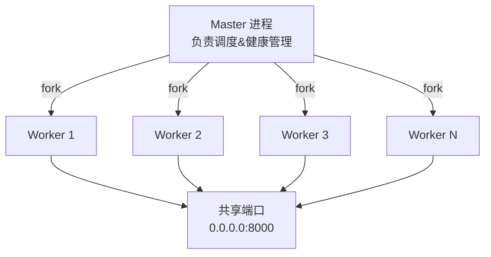

# 第3章 突破单线程瓶颈

> Node.js 单线程事件循环在处理 I/O 密集型任务时表现出色，但当面对 CPU 密集型计算时，单线程会成为性能瓶颈。本章深入探讨三种突破单线程限制的方案：`child_process`、`Cluster` 和 `Worker Threads`，分析它们的原理、风险以及最佳实践。

---

## 3.1 使用场景

Node.js 的应用场景早已超越简单的 Web 请求响应。以下场景中，单线程事件循环会导致请求阻塞，必须借助多进程/多线程来突破瓶颈：

**图片/视频处理**。使用 `sharp`、`fluent-ffmpeg` 等库进行图片缩放、格式转换、视频转码时，计算量极大。若在主线程上执行，后续请求将全部排队等待。主流做法是将处理任务派发到 Worker 线程或子进程，主线程只负责接收请求和返回结果。

**加密/解密大量数据**。`crypto` 模块的 `pbkdf2`、`scrypt`、`hash` 等操作是 CPU 密集型的。Node.js 虽对 `crypto.randomBytes` 等少数 API 提供了线程池支持（libuv 默认 4 个线程），但大量定制加密操作仍需显式分发到 Worker 线程以避免阻塞。

**大文件解析（CSV/JSON）**。解析数百 MB 的 CSV 或 JSON 文件时，`JSON.parse` 或流式解析本身是同步操作，会长时间占用事件循环。对于日志聚合、数据导入等场景，使用 Worker 线程进行解析可以保持主线程响应。

**多核 CPU 利用率提升**。Node.js 单进程只能使用一个 CPU 核，对于运行在多核服务器上的应用，这是一种资源浪费。Cluster 模块可以 Fork 出与 CPU 核数相同的 Worker 进程，实现真正的并行处理，将 CPU 利用率从 25%（四核单进程）提升到接近 100%。

---

## 3.2 实现原理

### 3.2.1 child_process —— 子进程的四种模式

`child_process` 模块提供了创建子进程的四种方式，底层全部基于 `libuv` 的 `uv_spawn`：

| 方法 | 用途 | 输出获取方式 | 适用场景 |
|------|------|-------------|---------|
| `spawn` | 启动子进程执行命令 | Stream（stdout/stderr） | 大量输出、长时间运行 |
| `exec` | 启动子进程执行命令 | Buffer（回调一次性返回） | 少量输出、简单脚本 |
| `execFile` | 直接执行可执行文件 | Buffer | 无需 Shell 的可执行文件 |
| `fork` | 衍生 Node.js 子进程 | IPC Channel | 进程间通信 |

**Pipe 机制**。`spawn` 的 `stdio` 选项控制子进程与父进程之间的管道关系。默认值为 `['pipe', 'pipe', 'pipe']`，即 stdin/stdout/stderr 都通过管道连接。可选项包括 `'pipe'`（管道）、`'inherit'`（继承父进程的 stdio）、`'ignore'`（忽略）、`'ipc'`（IPC 通道，用于 `send`/`message` 通信）。底层通过 `pipe()` 系统调用创建一对文件描述符，一个用于读端，一个用于写端。

**`fork` 的特殊性**。`fork` 是 `spawn` 的特化版本，固定创建 Node.js 子进程并自动建立 IPC 通道。子进程通过 `process.on('message')` 接收消息，通过 `process.send()` 发送消息。其本质是创建一个管道（pipe），但在此基础上封装了 JSON 序列化/反序列化，使父子进程可以像调用函数一样通信。

### 3.2.2 Cluster —— Master-Worker 模型

Cluster 模块建立在 `child_process.fork` 之上，但它不做简单的一对一 Fork：



**内核级负载均衡**。Cluster 的核心设计是多个 Worker 进程共享同一个端口。在 Linux 上，Cluster 利用 `SO_REUSEPORT` 套接字选项实现内核级负载均衡。当多个进程绑定到同一地址和端口时，操作系统内核负责将传入连接均匀分发到各个 Worker 进程。此时负载均衡发生在内核的 TCP 层，性能极高。

当 `SO_REUSEPORT` 不可用时（如旧版 Windows），Cluster 采用主进程轮转（Round-Robin）策略：主进程接受连接后，通过 IPC 将 `server.handle`（一个经过特殊序列化的底层句柄）轮转传递给各个 Worker。这种方式性能略低于内核级分发，但兼容性更好，也支持 `cluster.schedulingPolicy` 切换为 `cluster.SCHED_RR`。

### 3.2.3 Worker Threads —— 真正的线程

Worker Threads（`node:worker_threads`）是 Node.js 10+ 引入的真正线程模型。与 Cluster 的子进程不同，Worker 线程共享同一个进程地址空间，这意味着它们可以共享内存。

**消息传递（Message Passing）**。主线程和 Worker 线程通过 `postMessage` / `on('message')` 进行通信。每次调用 `postMessage`，数据会被**结构化克隆算法（Structured Clone Algorithm）** 克隆后传递给对方。结构化克隆支持 `Object`、`Array`、`Map`、`Set`、`RegExp`、`Date`、`ArrayBuffer`、`TypedArray`、`Error` 等类型，但不支持 `Function`、`Symbol`、`DOM 节点`。

**共享内存（SharedArrayBuffer）**。对于大块数值数据，消息克隆的开销不可忽视（例如一个 100MB 的 `Float64Array`，每次 `postMessage` 都会复制 100MB）。Worker Threads 支持 `SharedArrayBuffer`——一种可以在多个线程间共享的内存区域。主线程和 Worker 线程可以同时读写同一块内存，而无需复制。

```typescript
// 主线程
const sharedBuffer = new SharedArrayBuffer(1024);
const sharedArray = new Float64Array(sharedBuffer);
worker.postMessage(sharedBuffer); // 传递的是引用，不是副本
```

使用共享内存时必须借助 `Atomics` 对象进行同步，否则会出现数据竞争。

---

## 3.3 潜在风险

### 3.3.1 进程/线程创建开销

**fork 的 COW 页表复制**。`child_process.fork()` 和 `cluster.fork()` 底层调用 POSIX `fork()` 系统调用。`fork()` 使用写时复制（Copy-on-Write, COW）机制：子进程刚创建时共享父进程的物理内存页，只有在写入时才会复制页面。即便如此，`fork()` 仍需复制父进程的**页表**（page table），对于内存占用数百 MB 的 Node.js 进程（V8 堆、模块缓存、依赖加载），页表复制和 TLB 刷新成本不可忽视。创建 4-8 个 Worker 进程可能额外消耗数百 ms。

**Worker Thread 创建开销**。相比于 `fork()`，`Worker` 的创建开销更小（共享进程地址空间，无需复制页表），但仍需初始化 V8 实例、加载模块、创建事件循环。高频创建/销毁 Worker 会引发内存抖动。

### 3.3.2 postMessage 序列化成本

`postMessage` 使用结构化克隆算法对数据进行深拷贝。对于小型消息（几十 KB 以内），此开销可忽略。但对于大型对象（数 MB 的 JSON）、包含循环引用的复杂对象、或 `ArrayBuffer` 的大块数据，序列化/反序列化会显著阻塞发送方和接收方。

结构化克隆算法的限制包括：
- 不支持 `Function`、`Symbol`
- 不支持 `WeakMap`、`WeakRef`
- `Error` 对象在克隆后堆栈信息可能被截断
- 循环引用会抛出 `DataCloneError` 而非静默丢失数据

### 3.3.3 共享内存竞争条件

使用 `SharedArrayBuffer` 时，如果没有正确的同步机制，会出现典型的并发问题：

- **ABA 问题**：线程 A 读取值 X，线程 B 修改为 Y 再改回 X，线程 A 看到 X 认为没有变化，但实际上中间状态已改变。
- **读取-修改-写入（RMW）非原子性**：`sharedArray[i]++` 在底层是三步操作（读取、加一、写入），两个线程同时执行时会导致最终结果比预期少 1。
- **内存可见性**：现代 CPU 有多个核心和缓存层级（L1/L2/L3），线程 A 的写入可能在线程 B 中不可见，直到缓存行被同步。

### 3.3.4 Cluster 的 Sticky Session 问题

在非 `SO_REUSEPORT` 的场景下（例如 Windows 或 `SCHED_RR` 模式），Cluster 的 Round-Robin 分发对 HTTP 长连接场景（如 WebSocket、Server-Sent Events）会产生 Sticky Session 问题。Round-Robin 按连接分发，而 WebSocket 连接需要保持与首次握手相同的 Worker，否则握手信息丢失。解决方案包括：

- 在应用层维护 Session-Worker 映射（如使用 Redis 存储 session）
- 使用外部负载均衡器（Nginx、HAProxy）启用 `ip_hash` 或 `sticky sessions`

---

## 3.4 优化策略

### 3.4.1 Worker 池化（Pre-warm）

创建和销毁进程/线程是昂贵的操作。Worker 池（Worker Pool）模式在应用启动时预先创建固定数量的 Worker，任务到达时从池中取出空闲 Worker，处理完成后 Worker 回池复用。

```typescript
// Worker Pool 的核心设计
// 详细实现见 3.7 节示例代码

const pool = new WorkerPool('./worker.js', os.cpus().length);
await pool.run(largeTask);    // 复用 Worker，无需重新创建
await pool.run(anotherTask);  // 立即派发到其他空闲 Worker
```

**池化优势**：
- 消除每次任务创建/销毁 Worker 的开销
- 控制最大并行度，避免过量创建耗尽系统资源
- 支持任务排队，背压（backpressure）机制自然

### 3.4.2 并行度选择：os.cpus().length

并行度不是越大越好。创建多于 CPU 核数的 Worker 会导致：
- 上下文切换开销激增（CPU 时间片争抢）
- 内存压力增大（每个 Worker 独享 V8 堆）
- Cache Miss 率上升

**经验公式**：

| 任务类型 | 推荐并行度 |
|---------|-----------|
| CPU 密集型 | `os.cpus().length` |
| I/O 密集型 | `os.cpus().length * 2`（或更多） |
| 混合型 | `os.cpus().length` 为基础，逐步调整 |

```typescript
import { cpus } from 'node:os';
const POOL_SIZE = cpus().length; // 4-16 核的典型值
```

### 3.4.3 通信策略选择

不同数据类型适合不同的通信方式：

| 数据类型 | 推荐通信方式 | 原因 |
|---------|-------------|------|
| 小型对象 (<64KB) | `postMessage`（结构化克隆） | 克隆成本低，无竞争风险 |
| 大块数值数据 (>1MB) | `SharedArrayBuffer` + `Atomics` | 零拷贝共享，避免克隆开销 |
| 大块非数值数据 | `postMessage`（转移 ArrayBuffer） | 所有权转移，零拷贝 |
| 频繁更新的状态 | `SharedArrayBuffer` + `Atomics` | 避免消息队列压力 |

**ArrayBuffer 转移**。`postMessage` 支持将 `ArrayBuffer` 的所有权通过转移（transfer）方式移交给接收方。转移后发送方不再拥有该 `ArrayBuffer` 的访问权限，从而实现零拷贝：

```typescript
// 转移 ArrayBuffer 所有权（零拷贝）
const buffer = new ArrayBuffer(1024 * 1024 * 100); // 100MB
worker.postMessage(buffer, [buffer]);
// 此时 buffer.byteLength === 0，发送方无法再访问
```

### 3.4.4 消息合并与批处理

对于高频次的小消息，可以将消息合并为批次发送，减少进程间通信的次数：

```typescript
// 主线程：合并多个任务
const batch: Task[] = [];
const BATCH_INTERVAL = 50; // ms

function flushBatch() {
  if (batch.length > 0) {
    worker.postMessage({ type: 'batch', tasks: batch.splice(0) });
  }
}
setInterval(flushBatch, BATCH_INTERVAL);
```

---

## 3.5 典型问题处理

### 3.5.1 Cluster 模式下内存无法共享

Cluster 的每个 Worker 是独立的操作系统进程，拥有独立的 V8 堆。这意味着：

- 一个 Worker 中加载的大型模块（如 `sharp` 的 native 库镜像）不会在 Worker 间共享
- 缓存数据（如内存中的 Session）不会被其他 Worker 访问
- 内存开销 ≈ 单进程内存 × Worker 数量

**解决方案**：
- 共享数据使用 Redis、Memcached 等外部存储
- 使用 Worker Threads 替代 Cluster（共享进程地址空间）
- 对于只读的模块缓存，考虑使用 `require.cache` 的共享策略（但实际受限于进程隔离）

### 3.5.2 cluster.on('disconnect') 自动重启

Cluster 提供了 Worker 健康管理机制。当 Worker 因未捕获异常、内存溢出或外部信号退出时，Master 通过 `'exit'` 事件感知并自动 Fork 新 Worker：

```typescript
cluster.on('exit', (worker, code, signal) => {
  console.log(`Worker ${worker.process.pid} exited (code=${code}, signal=${signal})`);
  // 自动重启——但需要限制重启频率，防止频繁崩溃循环
  if (Date.now() - lastRestart > 5000) {
    cluster.fork();
    lastRestart = Date.now();
  }
});
```

**危险**：如果不加节流限制，Worker 持续崩溃会导致 Master 无限 Fork，最终耗尽系统资源。建议记录重启时间戳，限制 5 秒内最多重启一次。

### 3.5.3 ArrayBuffer.transfer 零拷贝移交所有权

Worker Threads 中，可以使用 `postMessage` 的 transferList 参数移交 `ArrayBuffer` 的所有权。这与共享内存不同：

- **所有权移交**：发送方失去访问权限，接收方获得唯一所有权
- **共享内存**：双方同时可读写，需要同步

所有权移交适用于"一次写入、一次消费"的场景：

```typescript
// 主线程
const buf = new ArrayBuffer(1024 * 1024);
worker.postMessage({ buf }, [buf]); // buf 被移交给 Worker

// Worker 线程
parentPort.on('message', ({ buf }) => {
  // 此时 buf 归 Worker 唯一所有
  const view = new Uint8Array(buf);
  // 处理完成后再传回主线程
});
```

### 3.5.4 isMainThread 区分主线程/Worker

`worker_threads` 模块提供 `isMainThread` 布尔值，用于在同一个文件中编写主线程和 Worker 代码：

```typescript
import { Worker, isMainThread, parentPort, workerData } from 'node:worker_threads';

if (isMainThread) {
  // 主线程代码：创建 Worker
  const worker = new Worker(__filename, {
    workerData: { filePath: './data.csv' }
  });
  worker.on('message', console.log);
} else {
  // Worker 线程代码：处理数据
  const { filePath } = workerData;
  // 处理逻辑...
  parentPort!.postMessage({ done: true });
}
```

这种方式避免了将 Worker 代码拆分到独立文件，适合小型任务。对于大型任务，建议将 Worker 代码分离到独立文件，保持代码结构的清晰。

---

## 3.6 开发者技能

### 3.6.1 cluster.schedulingPolicy

`cluster.schedulingPolicy` 控制 Cluster 的负载均衡策略：

```typescript
import cluster from 'node:cluster';

// Round-Robin（主进程轮转分发）
cluster.schedulingPolicy = cluster.SCHED_RR;
// 等效于设置环境变量 NODE_CLUSTER_SCHED_POLICY=rr

// 操作系统默认策略（每个平台不同）
cluster.schedulingPolicy = cluster.SCHED_NONE;
// 等效于设置环境变量 NODE_CLUSTER_SCHED_POLICY=none
```

- `SCHED_RR`：主进程接受连接，轮转分发给 Worker。兼容性好，所有平台支持
- `SCHED_NONE`：依赖操作系统特性（如 `SO_REUSEPORT`）。Linux 上性能更好，但不支持 Unix Socket 和 Windows

**最佳实践**：在 Linux 生产环境使用 `SCHED_NONE`，在其他平台使用 `SCHED_RR`。

### 3.6.2 receiveMessageOnPort 同步接收

`worker_threads` 模块提供了 `receiveMessageOnPort(port)` 方法，用于**同步**检查消息队列中是否有待处理的消息：

```typescript
import { receiveMessageOnPort, MessageChannel } from 'node:worker_threads';

const { port1, port2 } = new MessageChannel();
port2.postMessage({ hello: 'world' });

const message = receiveMessageOnPort(port1);
console.log(message); // { message: { hello: 'world' } }
```

此方法在需要轮询消息但不适合使用事件监听器的场景中很有用。不过，多数情况下应优先使用 `on('message')` 异步监听。

### 3.6.3 child_process 的 stdio 配置

`child_process.spawn` 的 `stdio` 选项提供了细粒度的 IO 控制：

```typescript
import { spawn } from 'node:child_process';

// 自定义 stdio 配置
const child = spawn('node', ['worker.js'], {
  stdio: [
    'pipe',   // stdin: pipe（管道）
    'pipe',   // stdout: pipe（捕获输出）
    'pipe',   // stderr: pipe（捕获错误）
  ]
});

// 子进程的 stdout 与父进程共享
const child2 = spawn('node', ['worker.js'], {
  stdio: ['ignore', process.stdout, process.stderr]
});

// 通过 IPC 通道通信
const child3 = spawn('node', ['worker.js'], {
  stdio: ['pipe', 'pipe', 'pipe', 'ipc']
});
child3.on('message', (msg) => console.log(msg));
child3.send({ type: 'task', data: '...' });
```

**三种典型配置**：

| stdio 配置 | 用途 | 行为 |
|-----------|------|------|
| `['pipe', 'pipe', 'pipe']` | 捕获输出 | 通过 `child.stdout` 流读取 |
| `['pipe', process.stdout, process.stderr]` | 日志传递 | 子进程日志直接输出到父进程终端 |
| `['ignore', 'pipe', 'pipe', 'ipc']` | IPC 通信 | 禁用 stdin，通过 IPC 通道通信 |

---

## 3.7 示例代码

### 3.7.1 WorkerPool —— Worker 线程池

以下实现了一个通用的 Worker 线程池。它在启动时预先创建固定数量的 Worker，管理任务队列，自动将任务派发给空闲 Worker：

```typescript
// worker-pool.ts
import { Worker, isMainThread, parentPort, workerData } from 'node:worker_threads';
import { cpus } from 'node:os';

export class WorkerPool {
  private workers: Worker[] = [];
  private queue: Array<{ data: any; resolve: (v: any) => void; reject: (e: Error) => void }> = [];
  private busyWorkers: Set<Worker> = new Set();
  private pendingTasks: Array<{ resolve: (v: any) => void; reject: (e: Error) => void }> = [];

  constructor(workerFile: string, poolSize = cpus().length) {
    for (let i = 0; i < poolSize; i++) {
      const worker = new Worker(workerFile);
      worker.on('message', (result) => {
        // FIFO 顺序，取最早未完成的 Promise 并 resolve
        const pending = this.pendingTasks.shift();
        pending?.resolve(result);
        this.busyWorkers.delete(worker);
        this.processNext();
      });
      worker.on('error', (err) => {
        const pending = this.pendingTasks.shift();
        pending?.reject(err);
        this.busyWorkers.delete(worker);
        this.processNext();
      });
      this.workers.push(worker);
    }
  }

  run(data: any): Promise<any> {
    return new Promise((resolve, reject) => {
      this.queue.push({ data, resolve, reject });
      this.processNext();
    });
  }

  private processNext() {
    const worker = this.workers.find(w => !this.busyWorkers.has(w));
    if (!worker || this.queue.length === 0) return;
    this.busyWorkers.add(worker);
    const task = this.queue.shift()!;
    this.pendingTasks.push({ resolve: task.resolve, reject: task.reject });
    worker.postMessage(task.data);
  }

  async terminate() {
    for (const w of this.workers) {
      await w.terminate();
    }
    this.workers = [];
    this.queue = [];
    this.busyWorkers.clear();
  }
}
```

**配套 Worker 文件**（`crypto-worker.ts`）：

```typescript
import { parentPort } from 'node:worker_threads';
import { pbkdf2Sync } from 'node:crypto';

parentPort!.on('message', (data: { password: string; salt: string; iterations: number }) => {
  const { password, salt, iterations } = data;
  const key = pbkdf2Sync(password, salt, iterations, 32, 'sha512');
  parentPort!.postMessage(key.toString('hex'));
});
```

**使用示例**：

```typescript
import { WorkerPool } from './worker-pool';

const pool = new WorkerPool('./crypto-worker.ts');
const results = await Promise.all([
  pool.run({ password: 'pass1', salt: 'salt1', iterations: 100000 }),
  pool.run({ password: 'pass2', salt: 'salt2', iterations: 100000 }),
  pool.run({ password: 'pass3', salt: 'salt3', iterations: 100000 }),
]);
console.log(results); // 三个加密任务在三个 Worker 上并行执行
await pool.terminate();
```

### 3.7.2 Cluster 负载均衡

以下代码创建一个 Cluster 模式的 HTTP 服务，Master 进程 Fork 多个 Worker，每个 Worker 独立处理请求：

```typescript
// cluster.ts
import cluster from 'node:cluster';
import { cpus } from 'node:os';
import http from 'node:http';

if (cluster.isPrimary) {
  const numCpus = cpus().length;
  console.log(`Primary ${process.pid} forking ${numCpus} workers`);

  for (let i = 0; i < numCpus; i++) {
    cluster.fork();
  }

  cluster.on('exit', (worker, code, signal) => {
    console.log(`Worker ${worker.process.pid} died. Restarting...`);
    cluster.fork();
  });
} else {
  http.createServer((req, res) => {
    res.writeHead(200);
    res.end(`Worker ${process.pid} handled request\n`);
  }).listen(8000);
}
```

**部署与验证**：

```bash
# 启动
$ node cluster.ts
Primary 12345 forking 8 workers

# 测试（多次请求，观察不同 Worker 响应）
$ for i in $(seq 1 10); do curl http://localhost:8000; done
Worker 12346 handled request
Worker 12347 handled request
Worker 12346 handled request
Worker 12348 handled request
# 8 个 Worker 轮流处理请求
```

### 3.7.3 child_process 管道通信

```typescript
// parent.ts
import { spawn } from 'node:child_process';
import { join } from 'node:path';

const child = spawn('node', [join(__dirname, 'child-script.mjs')], {
  stdio: ['pipe', 'pipe', 'pipe', 'ipc']
});

child.stdout.on('data', (data) => {
  console.log(`stdout: ${data}`);
});

child.on('message', (msg) => {
  console.log(`IPC message from child:`, msg);
  child.send({ reply: 'ack' });
});

child.stdin.write('Hello from parent\n');
```

---

## 3.8 小结

Node.js 提供了层次化的并发方案，每种方案有其适用场景和权衡：

| 方案 | 进程/线程 | 内存隔离 | 通信方式 | 适用场景 |
|------|----------|---------|---------|---------|
| `child_process` | 独立进程 | 完全隔离 | Pipe / IPC | 执行外部命令、解耦任务 |
| `cluster` | 独立进程 | 完全隔离 | IPC（共享端口） | 多核 HTTP 服务 |
| `worker_threads` | 线程（共享地址空间） | 部分共享 | postMessage / SharedArrayBuffer | CPU 密集型计算 |

**选择原则**：
- 需要最大稳定性与隔离性 → `child_process`
- 需要横向扩展 HTTP 服务 → `cluster`
- 需要高性能 CPU 计算 + 共享数据 → `worker_threads`
- 需要共享内存 + 大块数据传输 → `worker_threads` + `SharedArrayBuffer`
- 需要执行外部脚本或命令 → `child_process.spawn` / `exec`

在实际项目中，三者经常组合使用：Cluster 用于扩展 HTTP 服务容量，每个 Worker 内部使用 Worker Threads 池处理 CPU 密集型任务，对于个别需调用外部工具的任务则使用 `child_process`。