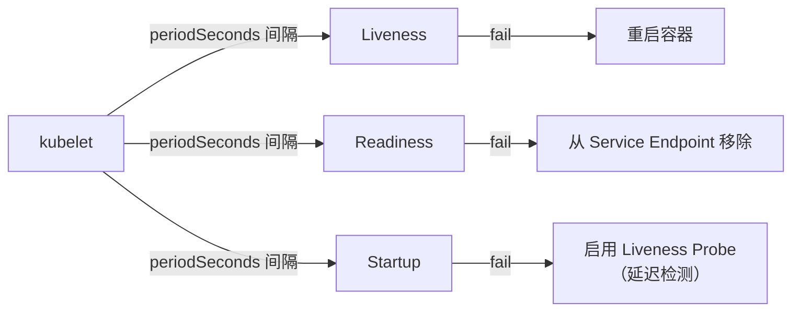

# 第12章 容器化部署与进程守护

## 12.1 使用场景

容器化部署已成为 Node.js 应用上生产的标准方式，主要解决以下痛点：

- **环境一致性**："在我机器上能跑"的问题——通过 Docker 将运行环境（Node 版本、系统依赖、时区设置）与代码打包成不可变镜像，确保开发、测试、生产三环境一致。
- **弹性伸缩**：Kubernetes 根据 CPU/内存指标自动调整 Pod 副本数，应对流量波峰波谷。
- **进程守护与自动恢复**：PM2 在单机层面守护进程（崩溃重启、内存超限自动重启），Kubernetes 在集群层面保证 Pod 数量符合预期（Deployment controller 自动替换故障 Pod）。
- **灰度发布与回滚**：K8s 的 Rolling Update 策略支持零停机发布，发布失败时可一键回滚到上一个版本。

## 12.2 实现原理

### Docker 多阶段构建

多阶段构建（Multi-stage Build）通过在一个 Dockerfile 中使用多个 `FROM` 指令，将"编译阶段"与"运行阶段"分离：

```
阶段1（builder）:
  基础镜像: node:20-alpine (含完整构建工具)
  工作: npm ci 安装依赖 → 编译 TypeScript → 生成 dist/
  产物: dist/ 和 node_modules/

阶段2（runtime）:
  基础镜像: node:20-alpine (精简运行环境)
  工作: 将 builder 阶段的 dist/ 和 node_modules/ 复制过来
  设置: 非 root 用户、暴露端口、定义启动命令
```

这种分离的好处：

- **镜像体积**：builder 阶段可能包含 TypeScript、ESLint、测试工具等开发依赖，但最终镜像只包含运行时需要的文件，体积可减小 60%~80%。
- **安全**：构建工具中的安全漏洞不会带入运行镜像。
- **缓存效率**：`COPY package*.json ./` 和 `RUN npm ci` 独立于源代码变更，可以利用 Docker 层缓存加速构建。

### PM2 Cluster 模式

PM2 的 Cluster 模式利用 Node.js 的 `cluster` 模块实现多进程架构：

1. **master 进程**：PM2 启动的主进程，负责管理 worker 的生命周期（fork、监控、重启）。
2. **worker 进程**：实际处理请求的子进程。每个 worker 独立拥有自己的事件循环和 V8 实例，共享同一个端口（master 监听端口并将连接分发到 worker）。
3. **Round-Robin 调度**：默认调度算法，master 将接入请求轮流分配到各 worker，实现负载均衡。

`pm2 start app.js -i max` 中的 `-i max` 表示 worker 数量等于 CPU 核心数。在 4 核机器上会启动 4 个 worker 进程，理论上吞吐量接近单进程的 4 倍。

**自动重启机制**：

- 进程崩溃 → PM2 立即自动重启
- 内存超过 `max_memory_restart` 阈值 → PM2 优雅重启
- 代码变更（watch 模式）→ PM2 逐个重启所有 worker

### K8s 探针机制

Kubernetes 的探针（Probe）由 kubelet 定期执行，用于判断 Pod 中的容器是否健康：



三种探针的区别：

| 探针类型 | 目的 | 失败后果 | 典型检测内容 |
|----------|------|----------|-------------|
| Liveness | 检测进程是否死锁/hang | kubelet 杀死并重启容器 | 内部健康检查端点 /health |
| Readiness | 检测容器是否可对外服务 | 从 Service 的 Endpoint 列表中移除 | 上游依赖是否就绪 /ready |
| Startup | 检测容器启动是否完成 | kubelet 杀死并重启容器 | 应用启动进度 /startup |

> **关键设计原则**：Liveness 不应依赖外部服务（如数据库、Redis），否则外部故障会导致滚动重启整个集群。外部依赖的状态应放在 Readiness Probe 中检测。

## 12.3 Dockerfile 最佳实践

### 标准多阶段 Dockerfile

```dockerfile
# ===== 第一阶段：builder =====
FROM node:20-alpine AS builder

# 设置工作目录
WORKDIR /app

# 先只拷贝依赖文件——利用 Docker 层缓存
COPY package*.json ./
COPY tsconfig*.json ./

# 安装生产依赖（仅生产包）
RUN npm ci --only=production && npm cache clean --force

# 复制源码并编译
COPY src/ ./src/
RUN npx tsc

# ===== 第二阶段：runtime =====
FROM node:20-alpine

# 安全：创建非 root 用户
RUN addgroup -S appgroup && adduser -S appuser -G appgroup

WORKDIR /app

# 只从 builder 复制运行时需要的文件
COPY --from=builder /app/dist ./dist
COPY --from=builder /app/node_modules ./node_modules
COPY --from=builder /app/package.json ./

# 使用非 root 用户运行
USER appuser

EXPOSE 3000

# 健康检查
HEALTHCHECK --interval=30s --timeout=3s --start-period=10s --retries=3 \
  CMD node -e "require('http').get('http://localhost:3000/health', r => r.resume())"

CMD ["node", "dist/app.js"]
```

### Dockerfile 最佳实践清单

| 实践 | 说明 |
|------|------|
| 使用 `npm ci` 而非 `npm install` | `npm ci` 严格遵循 lockfile，构建更快且可复现 |
| 分开 COPY package.json 和源码 | 只有 package.json 变更才会重新安装依赖，利用 Docker 层缓存 |
| 多阶段构建 | builder/runtime 分离，减少最终镜像体积 |
| 使用非 root 用户 | 以 `node` 或新建的 user 运行，避免容器逃逸风险 |
| 设置 `NODE_ENV=production` | 禁用 dev warnings，优化模块加载路径 |
| 添加 `HEALTHCHECK` 指令 | 容器编排工具可据此判断应用状态 |
| 固定基础镜像版本 | 使用 `node:20-alpine` 而非 `node:latest`，避免意外升级 |
| 清理缓存 | `npm cache clean --force` 减少镜像层体积 |

## 12.4 PM2 配置

### Cluster 模式配置

```javascript
// ecosystem.config.js
module.exports = {
  apps: [{
    // 应用名称
    name: 'my-app',

    // 入口文件
    script: 'dist/app.js',

    // Cluster 模式：利用所有 CPU 核心
    instances: 'max',          // 'max' = 等于 CPU 核心数
    exec_mode: 'cluster',      // 启用 cluster 模式

    // 自动重启阈值
    max_memory_restart: '500M', // 超过 500MB 时自动重启

    // 优雅关闭
    shutdown_with_message: true, // 向 worker 发送 shutdown 消息
    kill_timeout: 5000,          // 等待 worker 5 秒后强制退出

    // 日志
    error_file: './logs/err.log',
    out_file: './logs/out.log',
    merge_logs: true,
    log_date_format: 'YYYY-MM-DD HH:mm:ss Z',

    // 环境变量
    env: {
      NODE_ENV: 'production',
    },
  }],
};
```

启动：

```bash
pm2 start ecosystem.config.js
pm2 save                  # 保存进程列表，系统重启时自动恢复
pm2 startup               # 生成开机自启脚本
```

### 日志轮转

```bash
# 安装 pm2-logrotate 插件
pm2 install pm2-logrotate

# 配置轮转策略
pm2 set pm2-logrotate:max_size 100M    # 每个日志文件最大 100MB
pm2 set pm2-logrotate:retain 7         # 保留最近 7 个文件
pm2 set pm2-logrotate:compress true    # 轮转后压缩
pm2 set pm2-logrotate:interval '0 * * * *'  # 每小时检查一次
```

### Graceful Shutdown

生产环境中应用的优雅关闭至关重要，它确保在滚动更新或进程重启时不会丢弃正在处理的请求：

```typescript
// app.ts - Graceful Shutdown 实现
import express from 'express';

const app = express();
let server: ReturnType<typeof app.listen>;

// 全局连接追踪（实际场景使用 server.close 或 http-shutdown 库）
let activeConnections = 0;

app.get('/slow', async (req, res) => {
  activeConnections++;
  await new Promise(resolve => setTimeout(resolve, 10000));
  res.send('done');
  activeConnections--;
});

const shutdown = async (signal: string) => {
  console.log(`\nReceived ${signal}, starting graceful shutdown...`);

  // 1. 停止接受新请求
  server.close(() => {
    console.log('HTTP server closed');
  });

  // 2. 等待活跃请求完成（最多等 kill_timeout 秒）
  const maxWait = 5000;
  const start = Date.now();
  while (activeConnections > 0 && Date.now() - start < maxWait) {
    await new Promise(resolve => setTimeout(resolve, 100));
  }

  // 3. 关闭数据库连接、消息队列等
  // await db.close();
  // await redis.disconnect();

  console.log('Graceful shutdown complete');
  process.exit(0);
};

// PM2 在 Cluster 模式下会发送 'SIGINT' 信号
process.on('SIGINT', () => shutdown('SIGINT'));
process.on('SIGTERM', () => shutdown('SIGTERM'));

server = app.listen(3000, () => {
  console.log('Server listening on :3000');
});
```

### PM2 常用命令备忘

```bash
# 进程管理
pm2 list                    # 查看所有进程
pm2 monit                   # 实时资源监控
pm2 show my-app             # 查看进程详情

# 日志
pm2 logs my-app             # 查看实时日志
pm2 logs my-app --lines 100 # 查看最近 100 行

# 重启
pm2 reload my-app           # 逐个重启 worker（零停机）
pm2 restart my-app          # 重启所有 worker（有短暂停机）

# 保存与恢复
pm2 save                    # 保存进程列表
pm2 resurrect               # 恢复上次保存的进程列表

# 性能
pm2 scale my-app 8          # 动态调整 worker 数量
```

## 12.5 K8s 探针

### 完整 Probe 示例

```yaml
# k8s-deployment.yaml
apiVersion: apps/v1
kind: Deployment
metadata:
  name: node-app
spec:
  replicas: 3
  strategy:
    type: RollingUpdate
    rollingUpdate:
      maxUnavailable: 1
      maxSurge: 1
  template:
    spec:
      containers:
        - name: app
          image: my-registry/node-app:v1.2.3
          ports:
            - containerPort: 3000
          env:
            - name: NODE_ENV
              value: "production"

          # --- Liveness Probe ---
          # 检测进程死锁。失败 → kubelet 杀死并重启容器
          livenessProbe:
            httpGet:
              path: /health
              port: 3000
            initialDelaySeconds: 10   # 容器启动后等待 10 秒再开始探测
            periodSeconds: 5          # 每 5 秒探测一次
            timeoutSeconds: 3         # 单次探测超时 3 秒
            successThreshold: 1       # 连续成功 1 次视为健康
            failureThreshold: 3       # 连续失败 3 次触发重启

          # --- Readiness Probe ---
          # 检测应用是否可接收流量。失败 → 从 Service 中移除
          readinessProbe:
            httpGet:
              path: /ready
              port: 3000
            initialDelaySeconds: 5
            periodSeconds: 5
            timeoutSeconds: 3
            successThreshold: 1
            failureThreshold: 2

          # --- Startup Probe ---
          # 检测应用是否启动完成（不依赖定时估算）
          startupProbe:
            httpGet:
              path: /startup
              port: 3000
            initialDelaySeconds: 1
            periodSeconds: 2
            failureThreshold: 30      # 最多等 60 秒
          resources:
            requests:
              memory: "256Mi"
              cpu: "250m"
            limits:
              memory: "512Mi"
              cpu: "500m"
```

### Node.js 后端探针端点实现

```typescript
// probes.ts — 按 K8s 最佳实践设计探针端点
import express from 'express';

const app = express();

// 健康检查（仅检查进程自身，不依赖外部服务）
app.get('/health', (req, res) => {
  res.status(200).json({ status: 'ok', pid: process.pid });
});

// 就绪检查（检查外部依赖是否可用）
app.get('/ready', async (req, res) => {
  const checks = {
    database: false,
    redis: false,
  };

  try {
    // await db.raw('SELECT 1');           → checks.database = true
    // await redis.ping();                 → checks.redis = true
    checks.database = true;
    checks.redis = true;
  } catch (err) {
    // 任一依赖不可用 → 返回 503
  }

  const allReady = Object.values(checks).every(Boolean);
  res.status(allReady ? 200 : 503).json({
    status: allReady ? 'ready' : 'not ready',
    checks,
  });
});

// 启动检查（应用初始化完成）
app.get('/startup', (req, res) => {
  // 如果应用仍在初始化阶段，返回 503
  // 初始化完成后返回 200
  res.status(200).json({ status: 'startup complete' });
});
```

### K8s 探针设计原则

| 原则 | 说明 | 反例 |
|------|------|------|
| Liveness 不依赖外部服务 | 只检查进程自身存活 | 在 /health 中检查数据库连接 |
| Readiness 检查关键依赖 | 任一依赖不可用则返回 503 | 从不检查下游服务，导致流量打到不可用的 Pod |
| Startup 保护慢启动应用 | 初始启动需要较长时间时使用 | 仅靠 initialDelaySeconds 估算，可能估算不准 |
| timeoutSeconds 小于 periodSeconds | 避免探针重叠导致资源争抢 | timeout=10, period=5 会不断产生超时 |
| 失败阈值合理 | 允许偶发超时而非立即重启 | failureThreshold=1 导致短暂抖动就重启 |

## 12.6 开发者技能

| 技能领域 | 具体技能 | 掌握程度 |
|----------|----------|----------|
| Docker | 多阶段构建、层缓存优化、非 root 安全实践 | 熟练掌握 |
| Docker | docker-compose 编排、健康检查 | 熟练使用 |
| PM2 | Cluster 模式配置、日志轮转、Graceful Shutdown | 熟练掌握 |
| PM2 | pm2 scale、pm2 reload 零停机更新 | 了解 |
| K8s | Deployment、Service 配置 | 熟练掌握 |
| K8s | Liveness/Readiness/Startup 探针设计与实现 | 熟练掌握 |
| K8s | Rolling Update 策略与回滚 | 了解 |

## 12.7 示例代码回顾

本章涉及的主要配置文件和代码：

- `ecosystem.config.js` — PM2 Cluster 模式配置
- `Dockerfile` — 多阶段构建 Dockerfile
- `k8s-deployment.yaml` — K8s 部署文件（含三种探针）
- `app.ts` — 支持 Graceful Shutdown 的 Express 应用

它们共同构成了一套从"代码提交 → 镜像构建 → 容器化部署"的完整流水线。

## 12.8 Docker Compose：单机部署

以下 Compose 文件适用于单机或开发环境，演示了 Node.js 应用与监控栈的集成：

```yaml
# docker-compose.yml
services:
  node-app:
    build:
      context: .
      dockerfile: Dockerfile
    ports:
      - "3000:3000"
    environment:
      - NODE_ENV=production
      - LOG_LEVEL=info
    restart: unless-stopped
    healthcheck:
      test: ["CMD", "node", "-e", "require('http').get('http://localhost:3000/health', r => r.resume())"]
      interval: 30s
      timeout: 5s
      retries: 3
      start_period: 15s
    deploy:
      resources:
        limits:
          memory: 512M
          cpus: '1.0'

  prometheus:
    image: prom/prometheus:v2.52.0
    ports:
      - "9090:9090"
    volumes:
      - ./prometheus.yml:/etc/prometheus/prometheus.yml:ro
    command:
      - "--config.file=/etc/prometheus/prometheus.yml"
    restart: unless-stopped

  grafana:
    image: grafana/grafana:11.0.0
    ports:
      - "3001:3000"
    environment:
      - GF_AUTH_ANONYMOUS_ENABLED=true
    restart: unless-stopped
```