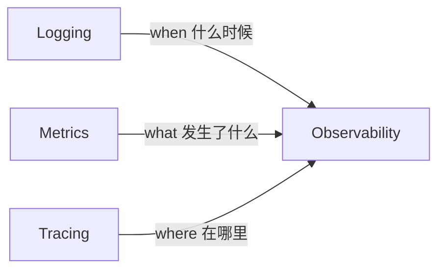

# 第13章 可观测性

## 13.1 使用场景

在微服务架构中，单个请求可能跨越十几个服务实例。当用户反馈"页面加载慢"或"订单提交失败"时，传统的手动排查（SSH 到服务器看日志）已完全不可行。可观测性（Observability）正是为了解决这类问题而生。

典型使用场景包括：

- **微服务排障**：A 服务调用 B 服务返回超时，但 B 的 CPU 和内存看起来正常——是网络抖动、B 的某个端点变慢、还是 A 的连接池耗尽？
- **性能分析**：大促期间系统整体响应变慢，需要快速定位瓶颈是数据库、下游 API、还是自身代码的某个函数。
- **告警**：不仅要知道"某台服务器 CPU > 90%"，更要能说清"过去 5 分钟内 /api/checkout 的 P99 延迟从 200ms 飙升到 5s，影响用户数约 1200 人"。
- **分布式追踪**：一次完整的"用户下单"流程涉及 API 网关 → 用户服务 → 订单服务 → 支付服务 → 消息队列 → 通知服务，需要追踪每个环节的耗时。

## 13.2 实现原理

### 三大支柱

可观测性由三个互补的数据维度构成：



| 维度 | 定义 | 典型数据 | 常用工具 |
|------|------|----------|----------|
| **Logging（日志）** | 离散的、带时间戳的事件记录 | 错误堆栈、请求日志、审计日志 | Pino, Winston, Loki |
| **Metrics（指标）** | 可聚合的数值型时间序列数据 | QPS、延迟分布、错误率、CPU 使用率 | Prometheus, Grafana |
| **Tracing（链路追踪）** | 跨服务、跨进程的请求执行路径 | Span 树、各阶段耗时、上下游依赖关系 | OpenTelemetry, Jaeger, Tempo |

### OpenTelemetry 规范

OpenTelemetry（简称 OTel）是 CNCF 孵化的可观测性标准，定义了三个核心概念：

- **Trace（追踪）**：一次完整请求的执行路径，由多个 Span 构成一棵有向无环图（DAG）。每个 Trace 拥有唯一的 `TraceID`。
- **Span（跨度）**：Trace 中的一个操作单元，描述"什么操作在什么时间持续了多久"。Span 包含 `SpanID`、`ParentSpanID`、`StartTime`、`EndTime`、`Attributes`、`Events`。
- **SpanContext**：Trace 的传播上下文（TraceID + SpanID），通过 HTTP 头（`traceparent`）在服务间传递。

一个典型的 Trace 结构：

```
TraceID: abc123
├── Span: HTTP GET /api/orders          [total: 1200ms]
│   ├── Span: auth.verifyToken          [200ms]
│   ├── Span: db.query orders           [300ms]
│   └── Span: HTTP POST payment/settle  [500ms]
│       └── Span: payment.charge        [450ms]
```

### Prometheus 数据模型

Prometheus 的指标数据模型基于 **Metric Family + Label**：

```
metric_name{label1="value1", label2="value2"} value  timestamp
```

例如：

```
http_requests_total{method="GET", endpoint="/api/users", status="200"} 1024 1680000000
http_requests_duration_ms_bucket{le="100"} 950
http_requests_duration_ms_bucket{le="500"} 998
http_requests_duration_ms_sum 45230
http_requests_duration_ms_count 1000
```

四种核心指标类型：
- **Counter**：只增不减的计数器（请求总数、错误总数）
- **Gauge**：可增可减的测量值（当前连接数、内存使用量）
- **Histogram**：数值分布统计（请求延迟分桶）
- **Summary**：类似 Histogram 但可计算分位数（P50/P90/P99）

### Grafana 面板

Grafana 将从 Prometheus（或其他数据源）查询到的数据绘制为面板（Panel），多个面板组成仪表盘（Dashboard）。典型的 Node.js 仪表盘包含：

- QPS 和错误率折线图
- P50/P90/P99 延迟分布热力图
- 事件循环延迟、GC 暂停时间
- CPU/内存资源使用

## 13.3 结构化日志

### Pino vs Winston vs console.log

| 特性 | console.log | Winston | Pino |
|------|-------------|---------|------|
| 性能（ops/sec） | ~100k | ~200k | ~600k |
| 输出格式 | 纯文本 | JSON（可配置） | JSON（默认） |
| 日志级别 | 无原生支持 | 支持 | 支持 |
| 序列化器 | 无 | 自定义序列化 | 内置 req/err/res 序列化器 |
| 日志轮转 | 不支持 | 原生支持 | 需配合 pino-rotating-file |
| 生态 | 内置 | 丰富 | 良好 |

**为什么生产环境推荐 Pino？**

Pino 是 Node.js 生态中性能最高的日志库，其 JSON 格式天然适合日志采集系统（如 Loki、ELK）的解析。而 `console.log` 虽然简单，但存在以下问题：

1. 没有日志级别区分，无法按环境控制日志量。
2. 同步 I/O 在部分场景下会阻塞事件循环。
3. 不支持序列化，错误对象打印为 `[Object object]`。

### 最佳实践：使用 Pino

```typescript
// logger.ts
import pino from 'pino';
import { randomUUID } from 'node:crypto';

const logger = pino({
  // 日志级别：生产环境通常 info，调试时设为 debug
  level: process.env.LOG_LEVEL || 'info',

  // 格式化输出：生产用 JSON，开发用 pretty
  ...(process.env.NODE_ENV !== 'production' && {
    transport: {
      target: 'pino-pretty',
      options: { colorize: true },
    },
  }),

  // 自定义级别名称
  formatters: {
    level(label) {
      return { level: label };
    },
  },

  // 内置序列化器
  serializers: {
    req: pino.stdSerializers.req,
    res: pino.stdSerializers.res,
    err: pino.stdSerializers.err,
  },
});

// 带 requestId 的请求日志
export function requestLogger(req: any, res: any, next: () => void) {
  const requestId = randomUUID();
  req.requestId = requestId;

  // 记录请求开始
  logger.info({
    requestId,
    method: req.method,
    url: req.url,
    ip: req.ip,
  }, 'incoming request');

  // 记录请求完成
  const start = Date.now();
  res.on('finish', () => {
    logger.info({
      requestId,
      method: req.method,
      url: req.url,
      statusCode: res.statusCode,
      durationMs: Date.now() - start,
    }, 'request completed');
  });

  next();
}
```

### 日志级别管理

```typescript
// 生产环境启动时建议的日志级别
const LOG_LEVEL_MAP = {
  production: 'info',
  staging: 'debug',
  development: 'debug',
  test: 'silent',
};

logger.level = LOG_LEVEL_MAP[process.env.NODE_ENV] || 'info';

// 运行时动态调整日志级别（无需重启进程）
app.post('/admin/log-level', (req, res) => {
  const { level } = req.body;
  if (['fatal', 'error', 'warn', 'info', 'debug', 'trace'].includes(level)) {
    logger.level = level;
    logger.info({ level }, 'log level changed dynamically');
    res.json({ status: 'ok', level });
  } else {
    res.status(400).json({ status: 'error', message: 'invalid log level' });
  }
});
```

## 13.4 链路追踪

### OpenTelemetry SDK 集成

完整集成需要三步：安装依赖 → 初始化 SDK → 配置导出器。

```bash
npm install @opentelemetry/sdk-node \
  @opentelemetry/exporter-trace-otlp-http \
  @opentelemetry/instrumentation-http \
  @opentelemetry/instrumentation-express \
  @opentelemetry/resources \
  @opentelemetry/semantic-conventions
```

```typescript
// tracing.ts
import { NodeSDK } from '@opentelemetry/sdk-node';
import { OTLPTraceExporter } from '@opentelemetry/exporter-trace-otlp-http';
import { HttpInstrumentation } from '@opentelemetry/instrumentation-http';
import { ExpressInstrumentation } from '@opentelemetry/instrumentation-express';
import { Resource } from '@opentelemetry/resources';
import { ATTR_SERVICE_NAME, ATTR_DEPLOYMENT_ENVIRONMENT } from '@opentelemetry/semantic-conventions';
import { diag, DiagConsoleLogger, DiagLogLevel } from '@opentelemetry/api';

// 启用 SDK 内部诊断日志（调试时启用）
// diag.setLogger(new DiagConsoleLogger(), DiagLogLevel.ERROR);

const sdk = new NodeSDK({
  resource: new Resource({
    [ATTR_SERVICE_NAME]: process.env.OTEL_SERVICE_NAME || 'node-app',
    [ATTR_DEPLOYMENT_ENVIRONMENT]: process.env.NODE_ENV || 'development',
  }),
  traceExporter: new OTLPTraceExporter({
    url: process.env.OTEL_EXPORTER_OTLP_ENDPOINT
      ? `${process.env.OTEL_EXPORTER_OTLP_ENDPOINT}/v1/traces`
      : 'http://tempo:4318/v1/traces',
    // OTLP/HTTP 默认使用 protobuf，需要 protobuf 支持
    // headers: { 'Content-Type': 'application/json' },
  }),
  instrumentations: [
    new HttpInstrumentation(),     // 自动追踪 HTTP 请求
    new ExpressInstrumentation(),  // 自动追踪 Express 路由
    // 更多自动埋点：
    // new RedisInstrumentation(),
    // new PgInstrumentation(),
  ],
});

// 正常启动
sdk.start()
  .then(() => console.log('OpenTelemetry SDK started'))
  .catch((err) => console.error('OpenTelemetry SDK failed to start:', err));

// 应用退出时优雅关闭
process.on('SIGTERM', () => {
  sdk.shutdown()
    .then(() => console.log('OpenTelemetry SDK shut down'))
    .catch(() => {});
});
```

### 手动创建 Span

自动埋点涵盖了 HTTP 请求和 Express 路由，但业务逻辑内部的耗时需要手动创建 Span：

```typescript
// manual-span.ts
import { trace, context, Span } from '@opentelemetry/api';

const tracer = trace.getTracer('my-app');

async function processOrder(orderId: string) {
  // 创建根 Span
  return tracer.startActiveSpan('processOrder', async (span: Span) => {
    span.setAttribute('order.id', orderId);

    try {
      // 子操作 1：验证订单（嵌套 Span）
      const user = await tracer.startActiveSpan('validateOrder', async (subSpan: Span) => {
        subSpan.setAttribute('order.id', orderId);
        // ... 验证逻辑
        const result = { userId: 'u123', valid: true };
        subSpan.end();
        return result;
      });

      // 子操作 2：扣减库存
      const inventory = await tracer.startActiveSpan('deductInventory', async (subSpan: Span) => {
        // ... 扣减逻辑
        subSpan.end();
      });

      // 子操作 3：调用支付服务
      const payment = await tracer.startActiveSpan('callPaymentService', async (subSpan: Span) => {
        subSpan.setAttribute('payment.amount', 99.99);
        // ... 调用支付
        subSpan.end();
      });

      return { success: true };
    } catch (err) {
      span.recordException(err as Error);
      span.setStatus({ code: 2, message: (err as Error).message });
      throw err;
    } finally {
      span.end();
    }
  });
}
```

### Span 属性与事件

```typescript
// 给 Span 添加业务属性的最佳实践
span.setAttribute('db.statement', 'SELECT * FROM orders WHERE id = ?');
span.setAttribute('db.system', 'postgresql');
span.setAttribute('http.method', 'POST');
span.setAttribute('http.url', '/api/orders');

// 记录事件（适用于异常和关键节点）
span.addEvent('cache.miss', { key: 'order:123' });
span.addEvent('retry.attempt', { attempt: 1, maxRetries: 3 });
span.addEvent('exception', {
  'exception.message': 'Connection refused',
  'exception.stacktrace': '...',
  'exception.type': 'ConnectionError',
});
```

## 13.5 指标收集

### Prometheus 客户端集成

```bash
npm install prom-client
```

```typescript
// metrics.ts
import express from 'express';
import client from 'prom-client';

const app = express();

// 创建 Registry
const register = new client.Registry();

// 添加默认指标（进程级别：CPU、内存、GC、句柄等）
client.collectDefaultMetrics({ register });

// 自定义 Counter：请求总数
const httpRequestCounter = new client.Counter({
  name: 'http_requests_total',
  help: 'Total number of HTTP requests',
  labelNames: ['method', 'endpoint', 'status'] as const,
  registers: [register],
});

// 自定义 Histogram：请求延迟
const httpRequestDuration = new client.Histogram({
  name: 'http_request_duration_ms',
  help: 'HTTP request duration in milliseconds',
  labelNames: ['method', 'endpoint'] as const,
  buckets: [5, 10, 25, 50, 100, 250, 500, 1000, 3000],
  registers: [register],
});

// 自定义 Gauge：活跃连接数
const activeConnections = new client.Gauge({
  name: 'http_active_connections',
  help: 'Number of active HTTP connections',
  registers: [register],
});

// 中间件：收集指标
app.use((req, res, next) => {
  activeConnections.inc();
  const start = Date.now();

  res.on('finish', () => {
    const duration = Date.now() - start;

    httpRequestCounter.labels(req.method, req.route?.path || req.path, String(res.statusCode)).inc();
    httpRequestDuration.labels(req.method, req.route?.path || req.path).observe(duration);
    activeConnections.dec();
  });

  next();
});

// /metrics 端点：供 Prometheus 抓取
app.get('/metrics', async (req, res) => {
  try {
    res.set('Content-Type', register.contentType);
    res.send(await register.metrics());
  } catch (err) {
    res.status(500).send(err);
  }
});
```

### Prometheus 配置

```yaml
# prometheus.yml
global:
  scrape_interval: 15s
  evaluation_interval: 15s

scrape_configs:
  - job_name: 'node-app'
    static_configs:
      - targets: ['node-app:3000']
    metrics_path: '/metrics'

  - job_name: 'prometheus'
    static_configs:
      - targets: ['localhost:9090']
```

### 常用 PromQL 查询

```promql
# QPS：每秒请求数
rate(http_requests_total[1m])

# P99 延迟：请求延迟的第 99 百分位
histogram_quantile(0.99, rate(http_request_duration_ms_bucket[5m]))

# 错误率
rate(http_requests_total{status=~"5.."}[5m]) / rate(http_requests_total[5m]) * 100

# 内存使用率
nodejs_heap_size_used_bytes / nodejs_heap_size_total_bytes * 100

# 事件循环最大延迟（最近 5 分钟）
max(event_loop_lag_ms_max[5m])
```

## 13.6 开发者技能

| 技能领域 | 具体技能 | 掌握程度 |
|----------|----------|----------|
| 结构化日志 | Pino 配置、序列化器、日志级别动态控制 | 熟练掌握 |
| OpenTelemetry | SDK 初始化、自动埋点、手动 Span 创建 | 熟练掌握 |
| OpenTelemetry | SpanContext 传播、TraceID 日志关联 | 了解原理 |
| Prometheus | 客户端集成、自定义指标、Histogram 分桶设计 | 熟练掌握 |
| PromQL | rate、histogram_quantile、聚合操作 | 基础查询 |
| Grafana | 面板编辑、PromQL 表达式、仪表盘构建 | 基础使用 |
| 架构设计 | 三大支柱的选型与集成（Loki/Tempo/Grafana） | 了解 |

## 13.7 示例代码回顾

本章涉及的示例代码：

- `logger.ts` — Pino 结构化日志配置与请求日志中间件
- `tracing.ts` — OpenTelemetry SDK 初始化与自动埋点
- `manual-span.ts` — 手动 Span 创建与属性设置
- `metrics.ts` — Prometheus 客户端指标收集与 /metrics 端点

这三部分（日志 + 追踪 + 指标）构成了完整的可观测性数据采集层。

## 13.8 Docker Compose：完整可观测性栈

以下 Compose 文件部署了完整的可观测性基础设施：Node.js 应用 + Prometheus（指标） + Grafana（可视化） + Tempo（链路追踪） + Loki（日志）。

```yaml
# docker-compose.monitoring.yml
services:
  node-app:
    build:
      context: .
      dockerfile: Dockerfile
    ports:
      - "3000:3000"
    environment:
      - NODE_ENV=production
      - LOG_LEVEL=info
      - OTEL_EXPORTER_OTLP_ENDPOINT=http://tempo:4318
      - OTEL_SERVICE_NAME=node-app
    depends_on:
      - prometheus
      - tempo
    restart: unless-stopped

  prometheus:
    image: prom/prometheus:v2.52.0
    ports:
      - "9090:9090"
    volumes:
      - prometheus_data:/prometheus
      - ./prometheus.yml:/etc/prometheus/prometheus.yml:ro
    command:
      - "--config.file=/etc/prometheus/prometheus.yml"
      - "--storage.tsdb.path=/prometheus"
    restart: unless-stopped

  grafana:
    image: grafana/grafana:11.0.0
    ports:
      - "3001:3000"
    environment:
      - GF_AUTH_ANONYMOUS_ENABLED=true
      - GF_AUTH_ANONYMOUS_ORG_ROLE=Admin
    volumes:
      - grafana_data:/var/lib/grafana
    depends_on:
      - prometheus
      - tempo
      - loki
    restart: unless-stopped

  tempo:
    image: grafana/tempo:2.4.0
    ports:
      - "4318:4318"    # OTLP/HTTP 接收端
      - "3200:3200"    # Tempo 查询端（Grafana 数据源）
    command:
      - "-config.file=/etc/tempo.yaml"
    volumes:
      - tempo_data:/tmp/tempo
      - ./tempo.yml:/etc/tempo.yaml:ro
    restart: unless-stopped

  loki:
    image: grafana/loki:3.0.0
    ports:
      - "3100:3100"
    command:
      - "-config.file=/etc/loki/local-config.yaml"
    volumes:
      - loki_data:/loki
    restart: unless-stopped

volumes:
  prometheus_data:
  grafana_data:
  tempo_data:
  loki_data:
```

完整的可观测性栈启动后，在 Grafana 中添加如下数据源：

| 数据源 | 类型 | URL |
|--------|------|-----|
| Prometheus | Prometheus | http://prometheus:9090 |
| Tempo | Tempo | http://tempo:3200 |
| Loki | Loki | http://loki:3100 |

然后导入 Node.js 社区仪表盘（Dashboard ID: 14568），即可看到应用完整的运行状态视图：QPS、延迟、错误率、事件循环健康度、以及 Trace 详情面板。